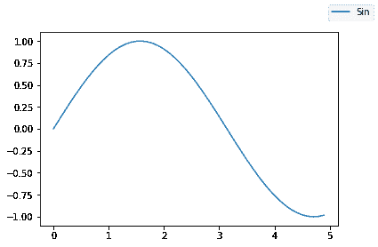
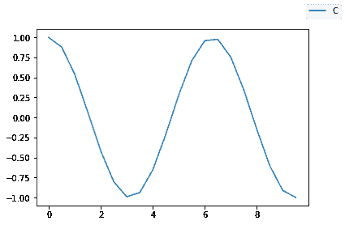

# Python 中的 Matplotlib.pyplot.figlegend()函数

> 原文:[https://www . geeksforgeeks . org/matplotlib-pyplot-fig legend-python 中的函数/](https://www.geeksforgeeks.org/matplotlib-pyplot-figlegend-function-in-python/)

[**Matplotlib**](https://www.geeksforgeeks.org/python-introduction-matplotlib/) 是一个 Python 库，用于使用 Pyplot 创建、动画和编辑图形、绘图和图形。 **Matplotlib.pyplot** 根据用户需求的偏好和需求，定义了许多功能供用户使用。

## matplotlib.pyplot.figlegend（）

这是用来在图形上放置图例的。Matplotlib 中的图例类似于定义图中曲线的铭牌。

> **语法:**matplotlib . pyplot . fig legend(* args、**kwargs)
> **参数:**一些重要参数有:
> 
> *   **手柄:**所有图形线条(或技术术语中的艺术家)列表要添加到图例中的艺术家(线条、面片)列表将作为不同的手柄。在 figlend()中，指定手柄是可选的。
> *   **标签:**图例的实际名称列表显示艺术家实际价值的标签列表称为标签。在 figlend()中，指定标签是可选的，如果未指定标签，则 figlend()函数会将其命名为图例 1、图例 2 等。
> *   **loc :** 图例的位置(默认:“最佳”)。
> 
> **返回**:返回要放在图上的图例。

**示例 1:** 创建了值为 x = [0，0.1，0.2，…的数据集 x。，5]和 y = sin(x)，然后使用标签=“Sin”绘制 x 轴为数据集 x、y 轴为数据集 y 的图形，并使用之前指定的标签作为图例使用默认的 figlegend()绘制图形。

## 蟒蛇 3

```
# Importing the necessary modules
import numpy as np
import matplotlib.pyplot as plt

# Creating a dataset
x = np.arange(0, 5, 0.1)
y = np.sin(x)

# Plotting the data
plt.plot(x, y, label = "Sin")

# Legend
plt.figlegend()
```

**输出:**



**示例 2:** 使用与上面相同的方法，但显示了 figlegend()手柄和标签的使用，但使用了默认位置。

## 蟒蛇 3

```
# Importing the necessary modules
import numpy as np
import matplotlib.pyplot as plt

# Creating a dataset
x = np.arange(0, 5, 0.1)
y = np.cos(x)

# Plotting the data
line1 = plt.plot(x, y)

# Legend
plt.figlegend((line1),('Cos'))
```

**输出:**



**示例 3:** 通过在 tan 和 cos 函数的一个图上绘制两个图形，展示了 figlegend(手柄、标签、位置)函数的使用。

## 蟒蛇 3

```
# Importing the necessary modules
import numpy as np
import matplotlib.pyplot as plt

# Creating a dataset
x = np.arange(0, 5, 0.1)
y = np.tan(x)

x1 = np.arange(0, 5, 0.1)
y1 = np.cos(x)

# Plotting the data
line1 = plt.plot(x, y)
line2 = plt.plot(x1, y1)

# Legend
plt.figlegend(
handles = (line1,line2),
          labels = ("Tan","Cos"),
          loc='upper right')
```

**输出:**

