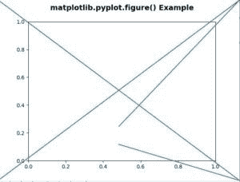
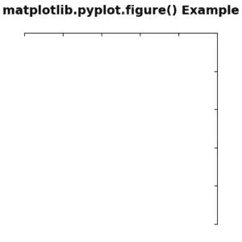

# matplotlib.pyplot.figure()中的 Python

> 哎哎哎:# t0]https://www . geeksforgeeks . org/matplot lib-pyplot-figure-in-python/

**[Matplotlib](https://www.geeksforgeeks.org/python-introduction-matplotlib/)** 是 Python 中的一个库，是 NumPy 库的数值-数学扩展。 **[Pyplot](https://www.geeksforgeeks.org/pyplot-in-matplotlib/)** 是一个基于状态的接口到 **Matplotlib** 模块，它提供了一个类似于 MATLAB 的接口。Pyplot 中可以使用的各种图有线图、等高线图、直方图、散点图、三维图等。

## matplotlib.pyplot.figure()函数:

matplotlib 库 pyplot 模块中的**图形()函数**用于创建新图形。

> **语法:**matplotlib . pyplot . fig(num =无，figsize =无，dpi =无，facecolor =无，edgecolor =无，frameon =真，FigureClass =，clear =假，**kwargs)
> 
> **参数:**该方法接受以下描述的参数:
> 
> *   **num :** 提供了此参数，并且已经存在一个具有此 id 的图形。
> *   **figsize(float，float):** 这些参数是以英寸为单位的宽度和高度。
> *   **dpi :** 该参数为图的分辨率。
> *   **面颜色:**该参数为背景颜色。
> *   **边框颜色:**该参数为边框颜色。
> *   **框架:**此参数抑制绘制图形框架。
> *   **图形类:**该参数使用自定义图形实例。
> *   **清除:**此参数如果为真且图形已经存在，则清除。
> 
> **返回值:**该方法返回以下值:
> 
> *   **图:**这将返回返回的图实例也将被传递给后端的 new_figure_manager。

下面的例子说明了 matplotlib.pyplot.figure()函数在 matplotlib.axes 中的作用:

**示例#1:**

```
# Implementation of matplotlib function
import matplotlib.pyplot as plt
import matplotlib.lines as lines

fig = plt.figure()
fig.add_artist(lines.Line2D([0, 1, 0.5], [0, 1, 0.3]))
fig.add_artist(lines.Line2D([0, 1, 0.5], [1, 0, 0.2]))

plt.title('matplotlib.pyplot.figure() Example\n',
                fontsize = 14, fontweight ='bold')

plt.show()
```

**输出:**


**例 2:**

```
# Implementation of matplotlib function
import matplotlib.pyplot as plt
from mpl_toolkits.axisartist.axislines import Subplot

fig = plt.figure(figsize =(4, 4))

ax = Subplot(fig, 111)
fig.add_subplot(ax)

ax.axis["left"].set_visible(False)
ax.axis["bottom"].set_visible(False)

plt.title('matplotlib.pyplot.figure() Example\n', 
                fontsize = 14, fontweight ='bold')

plt.show()
```

**输出:**
