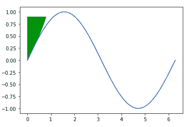
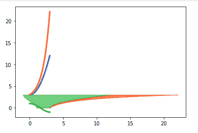

# matplotlib . pyplot . fill _ betweenx()用 Python

表示

> 原文:[https://www . geeksforgeeks . org/matplotlib-pyplot-fill _ between-in-x-python/](https://www.geeksforgeeks.org/matplotlib-pyplot-fill_betweenx-in-python/)

[Matplotlib](http://geeksforgeeks.org/python-matplotlib-an-overview/) 是 Python 中一个惊人的可视化库，用于数组的 2D 图。Matplotlib 是一个多平台数据可视化库，构建在 NumPy 数组上，旨在与更广泛的 SciPy 堆栈一起工作。

## matplot lib . pyplot . fill _ betweenx()

**matplotlib . pyplot . fill _ betwex()**用于填充两条竖曲线之间的区域。两点(x1，y)和(x2，y)定义了曲线。这将创建一个或多个描述填充区域的多边形。“where”参数可用于选择性填充某些区域。默认情况下，边直接连接给定点。如果填充需要是阶跃函数，则使用“阶跃”参数。

> **语法:**matplotlib . pyplot . fill _ betwex(y，x1，x2=0，其中=无，步长=无，插值=假，*数据=无，* * * kwargs)
> **参数:**
> 
> *   **y:** 是长度 n 的数组，这些是定义曲线的节点的 y 坐标。
>     
> *   **x1:** 是长度为 N 的数组或者标量。这表示定义第一条曲线的节点的 x 坐标。
>     
> *   **x2:** 是长度为 N 的数组，本质上是可选的。其默认值为 0。这表示定义第二条曲线的节点的 x 坐标。
>     
> *   **其中:**为长度为 n 的布尔值数组，定义是否需要排除部分垂直区域被填充。需要注意的是，这个定义意味着两个假值之间的一个孤立的真值不会被填充。相邻的假值不会填充真值的两边。
>     
> *   **插值:**是接受布尔值的可选参数。仅当使用了 where 并且两条曲线相互交叉时才相关。语义上如果一般用于 x1 > x2 或类似的情况。默认情况下，填充区域将放置在定义填充多边形区域的 y 阵列位置。有交集的 y 的部分被简单地裁剪。将此参数设置为“真”将导致实际交点的计算，并延伸到填充区域直至点。
>     
> *   **步骤:**这是一个可选参数，接受三个值中的一个，即‘pre’、‘post’和‘mid’。这用于指定步骤将在哪里发生。
>     *   **pre:** 从每个 x 位置开始，y 值持续向左，即区间(x[i-1]，x[i])的值为 y[i]。
>         
>     *   **post:** 从每个 x 位置开始，y 值不断向右延续，即区间(x[i]，x[i+1])的值为 y[i]。
>         
>     *   **中间:**这些步骤发生在 x 位置的中间。
>         
> 
> **返回:**它从多边形集合中返回一个绘制的多边形。

**其他参数:** **kwargs 包含来自控制多边形属性的 PolyCollection 的关键字；

<figure class="table">

| 财产 | 描述 |
| --- | --- |
| agg _ 筛选器 | 接受(m，n，3)浮点数组和返回(m，n，3)数组的 dpi 值的筛选函数 |
| 希腊字母的第一个字母 | 浮动或无 |
| 愉快的 | 弯曲件 |
| 排列 | ndaarray(阵列) |
| 帽式 | { '对接'，'圆形'，'突出' } |
| 氯林可霉素 | 长度为 2 的浮动序列；可能会在具有 vmin 和 vmax kwargs 的方法中被覆盖。 |
| cmap | 彩色地图或注册彩色地图 |
| 抗锯齿或 aa 或抗锯齿 | 布尔或布尔序列 |
| 剪辑盒 | Bbox |
| 剪辑 _on | 弯曲件 |
| 剪辑路径 | [(路径，转换)&#124;补丁&#124;无] |
| 颜色 | rgba 元组的颜色或序列 |
| 包含 | 请求即付的 |
| edgecolor 或 ec 或 edgecolors | 颜色或颜色序列或“脸” |
| facecolor 或 fc 或 facecolors | 颜色或颜色序列 |
| 数字 | 数字 |
| 眩倒病 | 潜艇用热中子反应堆（submarine thermal reactor 的缩写） |
| 舱口 | {'/'，' \ '，' &#124; '，'-'，'+'，' x '，' O '，' O '，' ', '*'} |
| in _ 布局 | 弯曲件 |
| 连接样式 | { '斜接'，'圆形'，'斜角' } |
| 线型或短划线 | {'-', '–', '-.'，':'，"，(偏移量，开-关-序列)，…} |
| 线宽 | 浮动或浮动序列 |
| 标准 | 使标准化 |
| 偏移位置 | {“屏幕”、“数据”} |
| 抵消 | 浮动或浮动序列 |
| 路径效果 | 抽象路径效应 |
| 采摘者 | 无、布尔、浮点或可调用 |
| 拾取半径 | 未知的 |
| 路径效果 | 抽象路径效应 |
| 采摘者 | 浮动或可调用[[艺术家，事件]，元组[布尔，字典]] |
| 拾取半径 | 漂浮物 |
| 光栅化 | 布尔或无 |
| 草图 _ 参数 | (刻度:浮动，长度:浮动，随机性:浮动)
 |
| 突然的 | 布尔或无 |
| 改变 | matplotlib . transforms . transform |
| 全球资源定位器(Uniform Resource Locator) | 潜艇用热中子反应堆（submarine thermal reactor 的缩写） |
| 资源定位符 | 列表[字符串]或无 |
| 看得见的 | 弯曲件 |
| xdata | 1D 阵列 |
| 更糟 | 漂浮物 |

</figure>

**例 1:**

## 蟒蛇 3

```
import matplotlib.pyplot as plt
import numpy as np

a = np.linspace(0,2*3.14,50)
b = np.sin(a)

plt.fill_betweenx(a, b, 0,
                  where = (a > -0.5) & (a <= 1),
                  color='g')

plt.plot(a, b)
```

**输出:**



**例 2:**

## 蟒蛇 3

```
import pylab as plt
import numpy as np

N  = np.linspace(0,3,200)
A1 = N**2 + 3
A2 = np.exp(N) + 2
A3 = np.cos(N)

plt.plot(N, A1, lw = 3)
plt.plot(N, A2, lw = 3)
plt.plot(N, A3, lw = 3)

plt.fill_betweenx(N, A1, A2,
                  color = 'r',
                  alpha = .5)
plt.fill_betweenx(N, A1, A3,
                  color = 'g',
                  alpha = .5)

plt.show()
```

**输出:**

