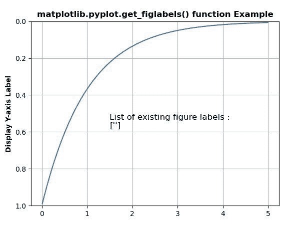
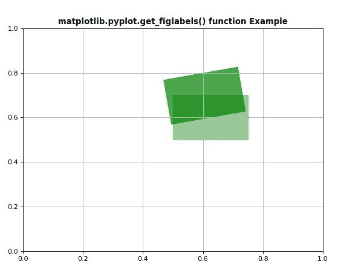

# matplotlib . pyplot . get _ figlabels()用 Python

表示

> 哎哎哎:# t0]https://www . geeksforgeeks . org/matplot lib-pyplot-get _ figlabels-in-python/

**[Matplotlib](https://www.geeksforgeeks.org/python-introduction-matplotlib/)** 是 Python 中的一个库，是 NumPy 库的数值-数学扩展。 **[Pyplot](https://www.geeksforgeeks.org/pyplot-in-matplotlib/)** 是一个基于状态的 Matplotlib 模块接口，它提供了一个类似 MATLAB 的接口。Pyplot 中可以使用的各种图有线图、等高线图、直方图、散点图、三维图等。

## matplotlib . pyplot . get _ fig labels()方法

matplotlib 库 pyplot 模块中的 **get_figlabels()方法**用于获取已有图形标签列表。

> **语法:**matplotlib . pyplot . get _ figlabels()
> 
> **参数:**此方法不接受任何参数。
> 
> **返回:**该方法返回现有图形标签列表。

下面的例子说明了 matplotlib.pyplot . get _ fig labels()函数在 matplotlib . pyplot 中的作用:

**例 1:**

```
import matplotlib.pyplot as plt
import numpy as np

t = np.arange(0.01, 5.0, 0.01)
s = np.exp(-t)

plt.plot(t, s)
plt.ylim(1, 0)
plt.ylabel('Display Y-axis Label', fontweight ='bold')
plt.grid(True)

w = plt.get_figlabels()

plt.text(1.5, 0.58,
         "List of existing figure labels : \n"
         + str(w),
         fontsize = 12)

plt.title('matplotlib.pyplot.get_figlabels() function\
 Example', fontweight ="bold") 

plt.show()
```

**输出:**


**例 2:**

```
import matplotlib.pyplot as plt
import matplotlib as mpl
import matplotlib.patches as patches
import numpy as np

mpl.rcParams['figure.dpi'] = 80
mpl.rcParams['savefig.dpi'] = 80 

def redraw(event):

    if  np.size(plt.get_figlabels()):
        ax.clear()
        drawRectangles(ax)
        fig.canvas.draw()
    else:
        pass

def drawRectangles(ax):

    td2dis = ax.transData
    coords = td2dis.transform([0.2, 0.5])
    tr = mpl.transforms.Affine2D().rotate_deg_around(coords[0],
                                                     coords[1], 10)
    t = td2dis + tr
    rec0 = patches.Rectangle((0.5, 0.5),
                             0.25, 0.2, 
                             color = 'green', 
                             alpha = 0.4)
    ax.add_patch(rec0)
    rect1 = patches.Rectangle((0.5, 0.5),
                              0.25, 0.2,
                              color = 'green',
                              alpha = 0.7,
                              transform = t)
    ax.add_patch(rect1);
    plt.title('matplotlib.pyplot.get_figlabels() function Example', fontweight ="bold")
    plt.grid()

figSize = (8, 6)
fig = plt.figure("Patch rotate", figsize = figSize)

ax = fig.add_subplot(111)
ax.set_xlim(0, 1);ax.set_ylim(0, 1);

fig.canvas.mpl_connect('resize_event', redraw)
drawRectangles(ax) 

plt.show()
```

**输出:**
