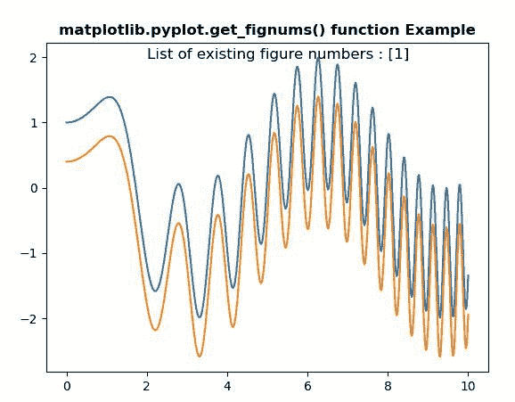
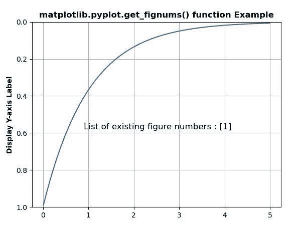

# matplotlib . pyplot . get _ fignums()用 Python

表示

> 原文:[https://www . geeksforgeeks . org/matplotlib-pyplot-get _ fig nums-in-python/](https://www.geeksforgeeks.org/matplotlib-pyplot-get_fignums-in-python/)

**[Matplotlib](https://www.geeksforgeeks.org/python-introduction-matplotlib/)** 是 Python 中的一个库，是 NumPy 库的数值-数学扩展。 **[Pyplot](https://www.geeksforgeeks.org/pyplot-in-matplotlib/)** 是一个基于状态的 Matplotlib 模块接口，它提供了一个类似 MATLAB 的接口。Pyplot 中可以使用的各种图有线图、等高线图、直方图、散点图、三维图等。

## matplotlib.pyplot.get_fignums()方法

matplotlib 库 pyplot 模块中的 **get_fignums()方法**用于获取已有图号列表。

> **语法:**matplotlib . pyplot . get _ fignums()
> 
> **参数:**此方法不接受任何参数。
> 
> **返回:**该方法返回已有图号列表。

下面的例子说明了 matplotlib.pyplot.get_fignums()函数在 matplotlib.pyplot 中的作用:

**例 1:**

```py
# Implementation of matplotlib function
import numpy as np
import matplotlib.pyplot as plt

x = np.linspace(0, 10, 500)
y = np.sin(x**2)+np.cos(x)

plt.plot(x, y, label ='Line 1')

plt.plot(x, y - 0.6, label ='Line 2')

w = plt.get_fignums()

plt.text(2, 1.98,
         "List of existing figure numbers : "
         + str(w),
         fontsize = 12)

plt.title('matplotlib.pyplot.get_fignums() function\
 Example', fontweight ="bold") 

plt.show()
```

**输出:**


**例 2:**

```py
# Implementation of matplotlib function
import matplotlib.pyplot as plt
import numpy as np

t = np.arange(0.01, 5.0, 0.01)
s = np.exp(-t)

plt.plot(t, s)
plt.ylim(1, 0)
plt.ylabel('Display Y-axis Label', fontweight ='bold')
plt.grid(True)

w = plt.get_fignums()

plt.text(0.9, 0.58,
         "List of existing figure numbers : "
         + str(w),
         fontsize = 12)

plt.title('matplotlib.pyplot.get_fignums() function\
 Example', fontweight ="bold") 

plt.show()
```

**输出:**
