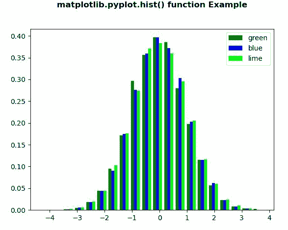

# Matplotlib.pyplot.hist()用 Python

表示

> 哎哎哎:# t0]https://www . geeksforgeeks . org/matplot lib-pyplot-hist-in-python/

**[Matplotlib](https://www.geeksforgeeks.org/python-introduction-matplotlib/)** 是 Python 中的一个库，是 NumPy 库的数值-数学扩展。 **[Pyplot](https://www.geeksforgeeks.org/pyplot-in-matplotlib/)** 是一个基于状态的接口到 **Matplotlib** 模块，它提供了一个类似于 MATLAB 的接口。

## matplotlib.pyplot.hist()函数

matplotlib 库 pyplot 模块中的 **hist()函数**用于绘制直方图。

> **语法:** matplotlib.pyplot.hist(x，bins =无，范围=无，密度=假，权重=无，累积=假，底部=无，histtype='bar '，align='mid '，orientation='vertical '，rwidth =无，log =假，color =无，label =无，堆积=假，*，data =无，*\*kwargs)
> 
> **参数:**该方法接受以下描述的参数:
> 
> *   **x :** 这个参数是数据的顺序。
> *   **bin:**该参数为可选参数，包含整数或序列或字符串。
> *   **范围:**该参数是可选参数，它是箱的下限和上限。
> *   **密度:**该参数为可选参数，包含布尔值。
> *   **权重:**该参数是可选参数，是权重数组，形状与 x 相同。
> *   **底部:**该参数是每个料仓底部基线的位置。
> *   **histtype :** 该参数为可选参数，用于绘制直方图的类型。{ '条形'，'条形堆叠'，'阶梯'，'阶梯填充' }
> *   **对齐:**此参数是可选参数，它控制直方图的绘制方式。{ '左'，'中'，'右' }
> *   **rwidth :** 此参数是可选参数，它是条的相对宽度，是料箱宽度的一部分
> *   **log :** 此参数为可选参数，用于将直方图轴设置为对数刻度
> *   **颜色:**此参数是可选参数，它是一个颜色规格或颜色规格序列，每个数据集一个。
> *   **标签:**该参数为可选参数，为字符串，或字符串序列，用于匹配多个数据集。
> *   **赋范:**该参数为可选参数，包含布尔值。而是使用密度关键字参数。
> 
> **返回:**这将返回以下内容:
> 
> *   **n :** 返回直方图仓的值。
> *   **面元:**这将返回面元的边缘。
> *   **面片:**返回用于创建直方图的单个面片列表。

下面的例子说明了 matplotlib.pyplot.hist()函数在 matplotlib.pyplot 中的作用:

**示例#1:**

```
# Implementation of matplotlib function
import matplotlib
import numpy as np
import matplotlib.pyplot as plt

np.random.seed(10**7)
mu = 121 
sigma = 21
x = mu + sigma * np.random.randn(1000)

num_bins = 100

n, bins, patches = plt.hist(x, num_bins, 
                            density = 1, 
                            color ='green',
                            alpha = 0.7)

y = ((1 / (np.sqrt(2 * np.pi) * sigma)) *
     np.exp(-0.5 * (1 / sigma * (bins - mu))**2))

plt.plot(bins, y, '--', color ='black')

plt.xlabel('X-Axis')
plt.ylabel('Y-Axis')

plt.title('matplotlib.pyplot.hist() function Example\n\n',
          fontweight ="bold")

plt.show()
```

**输出:**


**例 2:**

```
# Implementation of matplotlib function
import matplotlib
import numpy as np
import matplotlib.pyplot as plt

np.random.seed(10**7)
n_bins = 20
x = np.random.randn(10000, 3)

colors = ['green', 'blue', 'lime']

plt.hist(x, n_bins, density = True, 
         histtype ='bar',
         color = colors,
         label = colors)

plt.legend(prop ={'size': 10})

plt.title('matplotlib.pyplot.hist() function Example\n\n',
          fontweight ="bold")

plt.show()
```

**输出:**
