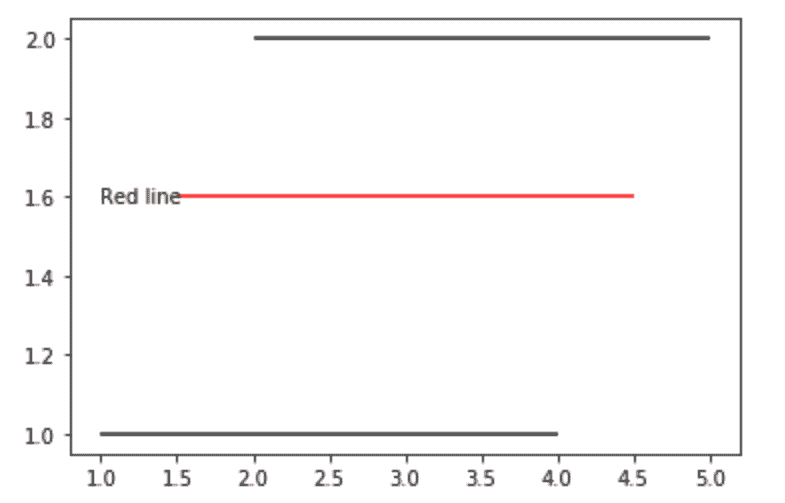

# Matplotlib.pyplot.hlines()用 Python

表示

> 哎哎哎:# t0]https://www . geeksforgeeks . org/matplot lib-pyplot-hlines-in-python/

[**Matplotlib**](http://geeksforgeeks.org/python-matplotlib-an-overview/) 是 Python 中一个惊人的可视化库，用于数组的 2D 图。Matplotlib 是一个多平台数据可视化库，构建在 NumPy 数组上，旨在与更广泛的 SciPy 堆栈一起工作。

## Matplotlib.pyplot.hlines()

`Matplotlib.pyplot.hlines()`用于在从 xmin 到 xmax 的每个 y 点绘制图表中的水平线。

> **语法:** matplotlib.pyplot.hlines(y，xmin，xmax，colors='k '，linestyles = ' solid '，label=，*，data=None，**kwargs
> 
> **参数:**
> `Matplotlib.pyplot.hlines()`接受下述参数:
> 
> *   **y :** 是该方法的必选参数。该参数描述了要在图形中绘制的线。它的值是一个标量或一系列标量，换句话说，它是要绘制线条的 y 索引。
> *   **xmin:** 它是一个必需的参数，具有标量值或类似 1D 数组的值，用于设置每行的开头。如果提供标量，所有的行都将具有相同的长度。
> *   **颜色:**顾名思义，用于设置要绘制的线条的颜色。该参数本质上是可选的，其默认值为“k”
> *   **线型:**也是可选参数，接受四个值，即‘实线’、‘虚线’、‘虚线’和‘虚线’。它负责设置要绘制的线的样式。
> *   **标签:**是一个可选参数，用于描述同一条直线上绘制直线的信息。这将接受默认值为空字符串的字符串。
> *   ****kwargs:** 该参数用于利用绘制线中的线集合属性。

**注意:**除了上面提到的参数，这个方法可以带一个 data 关键字参数。还需要注意的是，作为数据传递的对象必须支持项访问和成员资格测试。

**Example 1:**

```
from matplotlib import pyplot as plt

plt.hlines(y = 1, xmin = 1, xmax = 4)

plt.hlines(y = 1.6, xmin = 1.5, xmax = 4.5)

plt.hlines(y = 2, xmin = 2, xmax = 5)
```

**输出:**


**例 2:**

```
from matplotlib import pyplot as plt

plt.hlines(y = 1, xmin = 1, xmax = 4, label ="black line")

plt.hlines(y = 1.6, xmin = 1.5, xmax = 4.5, color ='r')
plt.text(1, 1.6, 'Red line', ha ='left', va ='center')

plt.hlines(y = 2, xmin = 2, xmax = 5)
```

**输出:**
