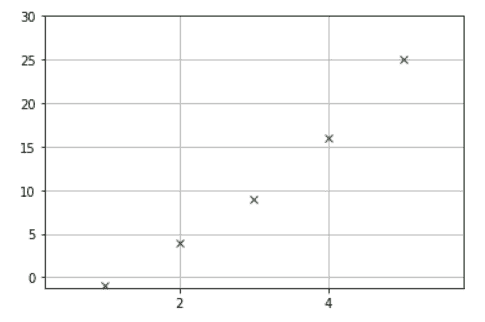

# matplotlib . pyplot . locator _ params()中的 Python

> 哎哎哎:# t0]https://www . geeksforgeeks . org/matplot lib-pyplot locator _ params-in-python/

**Matplotlib** 是最流行的用于数据可视化的 Python 包之一。这是一个跨平台的库，用于从数组中的数据制作 2D 图。 **Pyplot** 是一组命令风格的函数，使 matplotlib 像 MATLAB 一样工作。

**注:**更多信息请参考[Python Matplotlib–概述](http://geeksforgeeks.org/python-matplotlib-an-overview/)

**定位器 _params()** 用于控制蜱虫定位器的行为。属性轴用于指定应用函数的轴。

```py
# for Y axis
matplotlib.pyplot.locator_params(axis='y', nbins=3) 

# for X axis
matplotlib.pyplot.locator_params(axis='x', nbins=3) 

# for both, x-axis and y-axis: Default
matplotlib.pyplot.locator_params(nbins=3) 

```

减少最大刻度数并使用严格的界限:

```py
plt.locator_params(tight=True, nbins=4)

```

**例 1:**

```py
# importing libraries
import matplotlib.pyplot as plt

# Y-axis Values
y =[-1, 4, 9, 16, 25]

# X-axis Values
x =[1, 2, 3, 4, 5]

plt.locator_params(axis ='x', nbins = 5)

# adding grid to the plot
axes = plt.axes()
axes.grid()

# defining the plot
plt.plot(x, y, 'mx', color ='green')

# range of y-axis in the plot
plt.ylim(ymin =-1.2, ymax = 30)

# Set the margins
plt.margins(0.2)

# printing the plot
plt.show()
```

**输出:**


**例 2:**

```py
# importing libraries
import matplotlib.pyplot as plt

# defining the function
def for_lines(xlab, ylab, plot_title,
              size_x, size_y, content =[]): 

  width = len(content[0][1:])
  s = [x for x in range(1, width + 1)] 

  # specifying the size of figure
  plt.figure(figsize =(size_x, size_y))

  for line in content: 
        plt.plot(s,  line[1:], 'ro--', 
                 color ='green',
                 label = line[0])

  # to add title to the plot
  plt.title(plot_title)

  # for adding labels to the plot
  plt.xlabel(xlab)
  plt.ylabel(ylab) 

  t = len(s) 
  plt.locator_params(nbins = t)

for_lines("x-axis", "y-axis",
          "GeeksForGeeks", 7, 7,
          [[1, 2, 4, 3, 5]])
```

**输出:**


**例 3:**

```py
# importing libraries
import matplotlib.pyplot as plt

plt.locator_params(nbins = 10)

# defining the plot
plt.plot([1, 2, 3, 5, 7],
         [2, 3, 9, 15, 16],
         'ro-', color ='red')

# printing the plot
plt.show()
```

**输出:**
