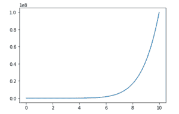
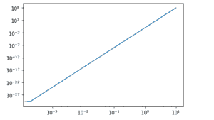

# Python 中的 matplotlib . pyplot . log log log()函数

> 原文:[https://www . geeksforgeeks . org/matplotlib-pyplot-loglog-function-in-python/](https://www.geeksforgeeks.org/matplotlib-pyplot-loglog-function-in-python/)

**先决条件:**T2【马特洛特利

Matplotlib 是一个全面的库，用于在 python 中创建交互式、静态和动画可视化。使用像 wxPython、SciPy、Tkinter 或 SciPy 这样的通用 GUI 工具包，它提供了一个面向对象的 API，用于将图嵌入到应用程序中。Matplotlib.pyplot 是使 Matplotlib 像 MATLAB 一样工作的函数集合。

这里，我们将探索 Matplotlib.pyplot 的 loglog()函数。它用于绘制 x 轴和 y 轴上的对数比例。

**语法:**

```py
loglog(X,Y)
```

哪里，

x 和 Y 分别指 x 和 Y 坐标。

使用的其他功能是 linespace()。它返回指定间隔内均匀分布的数字。

**语法:**

```py
np.linspace(start, stop, num, endpoint, retstep, dtype, axis)
```

哪里，

*   **开始**:序列的起始值，从你想显示线的地方开始，或者我们可以说线的起点
*   **Stop** :除非“endpoint”设置为 False，否则该值是序列的结束值，在该处线停止。
*   **数量**:要生成的样本数量。必须是非负数。默认情况下是 50。
*   **终点**:和停止一样工作。如果为真，则 stop 是最后一个样本，否则 stop 将从序列中排除。
*   **Retstep** :如果为真，返回(‘样本’，‘步长’)，其中‘步长’为样本之间的间距。
*   **数据类型**:输出数组的类型。
*   **轴**:结果中存储样本的轴，只有当开始或停止是阵列状时才相关

**示例:**无日志()

## 计算机编程语言

```py
# importing required modules
import matplotlib.pyplot as plt
import numpy as np

# inputs to plot using loglog plot
x_input = np.linspace(0, 10, 50000)

y_input = x_input**8

# plotting the value of x_input and y_input using plot function
plt.plot(x_input, y_input)
```

**输出:**



**示例:**带日志()

## 蟒蛇 3

```py
# importing required modules
import matplotlib.pyplot as plt
import numpy as np

# inputs to plot using loglog plot
x_input = np.linspace(0, 10, 50000)

y_input = x_input**8

# plotting the value of x_input and y_input using loglog plot
plt.loglog(x_input, y_input)
```

**输出:**

