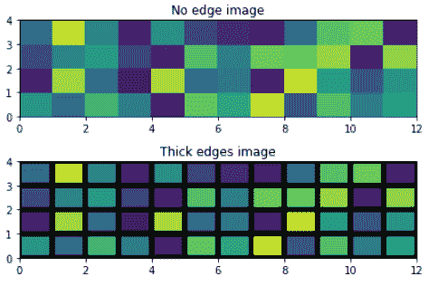

# matplotlib . pyplot . pcolor()python 中的函数

> 原文:[https://www . geeksforgeeks . org/matplotlib-pyplot-pcolor-python 中的函数/](https://www.geeksforgeeks.org/matplotlib-pyplot-pcolor-function-in-python/)

Matplotlib 是数据可视化中使用的著名 Python 包。Numpy 是 Matplotlib 的数值数学扩展。Matplotlib 能够生成高质量的图表和图形。Matplotlib 产生面向对象的应用编程接口，用于使用图形用户界面工具包(如 Tkinter、wxPython 或 Qt)将地块嵌入项目中。约翰·d·亨特是 Matplotlib 的最初开发者，它是根据 BSD 风格的许可证发行的。

## matplotlib.pyplot.pcolor()

Matplotlib 包含多种有助于执行不同任务的函数，其中之一就是**matplotlib . pyplot . pcolor()**函数。Matplotlib 库中 pyplot 模块中的 **pcolor()函数**有助于创建具有非规则矩形网格的伪彩色图。

> **语法:**matplotlib . pyplot . pcolor(* args，alpha=None，norm=None，cmap=None，vmin=None，vmax=None，data=None，**kwargs)
> **调用签名:** pcolor([X，Y，] C，**kwargs)
> **参数:**
> **C:** 表示定标器 2-D 数组
> **X，Y:
> 可选
> **捕捉:** bool，可选
> **其他参数:**
> **抗锯齿:** bool，可选
> *** * kwargs**
> **Returns:**该函数返回一个集合，即**matplotlib . collections . collection****

**注意:**对于较大的数组，matplotlib.pyplot.pcolor()的工作速度非常慢。

下面的例子演示了 matplotlib.pyplot.pcolor()函数的工作原理:

**示例 1:使用 pcolor()功能生成图像**

借助 pcolor()函数，我们可以生成**二维图像风格的图，**如下图所示

## 蟒蛇 3

```
# Demonstration of matplotlib function
import matplotlib.pyplot as plt
import numpy as np
from matplotlib.colors import LogNorm

Z = np.random.rand(4, 12)

fig, (ax0, ax1) = plt.subplots(2, 1)

c = ax0.pcolor(Z)
ax0.set_title('No edge image')

c = ax1.pcolor(Z, edgecolors='k', linewidths=5)
ax1.set_title('Thick edges image')

fig.tight_layout()
plt.show()
```

**输出:**



**例 2:使用对数刻度**加工 pcolor()

## 蟒蛇 3

```
# Demonstration of matplotlib function
import matplotlib.pyplot as plt
import numpy as np
from matplotlib.colors import LogNorm

N = 100
X, Y = np.mgrid[-4:4:complex(0, N), -4:4:complex(0, N)]

# Image show that a low hump with a spike coming out.
# We need a z/colour axis on a log scale in order
# to watch both hump and spike.
Z1 = np.exp(-(X)**2 - (Y)**2)
Z2 = np.exp(-(X * 10)**2 - (Y * 10)**2)
Z = Z1 + 50 * Z2

fig, (ax0, ax1) = plt.subplots(2, 1)

c = ax0.pcolor(X, Y, Z,norm=LogNorm(vmin=Z.min(), vmax=Z.max()), cmap=plt.cm.autumn)

fig.colorbar(c, ax=ax0)

c = ax1.pcolor(X, Y, Z, cmap=plt.cm.autumn)
fig.colorbar(c, ax=ax1)

plt.show()
```

**输出:**

