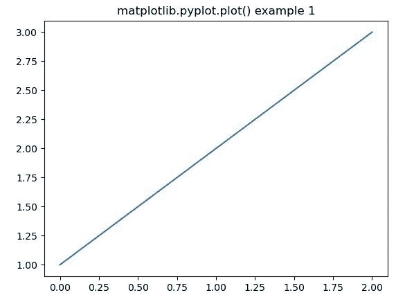

# Python 中的 Matplotlib.pyplot.plot()函数

> 原文:[https://www . geeksforgeeks . org/matplotlib-pyplot-plot-python 中的函数/](https://www.geeksforgeeks.org/matplotlib-pyplot-plot-function-in-python/)

[**Matplotlib**](https://www.geeksforgeeks.org/python-introduction-matplotlib/) 是 Python 中的一个库，是 NumPy 库的数值-数学扩展。 **[Pyplot](https://www.geeksforgeeks.org/pyplot-in-matplotlib/)** 是一个基于状态的接口到 **Matplotlib** 模块，它提供了一个类似于 MATLAB 的接口。Pyplot 中可以使用的各种图有线图、等高线图、直方图、散点图、三维图等。

## matplotlib.pyplot.plot()函数

matplotlib 库 pyplot 模块中的**绘图()函数**用于制作点 x，y 的 2D 六边形宁滨图。

> **语法:**matplotlib . pyplot . plot(\ * args，scalex=True，scaley=True，data=None，\*\*kwargs)
> 
> **参数:**该方法接受以下描述的参数:
> 
> *   **x，y:** 这些参数是数据点的水平和垂直坐标。x 值是可选的。
> *   **fmt:** 该参数为可选参数，包含字符串值。
> *   **数据:**该参数为可选参数，是一个带有标签数据的对象。
> 
> **返回:**这将返回以下内容:
> 
> *   **线:**这将返回表示打印数据的线 2D 对象列表。

下面的例子说明了 matplotlib.pyplot.plot()函数在 matplotlib.pyplot 中的作用:

**例 1:**

```py
# Implementation of matplotlib function 

import matplotlib.pyplot as plt 
import numpy as np 

plt.plot([1, 2, 3]) 
plt.title('matplotlib.pyplot.plot() example 1') 
plt.draw() 
plt.show() 
```

**输出:**


**例 2:**

```py
# Implementation of matplotlib function 

import matplotlib.pyplot as plt 
import numpy as np 

# Fixing random state for reproducibility 
np.random.seed(19680801) 

# create random data 
xdata = np.random.random([2, 10]) 

# split the data into two parts 
xdata1 = xdata[0, :] 
xdata2 = xdata[1, :] 

# sort the data so it makes clean curves 
xdata1.sort() 
xdata2.sort() 

# create some y data points 
ydata1 = xdata1 ** 2
ydata2 = 1 - xdata2 ** 3

# plot the data 
plt.plot(xdata1, ydata1, color ='tab:blue') 
plt.plot(xdata2, ydata2, color ='tab:orange') 

# set the limits 
plt.xlim([0, 1]) 
plt.ylim([0, 1]) 

plt.title('matplotlib.pyplot.plot() example 2') 

# display the plot 
plt.show()
```

**输出:**
