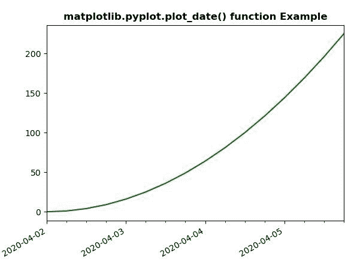

# matplotlib.pyplot.plot_date()用 Python

表示

> 哎哎哎:# t0]https://www . geeksforgeeks . org/matplot lib-pyplot-plot _ date-in-python/

**[Matplotlib](https://www.geeksforgeeks.org/python-introduction-matplotlib/)** 是 Python 中的一个库，是 NumPy 库的数值-数学扩展。 **[Pyplot](https://www.geeksforgeeks.org/pyplot-in-matplotlib/)** 是一个基于状态的接口到 **Matplotlib** 模块，它提供了一个类似于 MATLAB 的接口。

## matplotlib.pyplot.plot_date()函数:

matplotlib 库 pyplot 模块中的 **plot_date()函数**用于绘制包含日期的数据。

> **语法:**
> 
> ```
> matplotlib.pyplot.plot_date(x, y, fmt='o', tz=None, xdate=True, ydate=False, hold=None, data=None, **kwargs)
> 
> ```
> 
> **参数:**该方法接受以下描述的参数:
> 
> *   **x，y:** 这些参数是数据点的水平和垂直坐标。
> *   **fmt:** 该参数为可选参数，包含字符串值。
> *   **tz:** 此参数是标注日期时使用的时区。它包含时区字符串。
> *   **xdate:** 该参数也是可选参数。并且它包含带有默认值*真*的布尔值。如果为真，x 轴将被解释为 Matplotlib 日期。
> *   **ydate:** 该参数也是可选参数。并且它包含带有默认值*真*的布尔值。如果为真，y 轴将被解释为 Matplotlib 日期。
> 
> **返回:**这将返回以下内容:
> 
> *   **线:**这将返回表示打印数据的线 2D 对象列表。

下面的例子说明了 matplotlib.pyplot.plot_date()函数在 matplotlib.pyplot 中的作用:

**示例#1:**

```
# Implementation of matplotlib function
import datetime
import matplotlib.pyplot as plt
from matplotlib.dates import drange
import numpy as np

date1 = datetime.datetime(2020, 4, 2)
date2 = datetime.datetime(2020, 4, 12)
delta = datetime.timedelta(hours = 24)
dates = drange(date1, date2, delta)

y = np.arange(len(dates))

plt.plot_date(dates, y ** 2)
plt.title('matplotlib.pyplot.plot_date() function Example', fontweight ="bold")
plt.show()
```

**输出:**


**例 2:**

```
# Implementation of matplotlib function
import datetime
import matplotlib.pyplot as plt
from matplotlib.dates import DayLocator, HourLocator, DateFormatter, drange
import numpy as np

date1 = datetime.datetime(2020, 4, 2)
date2 = datetime.datetime(2020, 4, 6)
delta = datetime.timedelta(hours = 6)
dates = drange(date1, date2, delta)

y = np.arange(len(dates))

fig, ax = plt.subplots()
ax.plot_date(dates, y ** 2, 'g')

ax.set_xlim(dates[0], dates[-1])

ax.xaxis.set_major_locator(DayLocator())
ax.xaxis.set_minor_locator(HourLocator(range(0, 25, 6)))
ax.xaxis.set_major_formatter(DateFormatter('% Y-% m-% d'))

ax.fmt_xdata = DateFormatter('% Y-% m-% d % H:% M:% S')
fig.autofmt_xdate()
plt.title('matplotlib.pyplot.plot_date() function Example', fontweight ="bold")
plt.show()
```

**输出:**
