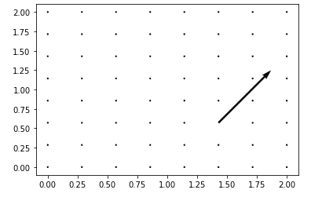

# Matplotlib.pyplot.quiver()用 Python

表示

> 哎哎哎:# t0]https://www . geeksforgeeks . org/matplot lib-pyplot-quiver-in-python/

**Matplotlib** 是一个 Python 绑定库，为用户提供了一个类似 MATLAB 的绘图框架。Matplotlib 可用于 Python 脚本、Python 和 IPython 外壳、web 应用服务器以及各种图形用户界面工具包，如 Tkinter、awxPython 等。

## Matplotlib.pyplot.quiver（）

`matplotlib.pyplot.quiver`方法用于绘制箭头的 2D 场。

> **语法:** matplotlib.pyplot .箭袋(x _ 坐标，y _ 坐标，x _ 方向，y _ 方向)
> 
> **参数:**
> **x _ 坐标:**箭头位置的 x 坐标
> **y _ 坐标:**箭头位置的 y 坐标
> **x _ 方向:**箭头方向的 x 分量
> **y _ 方向:**箭头方向的 y 分量
> 
> **可选参数:**
> **比例:**用于设置图形的比例
> **比例 _ 单位:**用于设置平面相对于 x 和 y 的单位
> **角度:**用于确定绘制的箭头向量的角度
> 
> **返回值:**返回带有箭头的 2D 图

**示例#1**

```
#Python program to explain
# matplotlib.pyplot.quiver method

import matplotlib.pyplot as plt
import numpy as np

#defining necessary arrays
x = np.linspace(0,2,8)
y = np.linspace(2,0,8)
x_dir = y_dir = np.zeros((8,8))
y_dir[5,5] = 0.2

#plotting the 2D graph
plt.quiver(x, y, x_dir, y_dir, scale=1)
```

**输出:**


**示例#2**
使用`quiver`方法在图形上绘制多个箭头

```
# Python program to explain 
# matplotlib.pyplot.quiver method

# importing necessary libraries
import matplotlib.pyplot as plt

# defining necessary arrays
x_coordinate = [0, 1.5]
y_coordinate = [0.5, 1.5]
x_direction = [1, -0.5]
y_direction = [1, -1]

# plotting the graph
plt.quiver(x_coordinate, y_coordinate,
           x_direction, y_direction,
           scale_units ='xy', scale = 1.)
```

**输出:**
