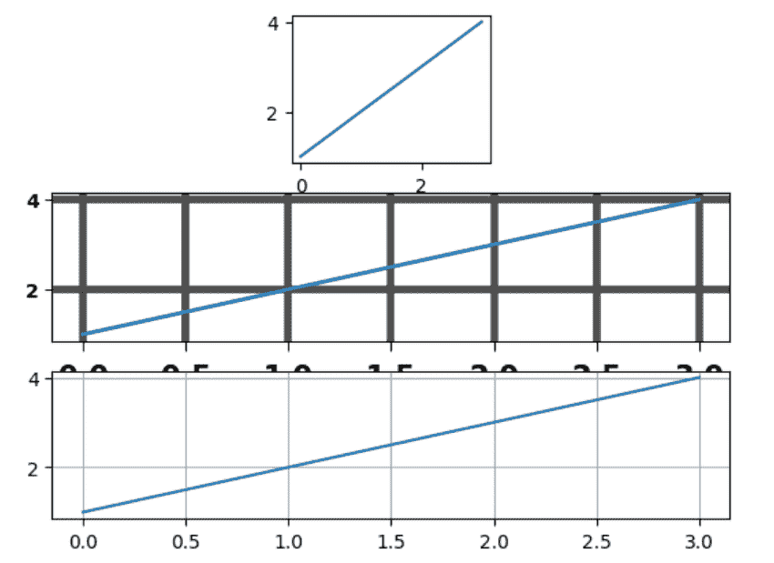

# Matplotlib.pyplot.rc()用 Python

表示

> 哎哎哎:# t0]https://www . geeksforgeeks . org/matplot lib-pyplot-RC-in-python/

**Matplotlib** 是 Python 中一个惊人的可视化库，用于数组的 2D 图。 [Matplotlib](http://geeksforgeeks.org/python-matplotlib-an-overview/) 是一个基于 NumPy 数组构建的多平台数据可视化库，旨在与更广泛的 SciPy 堆栈协同工作。

## matplotlib.pyplot.rc()

**matplotlib.pyplot.rc()** 函数用于计算 rc 参数。rc 中的分组是通过“组”完成的(例如，对于行)。对于轴中的线，该组是线宽。轴的组是 facecolor 等等。列表或元组也可以充当组名(例如，xtick、ytick)。Kwargs 作为一个名称值对，广义上是一个字典，例如:

**语法:**

> rc('线条'，线宽=3，颜色='g ')

它设置当前 rc 参数，并与相同

> rcParams[' line . line width ']= 3
> rcParams[' line . color ']= ' g '

要为交互式用户保存键入内容，可以使用以下别名:

| 别名 | 财产 |
| --- | --- |
| lw ' | '线宽' |
| ls ' | '线条样式' |
| c′ | '颜色' |
| ' fc ' | facecolor(面颜色) |
| ' ec ' | '边缘颜色' |
| “喵” | 标记宽度 |
| aa ' | “抗锯齿” |

因此，可以将上述 rc 命令缩写如下

> rc('线'，lw=3，c='g ')

**注意:**可以使用蟒蛇 kwargs 字典来存储其默认参数的字典。例如，

> font = {'family' : 'monospace '，
> 'weight' : 'italic '，
> 'size' : 'medium'}
> #传入字体 dict as kwargs
> rc('font '，**font)

这有助于在不同配置之间轻松切换。您也可以使用 matplotlib.style.use('default ')或 rcdefaults()在更改后还原 rc 参数。

**例 1:**

```py
from cycler import cycler
import numpy as np
import matplotlib.pyplot as plt

# setting up a custom cycler
sample_cycler = (cycler(color =['r', 'g', 
                                'b', 'y']) +
                 cycler(lw =[1, 2, 3, 4]))

# using the rc function
plt.rc('lines', linewidth = 4)
plt.rc('axes', prop_cycle = sample_cycler)

A = np.linspace(0, 2 * np.pi, 50)
line_offsets = np.linspace(0, 2 * np.pi, 4, 
                           endpoint = False)

B = np.transpose([np.sin(A + phi) for phi in line_offsets])

figure, (axes0, axes1) = plt.subplots(nrows = 2)
axes0.plot(B)
axes0.set_title('Set default color cycle to 1st plot')

axes1.set_prop_cycle(sample_cycler)
axes1.plot(B)
axes1.set_title('Set axes color cycle to 2nd plot')

# Adding space between the two plots.
figure.subplots_adjust(hspace = 0.4)
plt.show()
```

**输出:**


**例 2:**

```py
import matplotlib.pyplot as plt

plt.subplot(332)
plt.plot([1, 2, 3, 4])

# setting  the axes attributes 
# before the call to subplot
plt.rc('font', weight ='bold')
plt.rc('xtick.major', size = 5, pad = 7)
plt.rc('xtick', labelsize = 15)

# setting aliases for color, linestyle 
# and linewidth; gray, solid, thick
plt.rc('grid', c ='0.3', ls ='-', lw = 4)
plt.rc('lines', lw = 2, color ='g')
plt.subplot(312)

plt.plot([1, 2, 3, 4])
plt.grid(True)

# set changes to default value
plt.rcdefaults()
plt.subplot(313)
plt.plot([1, 2, 3, 4])
plt.grid(True)
plt.show()
```

**输出:**
