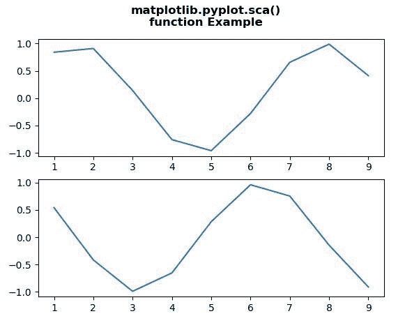
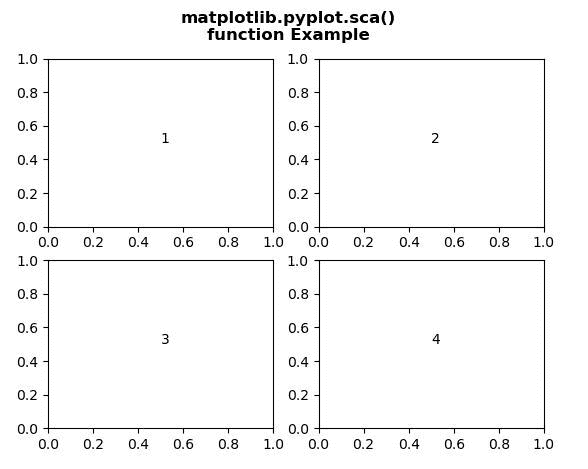

# Matplotlib.pyplot.sca()用 Python

表示

> 哎哎哎:# t0]https://www . geeksforgeeks . org/matplot lib-pyplot-SCA-in-python/

[**Matplotlib**](https://www.geeksforgeeks.org/python-introduction-matplotlib/) 是 Python 中的一个库，是 NumPy 库的数值-数学扩展。 [**Pyplot**](https://www.geeksforgeeks.org/pyplot-in-matplotlib/) 是一个基于状态的 Matplotlib 模块接口，它提供了一个类似 MATLAB 的接口。Pyplot 中可以使用的各种图有线图、等高线图、直方图、散点图、三维图等。

## matplotlib.pyplot.sca()方法

matplotlib 库的 **sca()方法** pyplot 模块用于将当前轴设置为 a。

> **语法:** matplotlib.pyplot.sca(self，a)
> 
> **参数:**该方法接受下面讨论的以下参数:
> 
> *   **a:** 此参数为当前坐标轴。
> 
> **返回:**该方法返回坐标轴。

下面的例子说明了 matplotlib.pyplot.sca()函数在 matplotlib.figure 中的作用:

**例 1:**

```py
# Implementation of matplotlib function
import matplotlib.pyplot as plt
from scipy import sin, cos

fig, ax = plt.subplots(2, 1)
x = [1, 2, 3, 4, 5, 6, 7, 8, 9]

y1 = sin(x)
y2 = cos(x)

plt.sca(ax[0])
plt.plot(x, y1)

plt.sca(ax[1])
plt.plot(x, y2)

fig.suptitle("""matplotlib.pyplot.sca()
function Example\n\n""", fontweight ="bold") 

plt.show() 
```

**输出:**


**例 2:**

```py
# Implementation of matplotlib function
import matplotlib.pyplot as plt

fig, axes = plt.subplots(2, 2) 
axes = axes.flatten() 

for i in range(4):
    plt.sca(axes[i])
    axes[i].text(0.5, 0.5, i + 1)

fig.suptitle("""matplotlib.pyplot.sca()
function Example\n\n""", fontweight ="bold") 

plt.show()  
```

**输出:**
