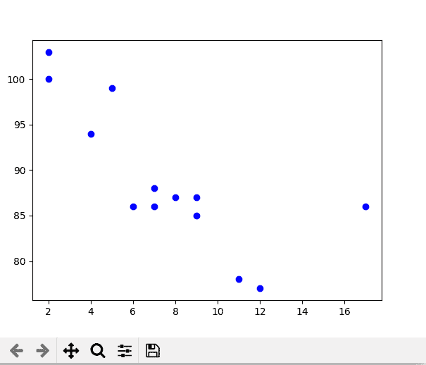

# matplotlib.pyplot.scatter()用 Python

表示

> 原文:[https://www . geeksforgeeks . org/matplotlib-pyplot-python 中的散点/](https://www.geeksforgeeks.org/matplotlib-pyplot-scatter-in-python/)

**Matplotlib** 是一个全面的库，用于在 Python 中创建静态、动画和交互式可视化。它用于在 Python 中绘制各种图，如散点图、条形图、饼图、线图、直方图、三维图等。我们将从 [matplotlib](https://www.geeksforgeeks.org/python-matplotlib-an-overview/) 库中了解散点图。
**注:**更多信息请参考[Python Matplotlib–概述](http://geeksforgeeks.org/python-matplotlib-an-overview/)

## matplotlib.pyplot.scatter()

散点图用于观察变量之间的关系，并使用点来表示变量之间的关系。matplotlib 库中的**散点图()**方法用于绘制散点图。散点图广泛用于表示变量之间的关系以及一个变量的变化如何影响另一个变量。
**语法**
散点()方法语法如下:

> matplotlib.pyplot .散点图(x_axis_data，y_axis_data，s=None，c=None，marker=None，cmap=None，vmin=None，vmax=None，alpha=None，线宽=None，edgecolors=None)

散点()方法采用以下参数:

*   **x 轴数据-** 包含 x 轴数据的数组
*   **y 轴数据-** 包含 y 轴数据的数组
*   **s-** 标记大小(可以是标量或大小等于 x 或 y 的数组)
*   **c-** 标记颜色序列的颜色
*   标记-标记样式
*   **cmap-** cmap 名称
*   **线宽-** 标记边框的宽度
*   **边缘颜色-** 标记边框颜色
*   **α-**混合值，介于 0(透明)和 1(不透明)之间

除了 x_axis_data 和 y_axis_data 之外，所有其他参数都是可选的，它们的默认值是“无”。以下是带有各种参数的散点图示例。
**例 1:** 这是散点图最基本的例子。

## 蟒蛇 3

```py
import matplotlib.pyplot as plt

x =[5, 7, 8, 7, 2, 17, 2, 9,
    4, 11, 12, 9, 6]

y =[99, 86, 87, 88, 100, 86,
    103, 87, 94, 78, 77, 85, 86]

plt.scatter(x, y, c ="blue")

# To show the plot
plt.show()
```

**输出**T2】



**示例 2:** 两个数据集不同形状和颜色的散点图。

## 蟒蛇 3

```py
import matplotlib.pyplot as plt

# dataset-1
x1 = [89, 43, 36, 36, 95, 10,
      66, 34, 38, 20]

y1 = [21, 46, 3, 35, 67, 95,
      53, 72, 58, 10]

# dataset2
x2 = [26, 29, 48, 64, 6, 5,
      36, 66, 72, 40]

y2 = [26, 34, 90, 33, 38,
      20, 56, 2, 47, 15]

plt.scatter(x1, y1, c ="pink",
            linewidths = 2,
            marker ="s",
            edgecolor ="green",
            s = 50)

plt.scatter(x2, y2, c ="yellow",
            linewidths = 2,
            marker ="^",
            edgecolor ="red",
            s = 200)

plt.xlabel("X-axis")
plt.ylabel("Y-axis")
plt.show()
```

**输出**T2】

