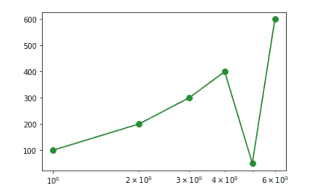
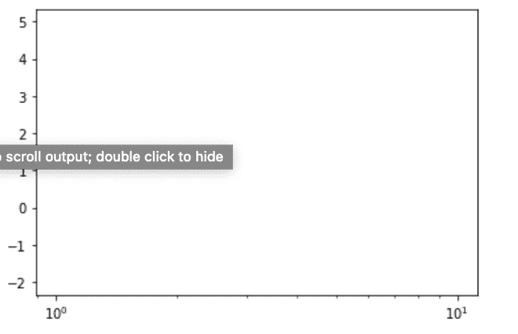
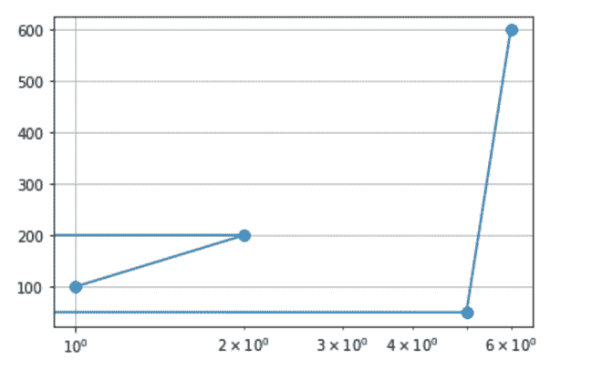
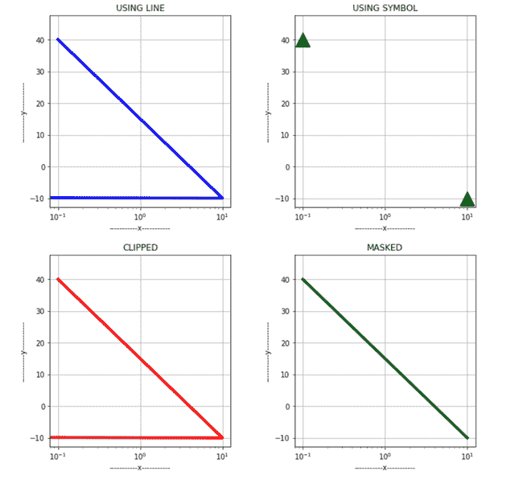
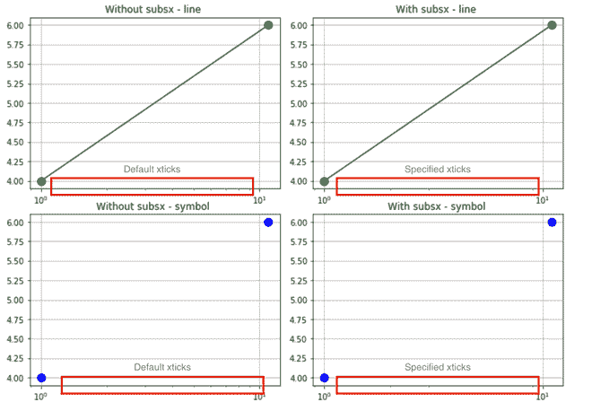

# Matplotlib.pyplot.semilogx()用 Python

表示

> 哎哎哎:# t0]https://www . geeksforgeeks . org/matplot lib-pyplot-semilogx-in-python/

[**数据可视化**](https://www.geeksforgeeks.org/data-visualization-different-charts-python/) 是分析数据的重要部分，因为绘制图表有助于更好地洞察和理解问题。[**matplotlib . pyplot**](https://www.geeksforgeeks.org/python-introduction-matplotlib/)是做同样事情最常用的库之一。它有助于创建有吸引力的数据，并且非常易于使用。

## matplotlib . pyplot . semi ogx()函数

此功能用于以 x 轴转换为日志格式的方式可视化数据。当其中一个参数非常大，因此最初以紧凑的方式存储时，此功能特别有用。它支持[](https://www.geeksforgeeks.org/matplotlib-pyplot-plot-function-in-python/)**和[**matplotlib . axes . axes . set _ xscale()**的所有关键字参数。](https://www.geeksforgeeks.org/matplotlib-axes-axes-set_xscale-in-python/)附加参数为 **basex** 、**subxx**和**nonpsx。****

> ****语法:**matplotlib . pyplot . semilogx(x，y，)**
> 
>  ****参数:**一些重要的参数有:
> 
> *   **X:**X 轴上的值。
> *   **Y:**Y 轴上的值。
> *   **颜色:**(可选)线条或符号的颜色。
> *   **线宽:**(可选)线宽。
> *   **标签:**(可选)指定图形的标签
> *   **basex:** (可选)x 对数的底数。标量应该大于 1。
> *   **子轴:**(可选)次轴的位置；无默认为自动瑞银，这取决于图中的十年数。
> *   **nonpsx:**(可选)x 中的非正值可以被屏蔽为无效，或者被裁剪为非常小的正数。
> *   **标记:**(可选)将点显示为上述符号。
> *   **标记化:**(可选)更改所有标记的大小。
> 
> **返回:**x 轴上的对数比例图。**

****例 1:** 简单图。**

## **蟒蛇 3**

```
#import required library
import matplotlib.pyplot as plt

# defining the values
# at X and Y axis
x = [1, 2, 3,
     4, 5, 6]
y = [100, 200, 300,
     400, 500, 600]

# plotting the given graph
plt.semilogx(x, y, marker = ".",
             markersize = 15,
             color = "green")
# plot with grid
plt.grid(True)

# show the plot
plt.show()
```

****输出:****

**

简单的情节** 

****例 2:在 X 轴和 Y 轴使用负值和零值。****

**由于 X 轴包含在对数函数中，因此很明显，负值或正值将被截断或屏蔽，如 nonposx 参数所指定的。默认情况下，负值或零值会被截断。**

## **蟒蛇 3**

```
# importing required libraries
import matplotlib.pyplot as plt

# defining the values
# at X and Y axis
x = [-1, -2, 0]
y = [5, -2, 0]

# plotting the given graph
plt.semilogx(x,y)

# show the plot
plt.show()
```

****输出:****

**

没有绘制任何值，因为所有值都是负 x 值** 

****示例 3:** 如果使用**符号**，则简单地移除负值或零值，仅绘制正值。**

## **蟒蛇 3**

```
#import required library
import matplotlib.pyplot as plt

# defining the values at X and Y axis
x = [-10, 30, 0, 20,
     -50, 25, 29, -3
     , 23, 25, 29, 31]
y = [-3, 30, -10, 0,
     -40, 3, 8, 0,
     -24, 40, 43, 25]

# plotting the graph
plt.semilogx(x,y,'g^', color = "red")

# plot with grid
plt.grid(True)

# set y axis label
plt.ylabel('---y---')

# set x axis label
plt.xlabel('---x---')

# show the plot
plt.show()
```

****输出:****

**

仅绘制正值** 

****示例 4:** 如果使用了**线**，则值会被截断。**

## **蟒蛇 3**

```
#import required library
import matplotlib.pyplot as plt

# defining the values
# at X and Y axis
x = [1, 2, -3,
     -4, 5, 6]
y = [100, 200, 300,
     400, 500, 600]

# plotting the graph
plt.semilogx(x, y, marker = ".",
             markersize = 15)

# plot with grid
plt.grid(True)

# show the plot
plt.show()
```

****输出:****

**

对应于-3 和-4 的值被剪裁** 

****例 5:** 下面的支线剧情会让区别更加明显。**

## **蟒蛇 3**

```
#import required library
import matplotlib.pyplot as plt

# specifying the subplot
fig, axes = plt.subplots(nrows = 4,
                         ncols = 4,
                         figsize = (10,10))

# Or equivalently, 
# "plt.tight_layout()"
fig.tight_layout()

# subplot 1
plt.subplot(2, 2, 1)
x2 = [0.1, 10, -30]
y2 = [40, -10, 45]

# plotting the given graph
plt.semilogx(x2, y2,
             color = "blue",
             linewidth = 4)
# set the title
plt.title("USING LINE")

# set y axis label
plt.ylabel('-----------y-----------')

# set x axis label
plt.xlabel('-----------x-----------')

# plot with grid
plt.grid(True)

# subplot 2
plt.subplot(2, 2, 2)
x2 = [0.1, 10, -30]
y2 = [40, -10, 45]

# plotting the given graph
plt.semilogx(x2, y2,
             'g^',
             markersize = 20,
             color = "black")
# set the title
plt.title("USING SYMBOL")

# set y axis label
plt.ylabel('-----------y-----------')

# set x axis label
plt.xlabel('-----------x-----------')

# plot with grid
plt.grid(True)

# subplot 3
plt.subplot(2, 2, 3)
x2 = [0.1, 10, -30]
y2 = [40, -10 ,45]

# plotting the given graph
plt.semilogx(x2, y2,
             nonposx = "clip",
             color = "red",
             linewidth = 4)
# set the title
plt.title("CLIPPED")

# set y axis label
plt.ylabel('-----------y-----------')

# set x axis label
plt.xlabel('-----------x-----------')

# plot with grid
plt.grid(True)

# subplot 4
plt.subplot(2, 2, 4)
x2 = [0.1, 10, -30]
y2 = [40, -10, 45]

# plotting the given graph
plt.semilogx(x2, y2,
             nonposx = "mask",
             color = "green",
             linewidth = 4)

# set the title
plt.title("MASKED")

# set y axis label
plt.ylabel('-----------y-----------')

# set x axis label
plt.xlabel('-----------x-----------')

# plot with grid
plt.grid(True)

# show the plot
plt.show()
```

****输出:****

**

所有情节之间的差异。** 

****示例 6:使用 nonposx 参数。****

**屏蔽会删除无效值，而剪裁会将它们设置为一个非常低的可能值。**

****削波**和**遮蔽**的区别在下面的剧情中会更加清晰。**

## **蟒蛇 3**

```
# import required library
import matplotlib.pyplot as plt

fig, axes = plt.subplots(nrows = 1,
                         ncols = 2,
                         figsize = (15,9))
# Or equivalently,  "plt.tight_layout()"
fig.tight_layout()

# subplot 1
x1 = [-1, 2, 0,
      -3, 5, 9,
      10, -3, -8,
      15, 12, 0.1,0.9]

y1 = [5, -2, 0,
      10, 20, 30,
      25, 28, 16,
      25, 28, 3, 5]

plt.subplot(1,2,1)

# plotting the graph
plt.semilogx(x1, y1,
             marker = ".",
             markersize = 20,
             nonposx = "clip",
             color = "green" )

# set the y-axis label
plt.ylabel('---y---')

# set the x-axis label
plt.xlabel('---x---')

# set the title
plt.title('CLIP')

# plot with grid
plt.grid(True)

# subplot 2
x2 = [-1, 2, 0,
      -3, 5, 9,
      10, -3, -8,
      15, 12, 0.1, 0.9]

y2 = [5, -2, 0,
      10, 20, 30,
      25, 28, 16,
      25, 28, 3, 5]

plt.subplot(1,2,2)
plt.semilogx(x2, y2,
             nonposx = "mask",
             color ="green",
             linewidth = 4,
             marker = ".",
             markersize = 20)

# set the title
plt.title('MASK')

# set the y-axis label
plt.ylabel('---y---')

# set the x-axis label
plt.xlabel('---x---')

# plot with grid
plt.grid(True)

# show the plot
plt.show()
```

****输出:****

**

遮罩和剪辑之间的区别** 

****例 7:改变基数。****

**基数可根据方便设置，应大于 1 以满足对数性质。**

## **蟒蛇 3**

```
# importing the required libraries
import numpy as np
import matplotlib.pyplot as plt

# function that will
# output the values
def function(t):
    return np.exp(-t)*np.sin(2*np.pi.t)/2 + np.tan(t)

# define the x-axis values
t1 = np.arange(-0.01, 1.0, 0.08)
t2 = np.arange(0.0, 5.0, 0.02)

# subplot 1
plt.figure(figsize = (10,10))
plt.subplot(211)

# plot the graph
plt.semilogx(t1, f(t1),
             'bo', t2, f(t2),
             'k', color = "blue",
             basex = 3)
# set the title
plt.title("BASE: 3")

# subplot 2
plt.subplot(212)

# plot the graph
plt.semilogx(t2, np.cos(2*np.pi*t2),
             'r--', color = "brown",
             linewidth = 2, basex = 4)

# set the title
plt.title("BASE: 4")

# show the plot
plt.show()
```

****输出:****

**

改变基数** 

****例 8:使用 subsx 参数。****

**指定 X 轴上的次要 X 轴。默认情况下，这取决于情节中的十年数。**

## **蟒蛇 3**

```
# import required library
import matplotlib.pyplot as plt

fig, axes = plt.subplots(nrows = 2,
                         ncols = 2,
                         figsize = (10,7))

# Or equivalently,  "plt.tight_layout()"
fig.tight_layout()

# subplot 1
plt.subplot(2, 2, 1)
x = [1, 11]
y = [4, 6]

# plot the graph
plt.semilogx(x, y, marker = ".",
             markersize = 20,
             color = "green")

# set the title
plt.title("Without subsx - line ")

# plot with grid
plt.grid(True)

# subplot 2
plt.subplot(2, 2, 2)
x = [1, 11]
y = [4, 6]

# plot the graph
plt.semilogx(x, y, subsx = [2, 3, 9, 10],
             marker = ".", markersize = 20,
             color = "green")

# set the title
plt.title("With subsx - line ")
plt.grid(True)

# subplot 3
plt.subplot(2, 2, 3)
x = [1, 11]
y = [4, 6]
plt.semilogx(x, y, 'g^', marker = ".",
             markersize = 20,
             color = "blue")
plt.title("Without subsx - symbol ")
plt.grid(True)

# subplot 4
plt.subplot(2, 2, 4)
x = [1, 11]
y = [4, 6]
plt.semilogx(x, y, 'g^', subsx=[2, 3, 9, 10],
             marker = ".", markersize = 20,
             color = "blue")
plt.title("With subsx - symbol ")
plt.grid(True)

plt.show()
```

****输出**:**

**

SUBSX 参数** 

****总结:****

*   **X 轴以对数方式绘制，可以通过定义 **basex** 属性来指定基数。基数应该大于 1**
*   **如果绘制了直线，则缺省情况下会裁剪负值或零值。**
*   ****蒙版**属性删除负值/零值，而**剪辑**属性将其设置为非常低的正值。**
*   **如果使用符号，则默认情况下会屏蔽负/零。**
*   ****semi ogx**遵循 **plot()** 和**matplotlib . axes . axes . set _ xscale()的所有参数。****
*   ****子 x** 参数定义次要 XT 信号。**