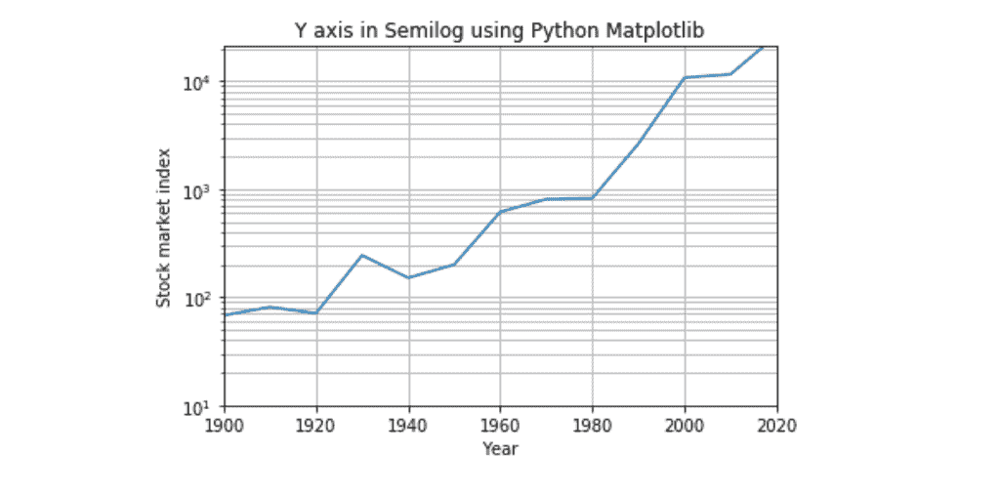
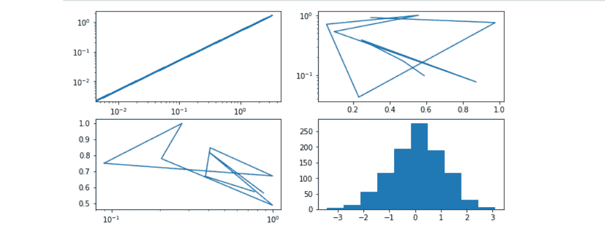
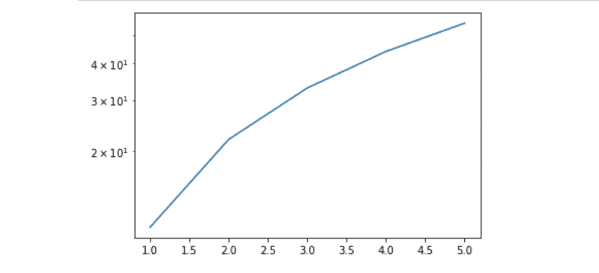

# Python 中的 matplotlib . pyplot . semicology()函数

> 原文:[https://www . geeksforgeeks . org/matplotlib-pyplot-semicology-python 中的函数/](https://www.geeksforgeeks.org/matplotlib-pyplot-semilogy-function-in-python/)

[Matplotlib](https://www.geeksforgeeks.org/graph-plotting-in-python-set-1/) 是最流行的 Python 就绪包，用于可视化数据。我们使用 matplotlib 绘制高质量的图表、图形和图形。

## matplotlib . pyplot . semicology()函数

matplotlib 库 pyplot 模块中的**matplotlib . py plot . semicology()函数**用于在 y 轴上进行对数缩放的绘图。

> **语法:**matplotlib . pyplot . semilogy(* args，**kwargs)
> 
> **参数:**该方法接受以下描述的参数:
> 
> *   **basey:** 此参数为 y 对数的底数，可选，默认值为 *10* 。
> *   **subsy:** 此参数是次要 y 刻度的位置序列，是可选的。
> *   **nonpsy:**此参数是 y 中的非正值，可被屏蔽为无效，或被裁剪为非常小的正数。
> 
> **返回:**这将返回以下内容:
> 
> *   **线:**这将返回表示打印数据的线 2D 对象列表..

以下示例说明了 matplotlib . pyplot . semicology()函数在 matplotlib.pyplot:
**示例#1:**

```
# importing necessary libraries
import matplotlib.pyplot as plot
import numpy as np

# Year data for the semilogy plot
years = [1900, 1910, 1920, 1930, 1940, 1950,
         1960, 1970, 1980, 1990, 2000, 2010, 
         2017]

# index data - taken at end of every
# decade - for the semilogy plot
indexValues = [68, 81, 71, 244, 151, 200, 615,
               809, 824, 2633, 10787, 11577,
               20656]

# Display grid
plot.grid(True, which ="both")

# Linear X axis, Logarithmic Y axis
plot.semilogy(years, indexValues )

plot.ylim([10, 21000])

plot.xlim([1900, 2020])

# Provide the title for the semilogy plot
plot.title('Y axis in Semilogy using Python Matplotlib')

# Give x axis label for the semilogy plot
plot.xlabel('Year')

# Give y axis label for the semilogy plot
plot.ylabel('Stock market index')

# Display the semilogy plot
plot.show()
```

**输出:**


**例 2:**

```
# importing necessary libraries
import matplotlib.pyplot as plt
import numpy as np

fig, ax = plt.subplots(nrows = 2,
                      ncols = 2,
                      figsize =(10, 5))
x = np.random.randn(1000)

# Plot to each different index
ax[0, 0].loglog(x, x / 2);
ax[0, 1].semilogy(np.random.random(10), np.random.random(10));
ax[1, 0].semilogx(np.random.random(10), np.random.random(10));
ax[1, 1].hist(np.random.randn(1000));
```

**输出:**


**示例#3:**

```
# importing necessary libraries
import matplotlib.pyplot as plt
import numpy as np

x = [1, 2, 3, 4, 5]
y = [11, 22, 33, 44, 55]

fig, ax = plt.subplots()
ax.semilogy(x, y);
```

**输出:**
