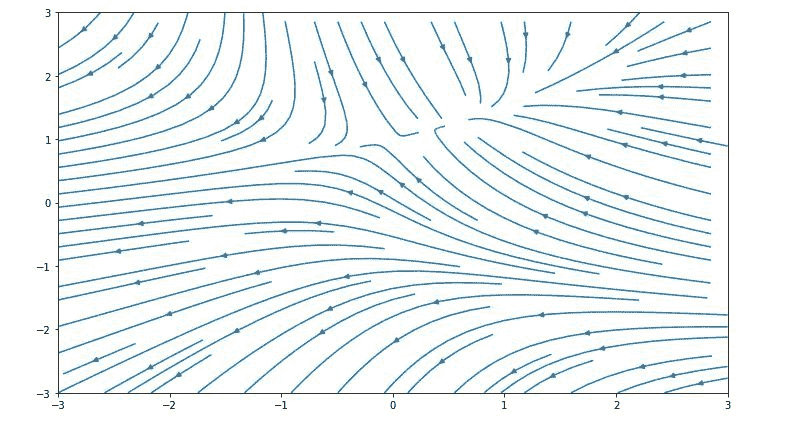
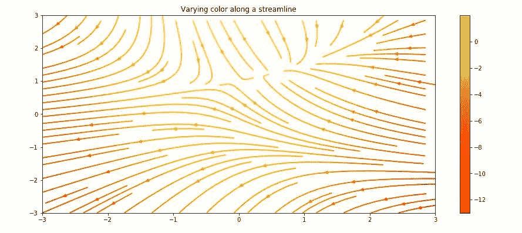
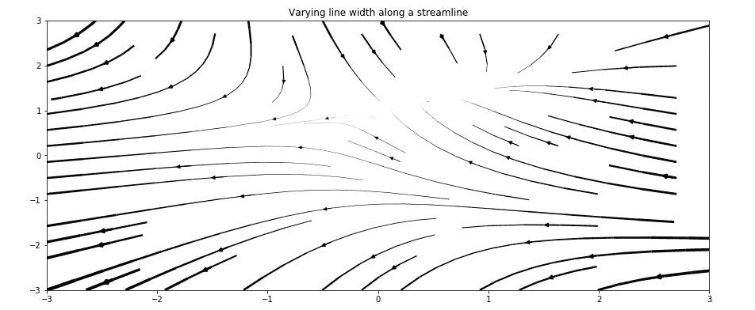
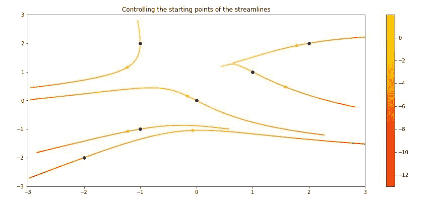
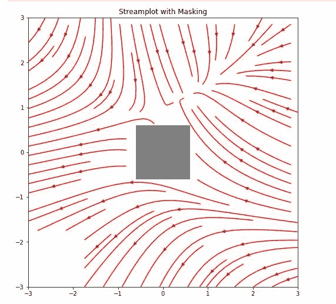

# matplotlib . pyplot . streamplot()用 Python

表示

> 哎哎哎:# t0]https://www . geeksforgeeks . org/matplot lib-pyplot-stream plot-in-python/

流图基本上是 2D 图的一种，主要被物理学家用来显示流体流动和 2D 场梯度。在 Matplotlib 中创建流图的基本功能是:

```
ax.streamplot(x_grid, y_grid, x_vec, y_vec, density=spacing)
```

这里 *x_grid* 和 *y_grid* 是 x 和 y 点的数组。 *x_vec* 和 *y_vec* 代表网格上每个点的流速。属性#密度=间距#指定将流线绘制在一起的距离。

### 创建流图–

让我们从创建一个包含 10 乘 10 网格上的流线的简单流图开始。所有的流线都是平行的，并且指向右边。下面的代码创建了包含指向右侧的水平平行线的流图:

## 蟒蛇 3

```
# Import libraries
import numpy as np
import matplotlib.pyplot as plt

# Creating dataset
x = np.arange(0, 10)
y = np.arange(0, 10)

# Creating grids
X, Y = np.meshgrid(x, y)

# x-component to the right
u = np.ones((10, 10))

# y-component zero
v = np.zeros((10, 10))

fig = plt.figure(figsize = (12, 7))

# Plotting stream plot
plt.streamplot(X, Y, u, v, density = 0.5)

# show plot
plt.show()
```

**输出:**


这里，x 和 y 是均匀间隔网格上的 1D 阵列，u 和 v 是速度为 x 和 y 的 2D 阵列，其中行数应与 y 的长度相匹配，而列数应与 x 相匹配，密度是控制流线紧密度的浮点值。

### 自定义流图–

借助 streamplot()函数，我们可以根据定义的 2D 矢量场创建和自定义显示场线的图。streamplot()函数中有许多属性可用于修改绘图。

## 蟒蛇 3

```
# Import libraries
import numpy as np
import matplotlib.pyplot as plt

# Creating data set
w = 3
Y, X = np.mgrid[-w:w:100j, -w:w:100j]
U = -1 - X**2 + Y
V = 1 + X - Y**2
speed = np.sqrt(U**2 + V**2)

# Creating plot
fig = plt.figure(figsize = (12, 7))
plt.streamplot(X, Y, U, V, density = 1)

# show plot
plt.show()
```

**输出:**



**上图的部分定制如下:**
**改变流线密度–**

## 蟒蛇 3

```
import numpy as np
import matplotlib.pyplot as plt
import matplotlib.gridspec as gridspec

# Creating dataset
w = 3
Y, X = np.mgrid[-w:w:100j, -w:w:100j]
U = -1 - X**2 + Y
V = 1 + X - Y**2
speed = np.sqrt(U**2 + V**2)

fig = plt.figure(figsize =(24, 20))
gs = gridspec.GridSpec(nrows = 3, ncols = 2,
                       height_ratios =[1, 1, 2])

# Varying the density along a
# streamline
ax = fig.add_subplot(gs[0, 0])
ax.streamplot(X, Y, U, V,
              density =[0.4, 0.8])

ax.set_title('Varying the density along a streamline')

# show plot
plt.tight_layout()
plt.show()
```

**输出:**


**沿着流线改变颜色–**

## 蟒蛇 3

```
import numpy as np
import matplotlib.pyplot as plt
import matplotlib.gridspec as gridspec

# Creating dataset
w = 3
Y, X = np.mgrid[-w:w:100j, -w:w:100j]
U = -1 - X**2 + Y
V = 1 + X - Y**2
speed = np.sqrt(U**2 + V**2)

fig = plt.figure(figsize =(24, 20))
gs = gridspec.GridSpec(nrows = 3, ncols = 2,
                       height_ratios =[1, 1, 2])

# Varying color along a streamline
ax = fig.add_subplot(gs[0, 1])
strm = ax.streamplot(X, Y, U, V, color = U,
                     linewidth = 2, cmap ='autumn')
fig.colorbar(strm.lines)
ax.set_title('Varying the color along a streamline.')

# show plot
plt.tight_layout()
plt.show()   
```

**输出:**



**沿着流线改变线宽–**

## 蟒蛇 3

```
import numpy as np
import matplotlib.pyplot as plt
import matplotlib.gridspec as gridspec

# Creating dataset
w = 3
Y, X = np.mgrid[-w:w:100j, -w:w:100j]
U = -1 - X**2 + Y
V = 1 + X - Y**2
speed = np.sqrt(U**2 + V**2)

fig = plt.figure(figsize =(24, 20))
gs = gridspec.GridSpec(nrows = 3, ncols = 2,
                       height_ratios =[1, 1, 2])

# Varying line width along a streamline
ax = fig.add_subplot(gs[1, 0])
lw = 5 * speed / speed.max()
ax.streamplot(X, Y, U, V, density = 0.6,
              color ='k', linewidth = lw)

ax.set_title('Varying line width along a streamline')

# show plot
plt.tight_layout()
plt.show()
```

**输出:**



**控制流线起点–**

## 蟒蛇 3

```
import numpy as np
import matplotlib.pyplot as plt
import matplotlib.gridspec as gridspec

# Creating dataset
w = 3
Y, X = np.mgrid[-w:w:100j, -w:w:100j]
U = -1 - X**2 + Y
V = 1 + X - Y**2
speed = np.sqrt(U**2 + V**2)

fig = plt.figure(figsize =(24, 20))
gs = gridspec.GridSpec(nrows = 3, ncols = 2,
                       height_ratios =[1, 1, 2])

# Controlling the starting points
# of the streamlines
seek_points = np.array([[-2, -1, 0, 1, 2, -1],
                        [-2, -1,  0, 1, 2, 2]])

ax = fig.add_subplot(gs[1, 1])
strm = ax.streamplot(X, Y, U, V, color = U,
                     linewidth = 2,
                     cmap ='autumn',
                     start_points = seek_points.T)

fig.colorbar(strm.lines)
ax.set_title('Controlling the starting\
points of the streamlines')

# Displaying the starting points
# with blue symbols.
ax.plot(seek_points[0], seek_points[1], 'bo')
ax.set(xlim =(-w, w), ylim =(-w, w))

# show plot
plt.tight_layout()
plt.show()
```

**输出:**



**跳过掩蔽区域和 NaN 值的流线–**

## 蟒蛇 3

```
# Import libraries
import numpy as np
import matplotlib.pyplot as plt
import matplotlib.gridspec as gridspec

# Creating dataset
w = 3
Y, X = np.mgrid[-w:w:100j, -w:w:100j]
U = -1 - X**2 + Y
V = 1 + X - Y**2
speed = np.sqrt(U**2 + V**2)

fig = plt.figure(figsize =(20, 16))
gs = gridspec.GridSpec(nrows = 3, ncols = 2, height_ratios =[1, 1, 2])

# Create a mask
mask = np.zeros(U.shape, dtype = bool)
mask[40:60, 40:60] = True
U[:20, :20] = np.nan
U = np.ma.array(U, mask = mask)

ax = fig.add_subplot(gs[2:, :])
ax.streamplot(X, Y, U, V, color ='r')
ax.set_title('Streamplot with Masking')

ax.imshow(~mask, extent =(-w, w, -w, w), alpha = 0.5,
          interpolation ='nearest', cmap ='gray', aspect ='auto')
ax.set_aspect('equal')

# show plot
plt.tight_layout()
plt.show()
```

**输出:**



**示例:**
流图演示两点电荷产生的电场。表面上任意点的电场取决于两个电荷之间的位置和距离:

## 蟒蛇 3

```
import sys
import numpy as np
import matplotlib.pyplot as plt
from matplotlib.patches import Circle

# Function to determine electric field
def E(q, r0, x, y):
    den = np.hypot(x-r0[0], y-r0[1])**3
    return q * (x - r0[0]) / den, q * (y - r0[1]) / den

# Grid of x, y points
nx, ny = 64, 64
x = np.linspace(-2, 2, nx)
y = np.linspace(-2, 2, ny)
X, Y = np.meshgrid(x, y)

# Create a multipole with nq charges of
# alternating sign, equally spaced
# on the unit circle.

# Increase the power with increase in charge
nq = 2**1
charges = []
for i in range(nq):
    q = i % 2 * 2 - 1
    charges.append((q, (np.cos(2 * np.pi * i / nq),
                        np.sin(2 * np.pi * i / nq))))

# Electric field vector, E =(Ex, Ey)
# as separate components
Ex, Ey = np.zeros((ny, nx)), np.zeros((ny, nx))

for charge in charges:
    ex, ey = E(*charge, x = X, y = Y)
    Ex += ex
    Ey += ey

fig = plt.figure(figsize =(18, 8))
ax = fig.add_subplot(111)

# Plotting the streamlines with
# proper color and arrow
color = 2 * np.log(np.hypot(Ex, Ey))
ax.streamplot(x, y, Ex, Ey, color = color,
              linewidth = 1, cmap = plt.cm.inferno,
              density = 2, arrowstyle ='->',
              arrowsize = 1.5)

# Add filled circles for the charges
# themselves
charge_colors = {True: '#AA0000',
                 False: '#0000AA'}

for q, pos in charges:
    ax.add_artist(Circle(pos, 0.05,
                         color = charge_colors[q>0]))

ax.set_xlabel('X-axis')
ax.set_ylabel('X-axis')
ax.set_xlim(-2, 2)
ax.set_ylim(-2, 2)
ax.set_aspect('equal')

plt.show()
```

**输出:**

