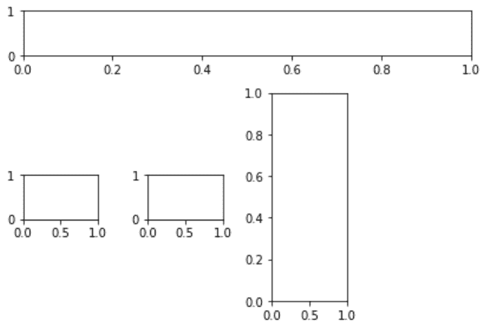

# python 中的 matplotlib . pyplot . sub lot 2 grid()

> 原文:[https://www . geeksforgeeks . org/matplotlib-pyplot-sub lot 2 grid-in-python/](https://www.geeksforgeeks.org/matplotlib-pyplot-subplot2grid-in-python/)

[Matplotlib](http://geeksforgeeks.org/python-matplotlib-an-overview/) 是 Python 中一个惊人的可视化库，用于数组的 2D 图。Matplotlib 是一个多平台数据可视化库，构建在 NumPy 数组上，旨在与更广泛的 SciPy 堆栈一起工作。

## Matplotlib.pyplot.subplot2grid()

Matplotlib . pyplot . sub lot 2 grid()函数在网格内的指定位置创建轴对象时提供了额外的灵活性。它还有助于将 axes 对象跨多个行或列。更简单地说，这个函数用于在同一个图中创建多个图表。它是一个子图形布局管理器。

> **语法:**PLT . sublot 2 grid(形状、位置、行跨度、列跨度)
> 
> **参数:**
> 
> *   **形状:**顾名思义，它用于定义要在图形中绘制的网格的形状。这是一个必需的参数，通常作为两个数字的列表或元组传递，这两个数字负责网格的布局，第一个数字是行数，第二个数字是列数。
> *   **位置(loc):** 这是该函数采用的第二个强制参数。与 shape 参数类似，它也是一个必需的参数，通常作为两个数字的列表或元组传递。它用于指定放置子图的行号和列号。还需要注意的是，索引从 0 开始。因此(0，0)将是网格的第一行和第一列中的单元格。
> *   **rowspan:** 一旦设置了网格布局，并且使用 location(loc)决定了起始索引，就可以使用此参数扩展选择以占据更多行。这是一个可选参数，默认值为 1。
> *   **colspan:** 与 rowspan 类似，它用于扩展选择以占据更多列。它也是一个可选参数，默认值为 1。

**例 1:**

```py
import matplotlib.pyplot as plt

fig = plt.figure()

axes1 = plt.subplot2grid((4, 4), (0, 0),
                         colspan = 4)

axes2 = plt.subplot2grid((4, 4), (1, 0),
                         colspan = 3)

axes3 = plt.subplot2grid((4, 4), (1, 2), 
                         rowspan = 3)

axes4 = plt.subplot2grid((4, 4), (2, 0))
axes5 = plt.subplot2grid((4, 4), (2, 1))

fig.tight_layout()
```

**输出:**


**例 2:**

```py
import random
import matplotlib.pyplot as plt
from matplotlib import style

style.use('fivethirtyeight')

fig = plt.figure()

# helper function to plot the lines
def helper():

    xs = []
    ys = []

    for i in range(10):
        x = i
        y = random.randrange(10)

        xs.append(x)
        ys.append(y)
    return xs, ys

axes1 = plt.subplot2grid ((7, 1), (0, 0),
                          rowspan = 2, 
                          colspan = 1)

axes2 = plt.subplot2grid ((7, 1), (2, 0),
                          rowspan = 2,
                          colspan = 1)

axes3 = plt.subplot2grid ((7, 1), (4, 0), 
                          rowspan = 2, 
                          colspan = 1)

x, y = helper()
axes1.plot(x, y)

x, y = helper()
axes2.plot(x, y)

x, y = helper()
axes3.plot(x, y)
```

**输出:**
