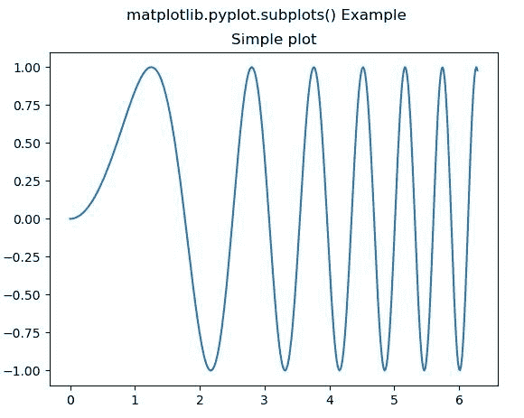
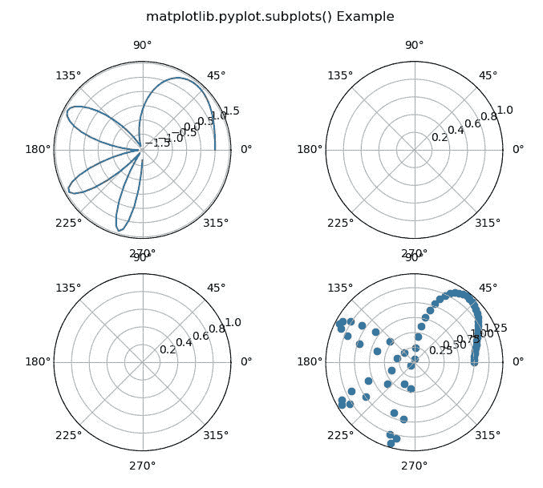

# matplotlib . pyplot . subplot()用 Python

表示

> 哎哎哎:# t0]https://www . geeksforgeeks . org/matplot lib-pyplot-subplot-in-python/

**[Matplotlib](https://www.geeksforgeeks.org/python-introduction-matplotlib/)** 是 Python 中的一个库，是 NumPy 库的数值-数学扩展。 **[Pyplot](https://www.geeksforgeeks.org/pyplot-in-matplotlib/)** 是一个基于状态的接口到 **Matplotlib** 模块，它提供了一个类似于 MATLAB 的接口。

**样本代码**

```py
# sample code
import matplotlib.pyplot as plt 

plt.plot([1, 2, 3, 4], [16, 4, 1, 8]) 
plt.show() 
```

**输出:**


## matplotlib . pyplot . subplot()函数

matplotlib 库 pyplot 模块中的**子图()函数**用于创建一个图形和一组子图。

> **语法:**matplotlib . pyplot . subplot(nrows = 1，ncols=1，sharex=False，sharey=False，挤压=True，subplot_kw=None，gridspec_kw=None，**fig_kw)
> 
> **参数:**该方法接受以下描述的参数:
> 
> *   **nrow，ncol:**这些参数是子图网格的行数/列数。
> *   **sharex，sharey :** 这些参数控制 x (sharex)或 y (sharey)轴之间的属性共享。
> *   **挤压:**该参数为可选参数，包含布尔值，默认值为真。
> *   **num:** 此参数是 pyplot.figure 关键字，用于设置图形编号或标签。
> *   **子剧情 _kwd:** 此参数是带有传递给 add _ 子剧情调用的关键字的 dict，用于创建每个子剧情。
> *   **gridspec_kw:** 此参数是带有传递给 gridspec 构造函数的关键字的 dict，该构造函数用于创建放置子情节的网格。
> 
> **返回:**该方法返回以下值。
> 
> *   **图:**此方法返回图布局。
> *   **斧头:**此方法返回斧头。轴对象或轴对象数组。

下面的例子说明了 matplotlib.pyplot . subplot()函数在 matplotlib . pyplot 中的作用:

**示例#1:**

```py
# Implementation of matplotlib function
import numpy as np
import matplotlib.pyplot as plt

# First create some toy data:
x = np.linspace(0, 2 * np.pi, 400)
y = np.sin(x**2)

fig, ax = plt.subplots()
ax.plot(x, y)
ax.set_title('Simple plot')

fig.suptitle('matplotlib.pyplot.subplots() Example')
plt.show()
```

**输出:**


**例 2:**

```py
# Implementation of matplotlib function
import numpy as np
import matplotlib.pyplot as plt

# First create some toy data:
x = np.linspace(0, 1.5 * np.pi, 100)
y = np.sin(x**2)+np.cos(x**2)

fig, axs = plt.subplots(2, 2,
                        subplot_kw = dict(polar = True))
axs[0, 0].plot(x, y)
axs[1, 1].scatter(x, y)

fig.suptitle('matplotlib.pyplot.subplots() Example')
plt.show()
```

**输出:**
