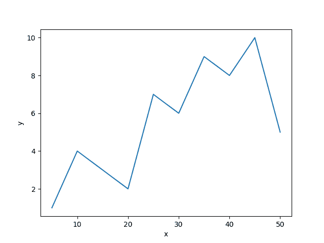
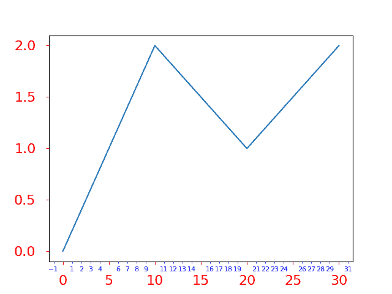

# matplotlib . pyplot . tick _ params()中的 Python

> 哎哎哎:# t0]https://www . geeksforgeeks . org/matplot lib-pyplot-tick _ params-in-python/

[Matplotlib](https://www.geeksforgeeks.org/graph-plotting-in-python-set-1/) 是 Python 中的可视化库，用于数组的 2D 图。Matplotlib 是一个多平台数据可视化库，构建在 NumPy 数组上，旨在与更广泛的 SciPy 堆栈一起工作。

## matplotlib.pyplot.tick_params()

**`matplotlib.pyplot.tick_params()`** 用于更改刻度、刻度标签和网格线的外观。

**语法:**

```py
matplotlib.pyplot.tick_params(axis='both', **kwargs)
```

**参数**:

| 参数 | 价值 | 使用 |
| --- | --- | --- |
| 轴 | {'x '，' y '，' both'}，可选 | 要将参数应用到哪个轴。默认值为“两者都有”。 |
| 重置 | 布尔，默认值：假 | 如果为真，则在处理其他关键字参数之前，将所有参数设置为默认值.. |
| 哪个 | {“大调”、“小调”、“两者兼有”} | 默认为“主要”；将参数应用于刻度。 |
| 方向 | {'in '，' out '，' inout'} | 将记号放在轴内、轴外或两者都放。 |
| 长度 | 漂浮物 | 以磅为单位的刻度长度。 |
| 宽度 | 漂浮物 | 默认为“主要”；将参数应用于刻度。 |
| 颜色 | 颜色 | 刻度颜色。 |
| 衬垫 | 漂浮物 | 刻度和标签之间的距离，以磅为单位。 | 标签大小 | 浮动或字符串 | 以磅为单位或以字符串为单位的刻度标签字体大小(例如“大”)。 | 标签色 | 颜色 | 刻度标签颜色。 | 颜色；色彩；色调 | 颜色 | 刻度颜色和标签颜色。 | 更糟 | 漂浮物 | 勾选并标记 zorder。 | 底部、顶部、左侧、右侧 | 弯曲件 | 是否绘制相应的刻度。 | labelbottom，labeltop，labelleft，labelright | 弯曲件 | 是否绘制相应的刻度标签。 | 标签旋转 | 漂浮物 | 刻度标签旋转 | 网格颜色 | 颜色 | 网格线颜色 | 网格 _alpha | 漂浮物 | 网格线的透明度:0(透明)到 1(不透明)。 | 网格 _ 线宽 | 漂浮物 | 以磅为单位的网格线宽度。 | 网格线样式 | 潜艇用热中子反应堆（submarine thermal reactor 的缩写） | 任何有效的线 2D 线型规范。 |

**示例#1:** 默认图

```py
# importing libraries
import matplotlib.pyplot as plt 

# values of x and y axes 
x = [i for i in range(5, 55, 5)]
y = [1, 4, 3, 2, 7, 6, 9, 8, 10, 5] 

plt.plot(x, y) 
plt.xlabel('x') 
plt.ylabel('y') 

plt.show() 
```

 **输出:**


**例 2:**

```py
# importing libraries
import matplotlib.pyplot as plt
from matplotlib.ticker import MultipleLocator, ScalarFormatter

fig, ax = plt.subplots()
ax.plot([0, 10, 20, 30], [0, 2, 1, 2])

ax.xaxis.set_minor_locator(MultipleLocator(1))
ax.xaxis.set_minor_formatter(ScalarFormatter())

ax.tick_params(axis ='both', which ='major', 
               labelsize = 16, pad = 12, 
               colors ='r')

ax.tick_params(axis ='both', which ='minor',
               labelsize = 8, colors ='b')

plt.show()
```

**输出:**
