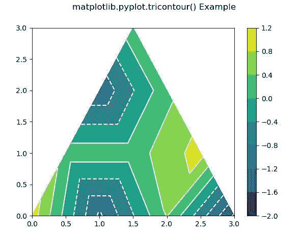
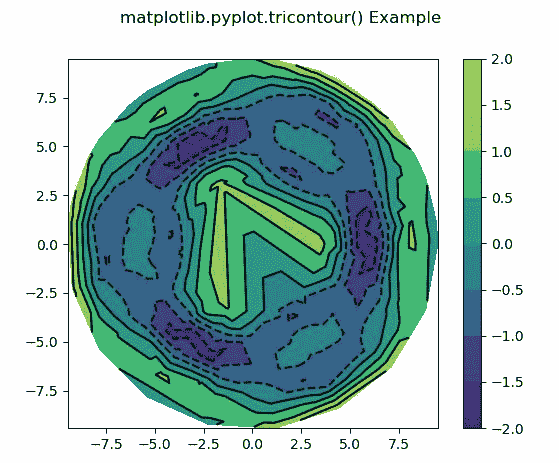

# matplotlib . pyplot . tricontour()用 Python

表示

> 哎哎哎:# t0]https://www . geeksforgeeks . org/matplot lib-pyplot-tricontour-in-python/

**[Matplotlib](https://www.geeksforgeeks.org/python-introduction-matplotlib/)** 是 Python 中的一个库，是 NumPy 库的数值-数学扩展。 **[Pyplot](https://www.geeksforgeeks.org/pyplot-in-matplotlib/)** 是一个基于状态的接口到 **Matplotlib** 模块，它提供了一个类似于 MATLAB 的接口。Pyplot 中可以使用的各种图有线图、等高线图、直方图、散点图、三维图等。

**样本代码**

```
# sample code
import matplotlib.pyplot as plt 

plt.plot([1, 2, 3, 4], [16, 4, 1, 8]) 
plt.show() 
```

**输出:**


## matplotlib.pyplot.tricontour()函数

matplotlib 库 pyplot 模块中的 **tricontour()函数**用于在非结构化三角形网格上绘制等高线。

> **语法:**
> 
> ```
> matplotlib.pyplot.tricontour(*args, **kwargs)
> 
> ```
> 
> **参数:**该方法接受以下描述的参数:
> 
> *   **x，y:** 这些参数是要绘制的数据的 x 和 y 坐标。
> *   **三角测量:**该参数是一个 matplotlib.tri.Triangulation 对象。
> *   **Z:** 此参数是要进行轮廓的值的数组，三角测量中每个点一个。
> *   ****kwargs:** 此参数是文本属性，用于控制标签的外观。
> 
> 所有剩余的`args`和`kwargs`与**相同。**
> 
> **返回:**返回包含以下内容的 2 行 2D 列表:
> 
> *   为三角形边缘绘制的线。
> *   为三角形节点绘制的标记

下面的例子说明了 matplotlib.pyplot.tricontour()函数在 matplotlib.pyplot 中的作用:

**示例#1:**

```
# Implementation of matplotlib function
import matplotlib.pyplot as plt
import matplotlib.tri as mtri
import numpy as np

# Create triangulation.
x = np.asarray([0, 1, 2, 3, 0.5,
                1.5, 2.5, 1, 2, 1.5])

y = np.asarray([0, 0, 0, 0, 1.0, 
                1.0, 1.0, 2, 2, 3.0])

triangles = [[0, 1, 4], [1, 5, 4],
             [2, 6, 5], [4, 5, 7],
             [5, 6, 8], [5, 8, 7],
             [7, 8, 9], [1, 2, 5], 
             [2, 3, 6]]

triang = mtri.Triangulation(x, y, triangles)
z = np.cos(3 * x) * np.cos(6 * y)+np.sin(6 * x)

fig, axs = plt.subplots()
t = axs.tricontourf(triang, z)
axs.tricontour(triang, z, colors ='white')
fig.colorbar(t)

fig.suptitle('matplotlib.pyplot.tricontour() Example') 
plt.show()
```

**输出:**


**例 2:**

```
# Implementation of matplotlib function
import matplotlib.pyplot as plt
import matplotlib.tri as tri
import numpy as np

n_angles = 26
n_radii = 10
min_radius = 0.35
radii = np.linspace(min_radius, 
                    0.95, n_radii)

angles = np.linspace(0, 3 * np.pi,
                     n_angles, 
                     endpoint = False)

angles = np.repeat(angles[..., np.newaxis],
                   n_radii, axis = 1)

angles[:, 1::2] += np.pi / n_angles

x = (10 * radii * np.cos(angles)).flatten()
y = (10 * radii * np.sin(angles)).flatten()
z = (np.cos(16 * radii) * np.cos(3 * angles)+np.sin(8 * radii)).flatten()

triang = tri.Triangulation(x, y)

triang.set_mask(np.hypot(x[triang.triangles].mean(axis = 1),
                         y[triang.triangles].mean(axis = 1))
                < min_radius)

fig1, ax1 = plt.subplots()
ax1.set_aspect('equal')
tcf = ax1.tricontourf(triang, z)
fig1.colorbar(tcf)
ax1.tricontour(triang, z, colors ='k')
fig1.suptitle('matplotlib.pyplot.tricontour() Example') 

plt.show()
```

**输出:**
