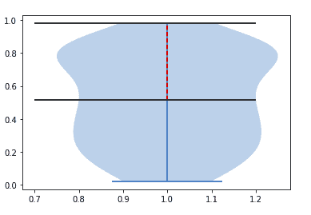
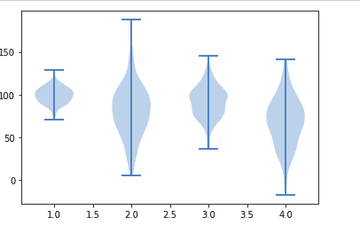

# matplotlib . pyplot . violinplot()用 Python

表示

> 哎哎哎:# t0]https://www . geeksforgeeks . org/matplot lib-pyplot 小提琴情节-python/

[**Matplotlib**](http://geeksforgeeks.org/python-matplotlib-an-overview/) 是 Python 中一个惊人的可视化库，用于数组的 2D 图。Matplotlib 是一个多平台数据可视化库，构建在 NumPy 数组上，旨在与更广泛的 SciPy 堆栈一起工作。

## Matplotlib.pyplot.violinplot()

**matplotlib . pyplot . violinplot()**顾名思义就是用来制作小提琴的剧情。通过该函数，您可以为数据集的每一列或数据集序列中的每一个向量绘制小提琴图。所有填充区域都扩展到显示整个数据范围，在平均值、中间值、最大值和最小值处有可选的线条。

> **语法:**matplotlib . pyplot . violinplot(数据集，位置=无，垂直=真，宽度=0.5，显示平均值=假，显示极值=真，显示中间值=假，点数=100，bw _ method =无，*数据=无)
> 
> **参数:**
> 
> 1.  **数据集:**是必选参数，一般为数组或向量序列。这是数据被馈送到函数的地方。
> 2.  **位置:**是一个类似数组的对象，默认值为 1 到 n 的数组(即默认值= [1，2，3…n])。它用于设置小提琴的位置。限制和刻度会自动设置以匹配位置。
> 3.  **垂直:**该参数接受布尔值。此参数的默认值为“假”。如果设置为真，它会创建一个垂直的小提琴图，否则会设置一个水平的小提琴图。
> 4.  **宽度:**接受类似数组的对象，默认值为 0.5。它用于设置每个小提琴的最大宽度，可以是标量或矢量。如果使用默认值，它将占用大约一半的水平空间。
> 5.  **showmeans:** 接受布尔值，默认设置为 False。如果设置为 true，它将切换平均值的呈现
> 6.  **showextremeama:**接受布尔值，默认设置为 False。如果设置为真，它将切换极值的渲染。
> 7.  **显示中间值:**它接受一个布尔值，并将默认值设置为假。如果设置为真，它将切换媒体的呈现。
> 8.  **点:**接受标量，默认值为 100。它用于定义计算每个高斯核密度估计的总点数。
> 9.  **bw_method:** 它是一个可选参数，接受字符串、标量或可调用。使用该方法计算估计器带宽。它可以是“silverman”、“scott”、可调用的或标量常数。在标量的情况下，它被直接用作 kde.factor。如果它是一个可调用的，那么它只接受 GaussianKDE 实例并返回一个标量。斯科特用在“无”的情况下
> 
> **返回:**该函数返回小提琴图的每个组件到相应集合实例列表的字典映射。返回的字典有以下键:
> 
> *   **body:**matplotlib . collections . polycollection 的实例列表，包含每个小提琴的填充区域。
> *   **cmeans:** 创建 matplotlib . collections . line collection 的一个实例来标识每个小提琴分布的平均值
> *   **cmins:** 创建 matplotlib . collections . line collection 的一个实例，用于标识每个小提琴分布的底部。
> *   **cmaxes:** 创建 matplotlib . collections . line collection 的一个实例，用于标识每个小提琴分布的顶部。
> *   **cbar:**matplotlib . collections . line collection 的一个实例，创建该实例是为了识别每个小提琴分布的中心。
> *   **cmedians:**matplotlib . collections . line collection 的一个实例，创建该实例是为了确定每个小提琴分布的平均值。

**例 1:**

```
import numpy as np
import matplotlib.pyplot as plt

np.random.seed(21)
data = np.random.random(111)
quartile1, median, quartile3 = np.percentile(data,
                                             [ 50, 75,100],
                                             axis=0)
plt.violinplot(data)
plt.vlines(1, quartile1, 
           quartile3,
           color='r', 
           linestyle='--')

plt.hlines(quartile1,.7,1.2)
plt.hlines(quartile3,.7,1.2) 
```

**输出:**



**例 2:**

```
import matplotlib.pyplot as plt

# Fixing random state for
# reproducibility
np.random.seed(15437660)

# creating randomly generate 
# collections / data
coll_1 = np.random.normal(100, 10, 200)
coll_2 = np.random.normal(80, 30, 200)
coll_3 = np.random.normal(90, 20, 200)
coll_4 = np.random.normal(70, 25, 200)

## combining these different 
# collections into a list
data_plotter = [coll_1, coll_2, 
                coll_3, coll_4]

plt.violinplot(data_plotter)

plt.show()
```

**输出:**

