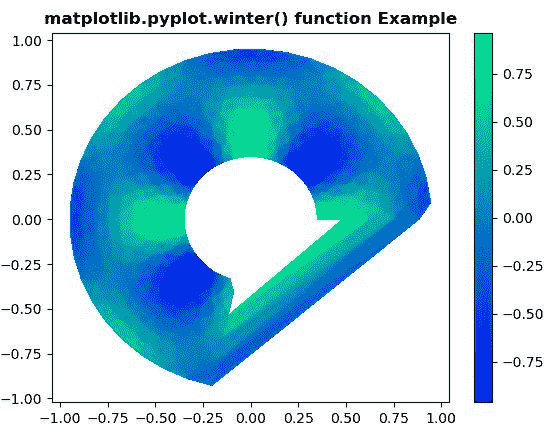

# matplotlib.pyplot.winter()用 Python

表示

> 原文:[https://www . geeksforgeeks . org/matplotlib-py plot-winter-in-python/](https://www.geeksforgeeks.org/matplotlib-pyplot-winter-in-python/)

**[Matplotlib](https://www.geeksforgeeks.org/python-introduction-matplotlib/)** 是 Python 中的一个库，是 NumPy 库的数值-数学扩展。 **[Pyplot](https://www.geeksforgeeks.org/pyplot-in-matplotlib/)** 是一个基于状态的接口到 **Matplotlib** 模块，它提供了一个类似于 MATLAB 的接口。

## matplotlib.pyplot.winter()函数:

matplotlib 库 pyplot 模块中的 **winter()功能**用于将 colormap 设置为“winter”。

> **语法:**
> 
> ```
> matplotlib.pyplot.winter()
> 
> ```
> 
> **参数:**该方法不接受任何参数。
> 
> **返回:**该方法不返回值。

下面的例子说明了 matplotlib.pyplot.winter()函数在 matplotlib.pyplot 中的作用:

**示例#1:**

```
#Implementation of matplotlib function
import matplotlib.pyplot as plt
import matplotlib.tri as tri
import numpy as np

ang = 32
rad = 10
radm = 0.35
radii = np.linspace(radm, 0.95, rad)

angles = np.linspace(0, 1.4*np.pi, ang)
angles = np.repeat(angles[..., np.newaxis], rad, axis=1)
angles[:, 1::2] += np.pi / ang

x = (radii * np.cos(angles)).flatten()
y = (radii * np.sin(angles)).flatten()
z = (np.sin(4*radii) * np.cos(4 * angles)).flatten()

triang = tri.Triangulation(x, y)
triang.set_mask(np.hypot(x[triang.triangles].mean(axis=1),
                         y[triang.triangles].mean(axis=1))
                         < radm)

tpc = plt.tripcolor(triang, z, shading='flat')
plt.colorbar(tpc)
plt.winter()
plt.title('matplotlib.pyplot.winter() function Example'
                                   ,fontweight="bold")

plt.show()
```

**输出:**


**例 2:**

```
#Implementation of matplotlib function
import matplotlib.pyplot as plt
import numpy as np
from matplotlib.colors import LogNorm

dx, dy = 0.015, 0.05
x = np.arange(-2.0,2.0, dx)
y = np.arange(-2.0, 2.0, dy)
X, Y = np.meshgrid(x, y)

extent = np.min(x), np.max(x), np.min(y), np.max(y)

Z1 = np.add.outer(range(4), range(4)) % 2
plt.imshow(Z1, cmap="binary_r", interpolation='nearest',
                 extent=extent, alpha=1)

def geeks(x, y):
    return (1 - x / 2 + x**5 + y**6) * np.exp(-(x**2 + y**2))

Z2 = geeks(X, Y)

plt.imshow(Z2, alpha=0.7, interpolation='bilinear',
                                     extent=extent)
plt.winter()
plt.title('matplotlib.pyplot.winter() function Example'
                                     ,fontweight="bold")
plt.show()
```

**输出:**
