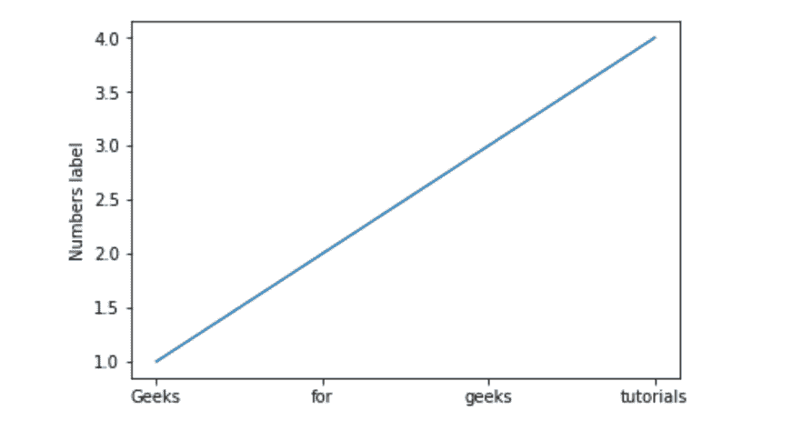
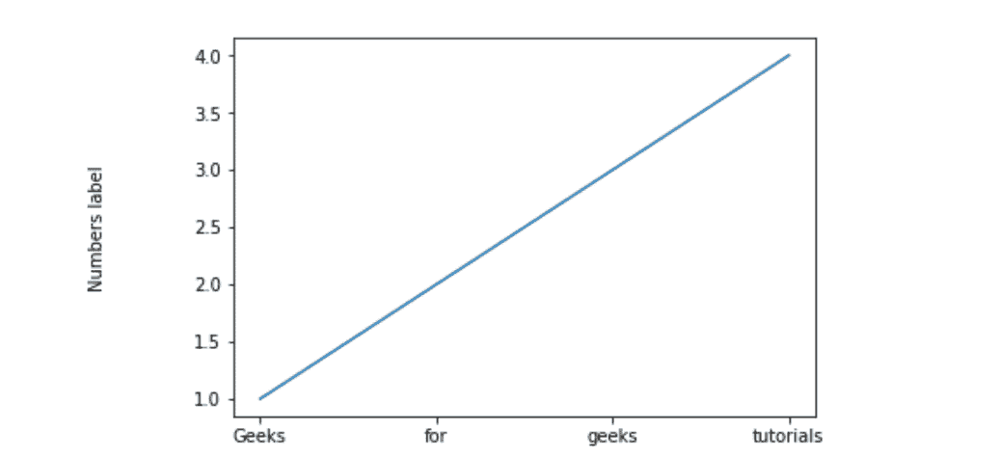
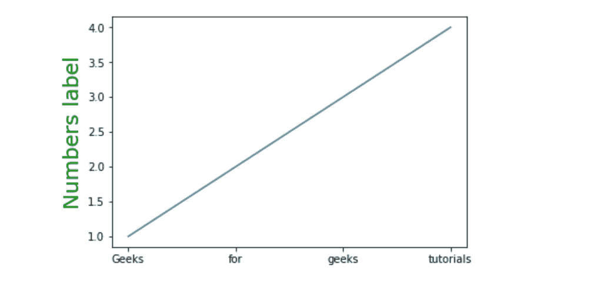

# Matplotlib.pyplot.ylabel()用 Python

表示

> 哎哎哎:# t0]https://www . geeksforgeeks . org/matplot lib-pyplot-ylabebel-in-python/

**Matplotlib** 是一个非常强大的绘图库，对于使用 Python 和 NumPy 的人来说非常有用。为了进行统计干扰，将我们的数据可视化变得非常必要，而 Matplotlib 是对此非常有帮助的工具。

## matplotlib.pyplot.ylabel()

此功能设置绘图 y 轴的标签。

> **语法:**matplotlib . pyplot . ylbel(ylbel，fontdict=None，labelpad=None)
> 
> **参数:**
> **依拉贝尔:**标签的名称
> **fontdict:** 将字体样式添加到标签
> **labelpad:** 这有助于我们设置标签和轴之间的间距

**示例#1:**

```py
import matplotlib.pyplot as plt

# setting x values
x =['Geeks', 'for', 'geeks', 'tutorials']

# Setting y values 
y =[1, 2, 3, 4]

# Adding label on the y-axis
plt.ylabel('Numbers label')

# plotting the graph
plt.plot(x, y)
```

**输出:**



**例 2:**

```py
import matplotlib.pyplot as plt

x =['Geeks', 'for', 'geeks', 'tutorials']
y =[1, 2, 3, 4]

# Adding space between label and
# axis by setting labelpad
plt.ylabel('Numbers label', labelpad = 50)

plt.plot(x, y)
```

**输出:**



**示例#3:**

```py
import matplotlib.pyplot as plt

x =['Geeks', 'for', 'geeks', 'tutorials']
y =[1, 2, 3, 4]

# Setting font dictionary 
font = {'family': 'Verdana',
        'color':  'green',
        'size': 20,
        }

# Adding the font styles to the label
plt.ylabel('Numbers label', fontdict = font)

plt.plot(x, y)
```

**输出:**
