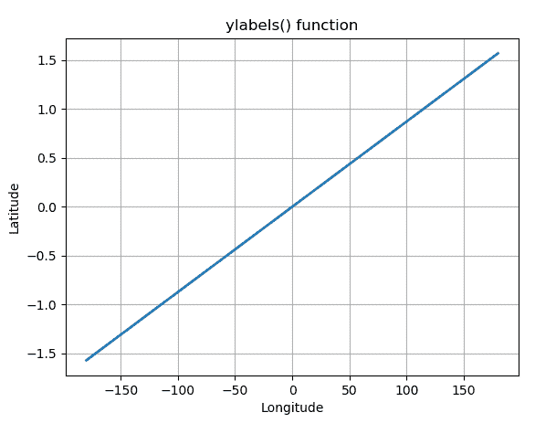
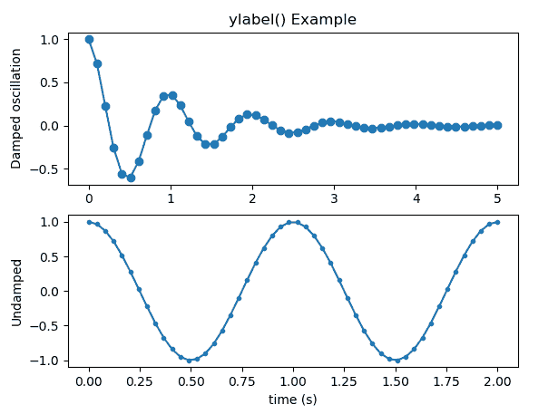

# Matplotlib.pyplot.ylabels()用 Python

表示

> 哎哎哎:# t0]https://www . geeksforgeeks . org/matplot lib-pyplot-ylabels-in-python/

**[Matplotlib](https://www.geeksforgeeks.org/python-introduction-matplotlib/)** 是 Python 中的一个库，是 NumPy 库的数值-数学扩展。 **[Pyplot](https://www.geeksforgeeks.org/pyplot-in-matplotlib/)** 是一个基于状态的接口到 **Matplotlib** 模块，它提供了一个类似于 MATLAB 的接口。

## matplotlib.pyplot.ylabel()函数

matplotlib 库 pyplot 模块中的 **ylabel()函数**用于设置 x 轴的标签..

> **语法:**matplotlib . pyplot . ylbel(ylbel，fontdict=None，labelpad=None，**kwargs)
> 
> **参数:**该方法接受以下描述的参数:
> 
> *   **依拉贝尔:**该参数为标签文本。并包含字符串值。
> *   **labelpad:** 此参数用于从轴边界框(包括刻度和刻度标签)以点为单位的间距，其默认值为“无”。
> *   ****kwargs:** 该参数是*文本*属性，用于控制标签的外观。

以下示例说明了 matplotlib.pyplot.ylabel()函数在 matplotlib.pyplot 中的作用:

**示例#1:**

```
# Implementation of matplotlib.pyplot.ylabels() 
# function

import numpy as np
import matplotlib.pyplot as plt

t = np.arange(-180.0, 180.0, 0.1)
s = np.radians(t)/2.

plt.plot(t, s, '-', lw = 2)

plt.xlabel('Longitude')
plt.ylabel('Latitude')
plt.title('ylabels() function')
plt.grid(True)

plt.show()
```

**输出:**


**例 2:**

```
# Implementation of matplotlib.pyplot.ylabels() 
# function

import numpy as np
import matplotlib.pyplot as plt

valx1 = np.linspace(0.0, 5.0)
x2 = np.linspace(0.0, 2.0)

valy1 = np.cos(2 * np.pi * valx1) * np.exp(-valx1)
y2 = np.cos(2 * np.pi * x2)

plt.subplot(2, 1, 1)
plt.plot(valx1, valy1, 'o-')
plt.title('ylabel() Example')
plt.ylabel('Damped oscillation')

plt.subplot(2, 1, 2)
plt.plot(x2, y2, '.-')
plt.xlabel('time (s)')
plt.ylabel('Undamped')

plt.show()
```

**输出:**
