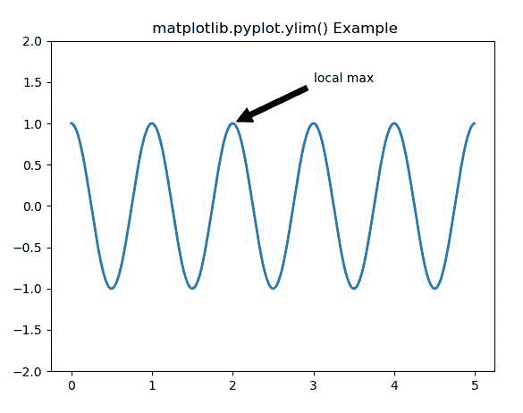

# Matplotlib.pyplot.ylim()用 Python

表示

> 哎哎哎:# t0]https://www . geeksforgeeks . org/matplot lib-pyplot-ylim-in-python/

**[Matplotlib](https://www.geeksforgeeks.org/python-introduction-matplotlib/)** 是 Python 中的一个库，是 NumPy 库的数值-数学扩展。 **[Pyplot](https://www.geeksforgeeks.org/pyplot-in-matplotlib/)** 是一个基于状态的接口到 **Matplotlib** 模块，它提供了一个类似于 MATLAB 的接口。

## matplotlib.pyplot.ylim()函数

matplotlib 库 pyplot 模块中的 **ylim()函数**用于获取或设置当前轴的 y 极限。

> **语法:**matplotlib . pyplot . ylim(* args，**kwargs)
> 
> **参数:**该方法接受以下描述的参数:
> 
> *   **底部:**此参数用于将叶立德设置为底部。
> *   **顶部:**此参数用于将叶立德设置为顶部。
> *   ****kwargs:** 该参数是*文本*属性，用于控制标签的外观。
> 
> **返回:**这将返回以下内容:
> 
> *   **底部，顶部:**这将返回新 y 轴限制的元组。

下面的例子说明了 matplotlib.pyplot.ylim()函数在 matplotlib.pyplot 中的作用:

**示例#1:**

```
# Implementation of matplotlib function
import matplotlib.pyplot as plt
import numpy as np

ax = plt.subplot(111)

t = np.arange(0.0, 5.0, 0.01)
s = np.cos(2 * np.pi * t)
line, = plt.plot(t, s, lw = 2)

plt.annotate('local max', xy =(2, 1),
             xytext =(3, 1.5),
             arrowprops = dict(facecolor ='black',
                               shrink = 0.05), )

plt.ylim(-2, 2)
plt.title(" matplotlib.pyplot.ylim() Example")
plt.show()
```

**输出:**


**例 2:**

```
# Implementation of matplotlib function
import matplotlib.pyplot as plt
import numpy as np

np.random.seed(9680801)

mu, sigma = 50, 13
x = mu + sigma * np.random.randn(10000)

# the histogram of the data
n, bins, patches = plt.hist(x, 50, 
                            density = True,
                            facecolor ='g',
                            alpha = 0.75)

plt.xlabel('No of Users in K')
plt.title('Histogram of IQ')
plt.text(50, .035, r'$\mu = 50,\
\ \sigma = 13{content}apos;)

plt.xlim(-10, 110)
plt.ylim(0, 0.04)

plt.grid(True)
plt.title(" matplotlib.pyplot.ylim() Example")

plt.show()
```

**输出:**
