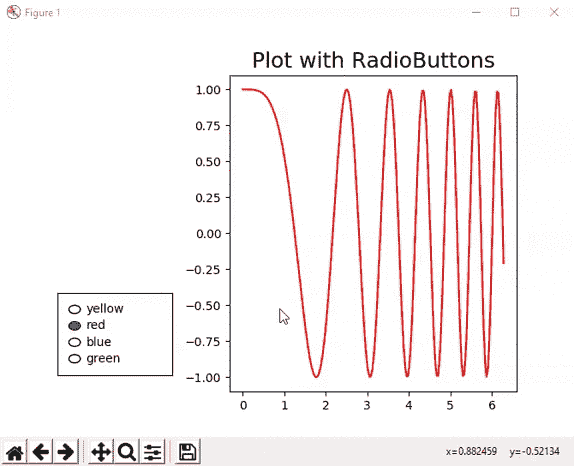
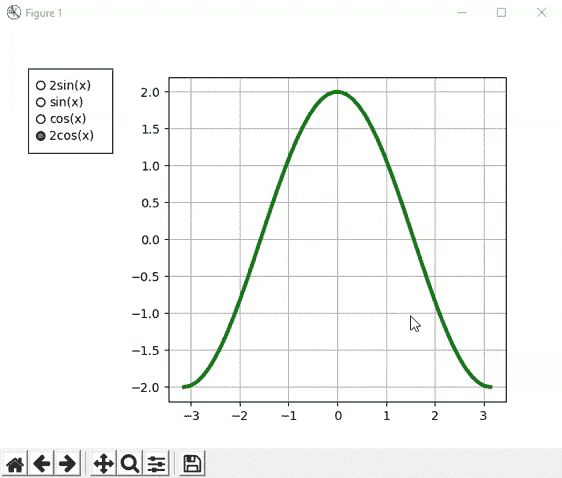
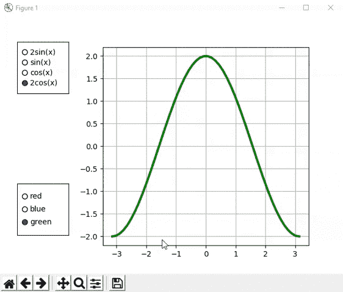

# matplot lib–radio buttons

> 哎哎哎::1230【https://www . geeksforgeeks . org/matplot lib-radio button/

**单选按钮**让用户在多个选项中只选择一个选项。这些按钮排列成两组或更多组，并带有一系列圆形点。为了使单选按钮保持响应，您必须保持对该对象的引用。我们将 RadioButtons 与 on_clicked 方法连接起来，使其具有响应性。

**语法:**

> matplot lib . widgets . radio button(ax，labels，active=0，activecolor='blue ')。
> 
> **参数:**
> 
> *   **轴:**单选按钮添加到的轴。
> *   **标签:**按钮标签(字符串列表)。
> *   **激活:**初始选择按钮的索引。
> *   **活动颜色:**所选按钮的颜色。

下面是描述如何使用 matplotlib 库创建和使用单选按钮的各种示例。

**例 1:**

## 蟒蛇 3

```py
# import required modules as numpy,
# matplotlib and radiobutton widget
import numpy as np
import matplotlib.pyplot as plt
from matplotlib.widgets import RadioButtons

# x and y-coordinates for graph creation
x = np.linspace(0, 2*np.pi, 200)
y = np.cos(x**2)

# Creating subplot and adjusting subplot
fig, ax = plt.subplots()
l, = ax.plot(x, y, color='yellow')
plt.subplots_adjust(left=0.4)
ax.set_title('Plot with RadioButtons',
             fontsize=18)

# sub-plot for radio button with
# left, bottom, width, height values
rax = plt.axes([0.1, 0.15, 0.2, 0.2])
radio_button = RadioButtons(rax, ('yellow',
                                  'red',
                                  'blue',
                                  'green'))

# function performed on switching the
# radiobuttons
def colorfunc(label):
    l.set_color(label)
    plt.draw()

radio_button.on_clicked(colorfunc)

plt.show()
```

**输出:**



**例 2:**

## 蟒蛇 3

```py
import numpy as np
import matplotlib.pyplot as plt
from matplotlib.widgets import RadioButtons

# plotting between the interval -π and π
x = np.linspace(-np.pi, np.pi)

# trigonometric functions to plot
p = 2*np.sin(x)
q = np.sin(x)
r = np.cos(x)
s = 2*np.cos(x)

fig, ax = plt.subplots()
l, = ax.plot(x, p, lw=3, color='green')
plt.subplots_adjust(left=0.3)

rax = plt.axes([0.05, 0.7, 0.15, 0.2])
radio = RadioButtons(rax, ('2sin(x)',
                           'sin(x)',
                           'cos(x)',
                           '2cos(x)'))

# function performed on clicking the radio buttons
def sinefunc(label):
    sindict = {'2sin(x)': p,
               'sin(x)': q,
               'cos(x)': r,
               '2cos(x)': s}
    data = sindict[label]
    l.set_ydata(data)
    plt.draw()

radio.on_clicked(sinefunc)

# plot grid
ax.grid()
plt.show()
```

**输出:**



**例 3:**

## 蟒蛇 3

```py
import numpy as np
import matplotlib.pyplot as plt
from matplotlib.widgets import RadioButtons

# plotting between the interval -π and π
x = np.linspace(-np.pi, np.pi)

# trigonometric functions to plot
p = 2*np.sin(x)
q = np.sin(x)
r = np.cos(x)
s = 2*np.cos(x)
fig, ax = plt.subplots()

l, = ax.plot(x, p, lw=3, color='red')
plt.subplots_adjust(left=0.3)

rax = plt.axes([0.05, 0.7, 0.15, 0.2])
radio = RadioButtons(rax, ('2sin(x)',
                           'sin(x)',
                           'cos(x)',
                           '2cos(x)'))

# function performed on clicking the radio buttons
def sinefunc(label):
    sindict = {'2sin(x)': p,
               'sin(x)': q,
               'cos(x)': r,
               '2cos(x)': s}
    data = sindict[label]
    l.set_ydata(data)
    plt.draw()

radio.on_clicked(sinefunc)

# plot grid
ax.grid()

# x and y-coordinates for graph creation
x = np.linspace(0, 2*np.pi, 200)
y = np.cos(x**2)

# sub-plot for radio button with
# left, bottom, width, height values
rax2 = plt.axes([0.05, 0.15, 0.15, 0.2])
radio_button = RadioButtons(rax2, ('red',
                                   'blue',
                                   'green'))

# function performed on switching radiobuttons
def colorfunc(label2):
    l.set_color(label2)
    plt.draw()

radio_button.on_clicked(colorfunc)

plt.show()
```

**输出:**

