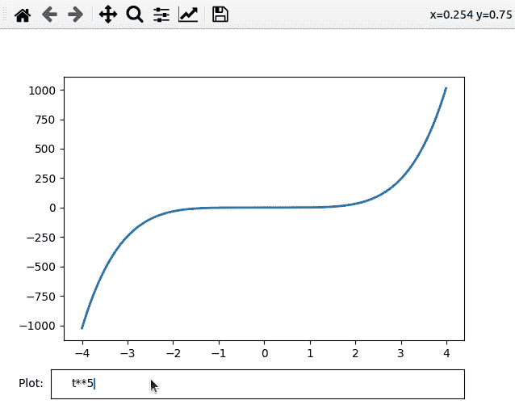

# Matplotlib – 文本框小部件

> [https://www.geeksforgeeks.org/matplotlib-textbox-widgets/](https://www.geeksforgeeks.org/matplotlib-textbox-widgets/)

在本文中，我们将看到 matplotlib 的 textbox 小部件。Matplotlib 是 Python 编程语言的绘图库。在本文中，我们将尝试绘制不同强国(如 t^2、t^3、t^9 等)的图表。)使用 textbox 小部件。

文本框是一个接受用户输入的小部件。输入也可以是公式，这样我们就可以根据这些公式生成图表。要使用这个小部件，我们使用 ***文本框()*** 功能。

它接受两个参数

*   图，即要使用的图表。
*   与文本框一起显示的文本，即标签到 txtBox。

下面是这个小部件的实现:

## 计算机编程语言

```
# Import modules
import numpy as np
import matplotlib.pyplot as plt
from matplotlib.widgets import TextBox

# Adjust illustration
fig, ax = plt.subplots()
fig.subplots_adjust(bottom=0.2)

t = np.arange(-4.0, 4.0, 0.01)
l, = ax.plot(t, np.zeros_like(t), lw=2)

# Function to plot graph 
# according to expression
def visualizeGraph(expr):
    ydata = eval(expr)
    l.set_ydata(ydata)
    ax.relim()
    ax.autoscale_view()
    plt.draw()

# Adding TextBox to graph
graphBox = fig.add_axes([0.1, 0.05, 0.8, 0.075])
txtBox = TextBox(graphBox, "Plot: ")
txtBox.on_submit(visualizeGraph)
txtBox.set_val("t**5")

# Plot graph
plt.show()
```

**输出:**



**说明:**

在上面的程序中，我们为 t <sup>2</sup> 创建了一个默认图形。在标记为*的 *txtBox* 中，我们可以输入想要查看图表的公式。*