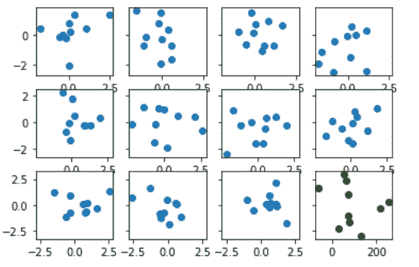
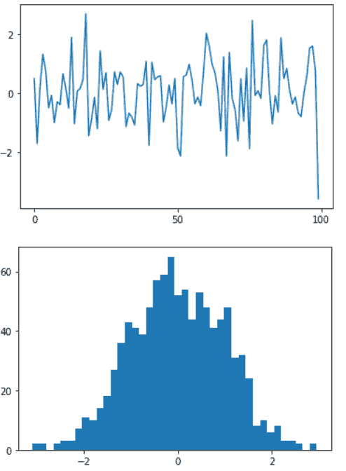

# Python 中的 Matplotlib.ticker.AutoLocator 类

> 原文:[https://www . geeksforgeeks . org/matplotlib-ticker-autolocator-python 中的类/](https://www.geeksforgeeks.org/matplotlib-ticker-autolocator-class-in-python/)

[**Matplotlib**](https://www.geeksforgeeks.org/python-matplotlib-an-overview/) 是 Python 中一个惊人的可视化库，用于数组的 2D 图。Matplotlib 是一个多平台数据可视化库，构建在 NumPy 数组上，旨在与更广泛的 SciPy 堆栈一起工作。

## matplotlib.ticker.AutoLocator

matplotlib.ticker.AutoLocator 类是 matplotlib.ticker.MaxNLocator 的子类，其参数 nbins = 'auto '和 *steps = [1，2，2.5，5，10]。它用于动态查找主要刻度位置。*

> ***语法:**类 matplotlib . ticker . autolocator*
> ***参数:***
> 
> *   ***nbins:** 不是整数就是‘auto’，其中整数值代表最大间隔数；比最大刻度数少一个。根据轴的长度自动确定箱的数量。它是一个可选参数，默认值为 10。*
>     
> *   ***步骤:**这是一个可选参数，代表一个从 1 开始到 10 结束的漂亮的数字序列。*
>     
> *   ***整数:**可选布尔值。如果设置为真，刻度仅接受整数值，前提是至少 min_n_ticks 整数在视图限制内。*
>     
> *   ***对称:**是可选值。如果设置为真，自动缩放将产生一个关于零对称的范围。*
>     
> *   ***修剪:**这是一个可选参数，接受以下四个值中的任意一个:{ '下'，'上'，'两者都有'，无}。默认情况下，它是“无”。*

***例 1:***

## 蟒蛇 3

```
import matplotlib
import matplotlib.pyplot as plt
import numpy as np

fig, axes = plt.subplots(3, 4,
                         sharex = 'row',
                         sharey = 'row',
                         squeeze = False)

data = np.random.rand(20, 2, 10)

for ax in axes.flatten()[:-1]:

    ax.plot(*np.random.randn(2, 10), marker ="o", ls ="")

# Now remove axes[1, 5] from
# the grouper for xaxis
axes[2, 3].get_shared_x_axes().remove(axes[2, 3])

# Create and assign new ticker
xticker = matplotlib.axis.Ticker()
axes[2, 3].xaxis.major = xticker

# The new ticker needs new locator
# and formatters
xloc = matplotlib.ticker.AutoLocator()
xfmt = matplotlib.ticker.ScalarFormatter()

axes[2, 3].xaxis.set_major_locator(xloc)
axes[2, 3].xaxis.set_major_formatter(xfmt)

# Now plot to the "ungrouped" axes
axes[2, 3].plot(np.random.randn(10)*100 + 100,
                np.linspace(-3, 3, 10),
                marker ="o", ls ="",
                color ="green")

plt.show()
```

***输出:***



***例 2:***

## 蟒蛇 3

```
import pylab as pl
from matplotlib import ticker

# helper function
def AutoLocatorInit(self):

    ticker.MaxNLocator.__init__(self,
                                nbins = 4,
                                steps =[1, 2, 5, 10])

ticker.AutoLocator.__init__ = AutoLocatorInit

pl.plot(pl.randn(100))
pl.figure()
pl.hist(pl.randn(1000), bins = 40)

pl.show()
```

***输出:***

