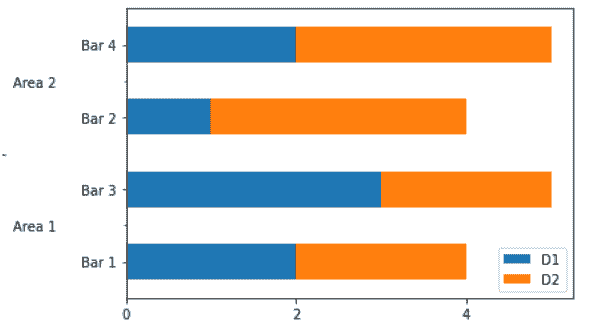
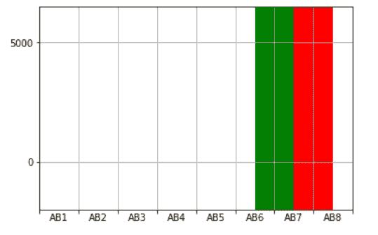

# Python 中的 matplotlib . ticker . autominorlocator 类

> 原文:[https://www . geeksforgeeks . org/matplotlib-ticker-autominorlocator-in-class-python/](https://www.geeksforgeeks.org/matplotlib-ticker-autominorlocator-class-in-python/)

**[Matplotlib](https://www.geeksforgeeks.org/python-matplotlib-an-overview/)** 是 Python 中一个惊人的可视化库，用于数组的 2D 图。Matplotlib 绘图库是一个基于 NumPy 阵列的多平台数据可视化库，旨在与更广泛的 SciPy 堆栈协同工作。

## matplotlib.ticker .自动转换器

`matplotlib.ticker.AutoMinorLocator`类用于根据主要刻度的位置动态查找次要刻度位置。主要刻度需要以线性刻度均匀分布。

> **语法:**class matplotlib . ticker . autominorlocator(n =无)
> 
> **参数:**
> 
> *   **n:** 表示主要蜱类间隔的细分数。如果省略 n 或无，它会自动设置为 5 或 4。

**该类方法:**

*   **tick_values(self，vmin，vmax):** 给定 vmin 和 vmax，它返回找到的 tick 的值。

**例 1:**

```py
import pandas as pd
import matplotlib.pyplot as plt
from matplotlib import ticker

data = [
    ('Area 1', 'Bar 1', 2, 2),
    ('Area 2', 'Bar 2', 1, 3),
    ('Area 1', 'Bar 3', 3, 2),
    ('Area 2', 'Bar 4', 2, 3),
]

df = pd.DataFrame(data, columns =('A', 'B',
                                  'D1', 'D2'))

df = df.set_index(['A', 'B'])
df.sort_index(inplace = True)

# Remove the index names for the plot,
# or it'll be used as the axis label
df.index.names = ['', '']

ax = df.plot(kind ='barh', stacked = True)

minor_locator = ticker.AutoMinorLocator(2)

ax.yaxis.set_minor_locator(minor_locator)

ax.set_yticklabels(df.index.get_level_values(1))
ax.set_yticklabels(df.index.get_level_values(0).unique(),
                   minor = True)

ax.set_yticks(np.arange(0.5, len(df), 2), 
              minor = True)

ax.tick_params(axis ='y', which ='minor', 
               direction ='out', pad = 50)

plt.show()
```

**输出:**


**例 2:**

```py
from pylab import * 
import matplotlib
import matplotlib.ticker as ticker

# Setting minor ticker size to 0, 
# globally.
matplotlib.rcParams['xtick.minor.size'] = 0

# Create a figure with just one 
# subplot.
fig = figure()
ax = fig.add_subplot(111)

# Set both X and Y limits so that
# matplotlib
ax.set_xlim(0, 800)

# Fixes the major ticks to the places
# where desired (one every hundred units)
ax.xaxis.set_major_locator(ticker.FixedLocator(range(0,
                                                     801, 
                                                     100)))
ax.xaxis.set_major_formatter(ticker.NullFormatter())

# Add minor tickers AND labels for them
ax.xaxis.set_minor_locator(ticker.AutoMinorLocator(n = 2))
ax.xaxis.set_minor_formatter(ticker.FixedFormatter(['AB %d' % x 
                                                    for x in range(1, 9)]))

ax.set_ylim(-2000, 6500, auto = False)

# common attributes for the bar plots
bcommon = dict(
    height = [8500],
    bottom = -2000,   
    width = 100)      

bars = [[600, 'green'],
        [700, 'red']]
for left, clr in bars:
    bar([left], color = clr, **bcommon)

show()
```

**输出:**
