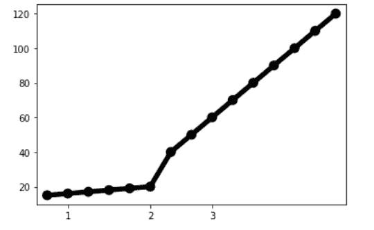
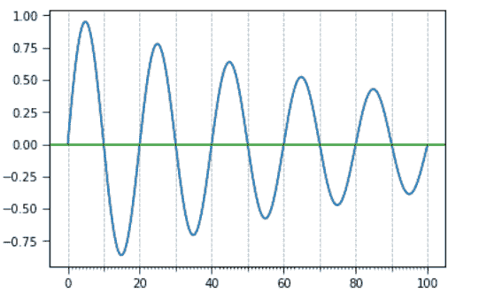

# Python 中的 Matplotlib.ticker.FixedLocator 类

> 原文:[https://www . geeksforgeeks . org/matplotlib-ticker-fixed locator-class-in-python/](https://www.geeksforgeeks.org/matplotlib-ticker-fixedlocator-class-in-python/)

**[Matplotlib](https://www.geeksforgeeks.org/python-matplotlib-an-overview/)** 是 Python 中一个惊人的可视化库，用于数组的 2D 图。Matplotlib 是一个多平台数据可视化库，构建在 NumPy 数组上，旨在与更广泛的 SciPy 堆栈一起工作。

## matplotlib.ticker.FixedLocator

`matplotlib.ticker.FixedLocator`类是`matplotlib.ticker.Locator`类的子类，用于固定刻度位置。如果 *nbins* 的值不等于无，那么所有可能位置的数组将被二次采样，以保持刻度总数小于或等于 *nbins* + 1。进行子采样以包括最小的绝对值。例如，如果零包含在可能值的数组中，那么它保证一个选定的刻度。

> **语法:**class matplotlib . ticker . fixed locator(locas，nbins=None)
> 
> **参数:**
> 
> *   **locas:**代表蜱的位置。
> *   **nbins:** 表示数据要划分的面元数。

**该类方法:**

*   **set_params(self，nbins=None):** 用于设置定位器内的参数。
*   **tick_value(self，vmin，vmax):** 返回 vmax 和 vmin 之间的 tick 位置。

**例 1:**

```
import numpy as np
import matplotlib.pyplot as plt
import matplotlib

np.arange(0, 15, 5)
plt.figure(figsize = [6,4])

x = np.array([1, 2, 3, 4, 5,
              6, 7, 8, 9, 10,
              11, 12, 13, 14, 15])

y = np.array([15, 16, 17, 18, 
              19, 20, 40, 50, 
              60, 70, 80, 90, 
              100, 110, 120])

ax = sns.pointplot(x, y,
                   color = 'k',
                   markers = ["."], 
                   scale = 2)

ax.xaxis.set_major_locator(matplotlib.ticker.FixedLocator([1,5,8]))

plt.show()
```

**输出:**


**例 2:**

```
import matplotlib.pyplot as plt
import numpy as np
import matplotlib.ticker

t = np.arange(0.0, 100.0, 0.1)
s = np.sin(0.1 * np.pi * t)*np.exp(-t * 0.01)

fig, ax = plt.subplots()
plt.plot(t, s)

ax1 = ax.twiny()
ax1.plot(t, s)

ax1.xaxis.set_ticks_position('bottom')

majors = np.linspace(0, 100, 6)
minors = np.linspace(0, 100, 11)
thirds = np.linspace(0, 100, 101)

ax.xaxis.set_major_locator(matplotlib.ticker.FixedLocator(majors))
ax.xaxis.set_minor_locator(matplotlib.ticker.FixedLocator(minors))
ax1.xaxis.set_major_locator(matplotlib.ticker.FixedLocator([]))
ax1.xaxis.set_minor_locator(matplotlib.ticker.FixedLocator(thirds))

ax1.tick_params(which ='minor', length = 2)
ax.tick_params(which ='minor', length = 4)
ax.tick_params(which ='major', length = 6)

ax.grid(which ='both', axis ='x', linestyle ='--')

plt.axhline(color ='green')

plt.show()
```

**输出:**
