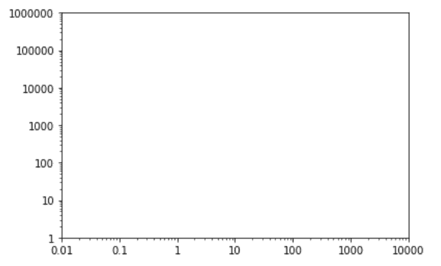

# Python 中的 matplotlib . ticker . Funcformatter 类

> 原文:[https://www . geesforgeks . org/matplotlib-ticker-func formatter-python 中的类/](https://www.geeksforgeeks.org/matplotlib-ticker-funcformatter-class-in-python/)

[**Matplotlib**](https://www.geeksforgeeks.org/python-matplotlib-an-overview/) 是 Python 中一个惊人的可视化库，用于数组的 2D 图。Matplotlib 是一个多平台数据可视化库，构建在 NumPy 数组上，旨在与更广泛的 SciPy 堆栈一起工作。

## matplot lib . ticker . funcfformatter

matplotlib . ticker . Funcformatter 类使用用户定义的函数进行格式化。该用户定义的函数必须将两个值作为刻度值 *x* 和位置*位置*的输入。

> **语法:**类 matplotlib . ticker . func formatter(func)
> **参数:**
> 
> *   **功能:**用户定义的绘图格式化功能。

**例 1:**

## 蟒蛇 3

```py
import matplotlib.pyplot as plt
import matplotlib.ticker as tick
import numpy as np

x = np.linspace(0, 10, 1000)
y = 0.000001 * np.sin(10 * x)

fig = plt.figure()
ax = fig.add_subplot(111)

ax.plot(x, y)

def y_fmt(x, y):
    return '{:2.2e}'.format(x).replace('e', 'x10^')

ax.yaxis.set_major_formatter(tick.FuncFormatter(y_fmt))

plt.show()
```

**输出:**


**例 2:**

## 蟒蛇 3

```py
import matplotlib.pyplot as plt
from matplotlib.ticker import FuncFormatter

fig, ax = plt.subplots()
ax.axis([0.01, 10000, 1, 1000000])
ax.loglog()

for axis in [ax.xaxis, ax.yaxis]:
    formatter = FuncFormatter(lambda y, _: '{:.16g}'.format(y))
    axis.set_major_formatter(formatter)

plt.show()
```

**输出:**

