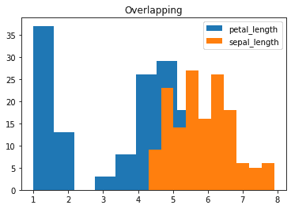
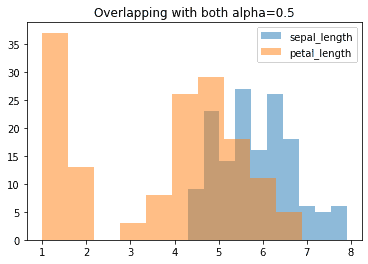
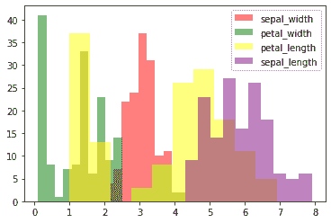

# 用 Python 中的 Matplotlib 重叠直方图

> 原文:[https://www . geesforgeks . org/重叠-直方图-with-matplotlib-in-python/](https://www.geeksforgeeks.org/overlapping-histograms-with-matplotlib-in-python/)

[直方图](https://www.geeksforgeeks.org/plotting-histogram-in-python-using-matplotlib/)是可视化数据的一种方式。在这里，我们将学习如何使用 *Matplotlib* 库在 python 中绘制重叠直方图。***matplotlib . pyplot . hist()***用于制作直方图。

我们取 [*虹膜*](https://gist.githubusercontent.com/netj/8836201/raw/6f9306ad21398ea43cba4f7d537619d0e07d5ae3/iris.csv) 数据集，用 *Matplotlib* 绘制各种重叠直方图。

**步骤 1:导入库**

## 蟒蛇 3

```py
# importing libraries
import matplotlib.pyplot as plt
import seaborn as sns
```

**第二步:加载数据集**

## 蟒蛇 3

```py
# load the iris dataset
data = sns.load_dataset('iris')

# view the dataset
print(data.head(5))
```


**第三步:让我们绘制** ***萼片 _ 长度*** **和** ***花瓣 _ 长度*** **的直方图。**

## 蟒蛇 3

```py
# plotting histograms
plt.hist(data['petal_length'], 
         label='petal_length')

plt.hist(data['sepal_length'], 
         label='sepal_length')

plt.legend(loc='upper right')
plt.title('Overlapping')
plt.show()
```



在这里，我们可以看到‘花瓣 _ 长度’直方图的某些部分已经隐藏在‘萼片 _ 长度’直方图的后面。为了正确地可视化两个直方图，我们需要将透明度参数**α**设置为合适的值。因此，让我们检查 alpha 的各种值，找出合适的值。

**第四步:设置*****α= 0.5*****为两者** ***萼片 _ 长度*** **和** ***花瓣 _ 长度***

## 蟒蛇 3

```py
plt.hist(data['petal_length'], 
         alpha=0.5, # the transaparency parameter
         label='petal_length')

plt.hist(data['sepal_length'],
         alpha=0.5,
         label='sepal_length')

plt.legend(loc='upper right')
plt.title('Overlapping with both alpha=0.5')
plt.show()
```



**第五步:设置*****α= 0.1*****为** ***萼片 _ 长度*** **和 0.9 为** ***花瓣 _ 长度***

## 蟒蛇 3

```py
plt.hist(data['petal_length'], 
         alpha=0.9,
         label='petal_length')

plt.hist(data['sepal_length'],
         alpha=0.1,
         label='sepal_length')

plt.legend(loc='upper right')
plt.title('Overlapping with alpha=0.1 and 0.9 for sepal and petal')
plt.show()
```


通过以上两个步骤，我们可以推断，为了更好地可视化两个直方图，**α= 0.5**将是透明度参数的最合适选项。

现在，要在需要自定义颜色的地方绘制两个以上的重叠直方图，让我们遵循步骤 6。

**第六步:用定制的颜色创建 2 个以上的重叠直方图。**

## 蟒蛇 3

```py
# plotting more than 2 overlapping histograms
plt.hist(data['sepal_width'], 
         alpha=0.5, 
         label='sepal_width',
         color='red') # customized color parameter

plt.hist(data['petal_width'], 
         alpha=0.5,
         label='petal_width',
         color='green')

plt.hist(data['petal_length'], 
         alpha=0.5,
         label='petal_length',
         color='yellow')

plt.hist(data['sepal_length'], 
         alpha=0.5,
         label='sepal_length',
         color='purple')

plt.legend(loc='upper right')
plt.show()
```



因此，在本文中，我们学习了如何使用 *Matplotlib* 绘制重叠直方图，如何设置它们的透明度值，以及自定义它们的颜色。