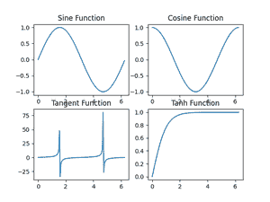
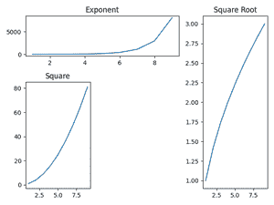

# 在 Matplotlib 中绘制多个地块

> 原文:[https://www . geesforgeks . org/plot-multi-plot-in-matplotlib/](https://www.geeksforgeeks.org/plot-multiple-plots-in-matplotlib/)

**先决条件** : [马特洛特利](https://www.geeksforgeeks.org/python-introduction-matplotlib/)

在 Matplotlib 中，我们可以通过两种方式在单个图中绘制多个图形。一种是通过使用子图()函数，另一种是通过将第二个图叠加在第一个图上，即所有的图都将出现在同一个图上。我们将逐一研究这两种方法。

## 使用子图()函数的多个图

subplot()函数是一个包装函数，它允许程序员只需调用一次就可以在一个图形中绘制多个图形。

> **语法:**matplotlib . pyplot . subplot(nrows = 1，ncols=1，sharex=False，sharey=False，挤压=True，subplot_kw=None，gridspec_kw=None，**fig_kw)
> 
> **参数:**
> 
> 1.  **n 行，ncol:**分别给出行数和列数。此外，必须注意，这两个参数都是可选的，默认值为 1。
> 2.  **sharex，sharey:** 这些参数指定了 a 轴和 y 轴之间共享的属性。它们的可能值可以是、行、列、无或默认值 False。
> 3.  **挤压:**这个参数是指定的布尔值，它询问程序员是否要挤出，意思是从数组中移除多余的维度。它具有默认值“假”。
> 4.  **子剧情 _kw:** 这个参数允许我们给每个子剧情添加关键词，它的默认值是 None。
> 5.  **gridspec_kw:** 这允许我们在每个子剧情上添加网格，默认值为 None。
> 6.  ****fig_kw:** 这允许我们向函数调用传递任何其他额外的关键字参数，默认值为 None。

**示例:**

## 蟒蛇 3

```py
# importing libraries
import matplotlib.pyplot as plt
import numpy as np
import math

# Get the angles from 0 to 2 pie (360 degree) in narray object
X = np.arange(0, math.pi*2, 0.05)

# Using built-in trigonometric function we can directly plot
# the given cosine wave for the given angles
Y1 = np.sin(X)
Y2 = np.cos(X)
Y3 = np.tan(X)
Y4 = np.tanh(X)

# Initialise the subplot function using number of rows and columns
figure, axis = plt.subplots(2, 2)

# For Sine Function
axis[0, 0].plot(X, Y1)
axis[0, 0].set_title("Sine Function")

# For Cosine Function
axis[0, 1].plot(X, Y2)
axis[0, 1].set_title("Cosine Function")

# For Tangent Function
axis[1, 0].plot(X, Y3)
axis[1, 0].set_title("Tangent Function")

# For Tanh Function
axis[1, 1].plot(X, Y4)
axis[1, 1].set_title("Tanh Function")

# Combine all the operations and display
plt.show()
```

**输出**



使用子图()函数的多个图

在 Matplotlib 中，还有一个与子剧情非常相似的函数，那就是 subplot2grid()。它与子剧情功能几乎相同，但提供了更多的灵活性来根据程序员的需要安排剧情对象。

该函数编写如下:

> **语法:**matplotlib . pyplot . sublot 2 grid(shape，loc，rowspan=1，colspan=1，fig=None，**kwargs)
> 
> **参数:**
> 
> 1.  **形状**
>     这个参数是两个整数值的序列，它告诉我们需要为其放置轴的网格的形状。第一个条目用于行，而第二个条目用于列。
> 2.  **loc**
>     与形状参数一样，偶数 Ioc 是 2 个整数值的序列，其中第一个条目保留用于行，第二个条目保留用于列，以将轴放置在网格内。
> 3.  **行跨度**
>     该参数取整数值和表示轴跨度向右或向右增加的行数。
> 4.  **柱距**
>     该参数取整数值和表示轴的柱数向下延伸或增加长度的数字。
> 5.  **图**
>     这是一个可选参数，取图放置轴。默认为当前数字。
> 6.  ****kwargs**
>     这允许我们向函数调用传递任何其他额外的关键字参数，默认值为 None。

**示例:**

## 蟒蛇 3

```py
# Importing libraries
import matplotlib.pyplot as plt
import numpy as np
import math

# Placing the plots in the plane
plot1 = plt.subplot2grid((3, 3), (0, 0), colspan=2)
plot2 = plt.subplot2grid((3, 3), (0, 2), rowspan=3, colspan=2)
plot3 = plt.subplot2grid((3, 3), (1, 0), rowspan=2)

# Using Numpy to create an array x
x = np.arange(1, 10)

# Plot for square root
plot2.plot(x, x**0.5)
plot2.set_title('Square Root')

# Plot for exponent
plot1.plot(x, np.exp(x))
plot1.set_title('Exponent')

# Plot for Square
plot3.plot(x, x*x)
plot.set_title('Square')

# Packing all the plots and displaying them
plt.tight_layout()
plt.show()
```

**输出**



使用子批次 2grid()函数的多个绘图

## 在同一个地块中绘图

我们现在已经学习了使用 Matplotlib 库的子图和子图 2grid 函数绘制多个图形。如前所述，我们现在将通过叠加绘制多条曲线。在这种方法中，我们不使用任何特殊的函数，而是直接绘制曲线，并试图设置比例。

**示例:**

## 蟒蛇 3

```py
# Importing libraries
import matplotlib.pyplot as plt
import numpy as np
import math

# Using Numpy to create an array X
X = np.arange(0, math.pi*2, 0.05)

# Assign variables to the y axis part of the curve
y = np.sin(X)
z = np.cos(X)

# Plotting both the curves simultaneously
plt.plot(X, y, color='r', label='sin')
plt.plot(X, z, color='g', label='cos')

# Naming the x-axis, y-axis and the whole graph
plt.xlabel("Angle")
plt.ylabel("Magnitude")
plt.title("Sine and Cosine functions")

# Adding legend, which helps us recognize the curve according to it's color
plt.legend()

# To load the display window
plt.show()
```

**输出**


一张图中的正弦和余弦函数曲线