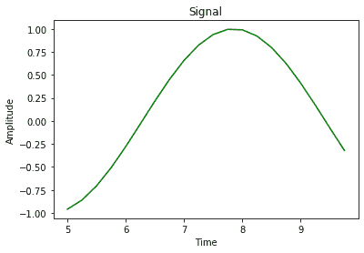
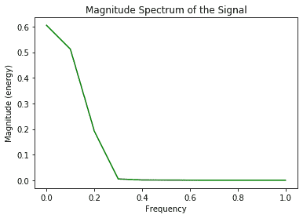
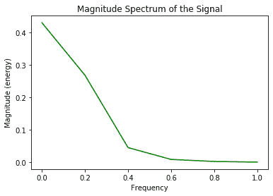
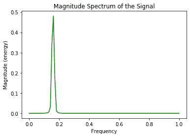

# 使用 Matplotlib

在 Python 中绘制震级谱

> 原文:[https://www . geeksforgeeks . org/python 中使用 matplotlib 绘制星等光谱图/](https://www.geeksforgeeks.org/plot-the-magnitude-spectrum-in-python-using-matplotlib/)

一个**信号**是一个电磁场或者电流来传输数据。信号有各种成分，如频率、振幅、波长、相位、角频率和描述它的周期。
周期信号可以用下面的正弦函数表示:

```py
y = A sin(w*t + Q)

```

其中`A`代表周期信号的振幅(单位:米)`w`代表频率(单位:赫兹)`t`代表时间周期(单位:秒)`Q`代表相位(单位:弧度)。

周期信号的两个主要成分频率和振幅定义了该信号的**幅度谱**。周期信号的频率分量绘制在横轴上，周期信号的幅度分量绘制在纵轴上。

在 Python 中，Python `matplotlib`库的`pyplot`模块中的`magnitude_spectrum()`方法绘制周期信号的幅度谱。下面是一些演示使用`magnitude_spectrum()`方法来可视化不同周期信号的幅度谱的程序。
**例 1:**

```py
# importing modules
import numpy
from matplotlib import pyplot 

# assigning time values of the signal
# initial time period, final time period and phase angle 
signalTime = numpy.arange(5, 10, 0.25);

# getting the amplitude of the signal
signalAmplitude = numpy.sin(signalTime)

# plotting the signal 
pyplot.plot(signalTime, signalAmplitude, color ='green')

pyplot.xlabel('Time')
pyplot.ylabel('Amplitude')
pyplot.title("Signal")

# plotting the magnitude spectrum of the signal 
pyplot.magnitude_spectrum(signalAmplitude, color ='green')

pyplot.title("Magnitude Spectrum of the Signal")
pyplot.show()
```

**输出:**


第一张图表示振幅对时间分量中的信号，第二张图表示振幅对频率图中的信号的幅度谱，通过对具有从 5 到 10 秒的时间周期、0.25 弧度相位角的信号使用`magnitude_spectrum()`，从给定的时间周期计算信号的频率，并且使用`numpy`模块中的`sin()`功能计算信号的振幅。

**例 2:**

```py
# importing modules
import numpy
from matplotlib import pyplot 

# assigning time values of the signal
# initial time period, final time period and phase angle 
signalTime = numpy.arange(0, 1, 0.1);

# getting the amplitude of the signal
signalAmplitude = numpy.sin(signalTime)

# plotting the signal 
pyplot.plot(signalTime, signalAmplitude, color ='green')

pyplot.xlabel('Time')
pyplot.ylabel('Amplitude')
pyplot.title("Signal")

# plotting the magnitude spectrum of the signal 
pyplot.magnitude_spectrum(signalAmplitude, color ='green')

pyplot.title("Magnitude Spectrum of the Signal")
pyplot.show()
```

**输出:**


在上面的程序中，由于信号的振幅随时间增加，所以在第一个图形中没有形成正弦波。信号存在于 0 到 1 秒的时间周期内，相位角为 0.1 弧度，信号的幅度谱用`magnitude_spectrum()`方法描绘。

**例 3:**

```py
# importing modules
import numpy
from matplotlib import pyplot 

# assigning time values of the signal
# initial time period, final time period and phase angle  
signalTime = numpy.arange(1, 100, 0.5);

# getting the amplitude of the signal
signalAmplitude = numpy.sin(signalTime)

# plotting the signal 
pyplot.plot(signalTime, signalAmplitude, color ='green')

pyplot.xlabel('Time')
pyplot.ylabel('Amplitude')
pyplot.title("Signal")

# plotting the magnitude spectrum of the signal 
pyplot.magnitude_spectrum(signalAmplitude, color ='green')

pyplot.title("Magnitude Spectrum of the Signal")
pyplot.show()
```

**输出:**


这里，信号用形成正弦波的振幅对时间图表示，信号的幅度谱用振幅对频率图中的`magnitude_spectrum()`方法表示。信号的时间周期从 1 秒到 100 秒开始，相位角为 0.5 弧度。