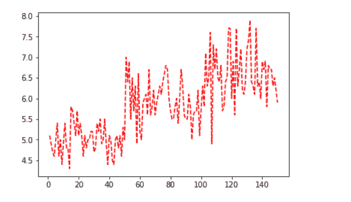
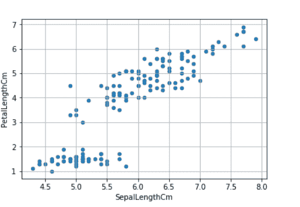
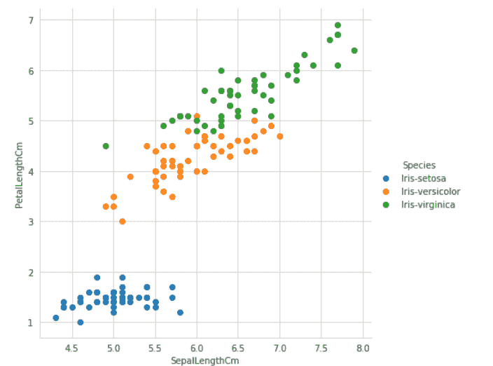

# 使用 Seaborn 和 Matplotlib 绘制虹膜数据集的图形

> 原文:[https://www . geeksforgeeks . org/绘图-graph-for-iris-dataset-use-seaborn-and-matplotlib/](https://www.geeksforgeeks.org/plotting-graph-for-iris-dataset-using-seaborn-and-matplotlib/)

**Matplotlib.pyplot** 库是机器学习领域 Python 中最常用的库。它有助于绘制大型数据集的图形。这不仅有助于对不同的数据集进行分类。它可以绘制二维和三维图形。它具有图例、标签、网格、图形形状、网格等功能，使数据集更容易理解和分类。

**Seaborn** 提供了一个漂亮的不同风格的图形绘制，使我们的数据集更加可区分和有吸引力。

### 装置

要安装软件包，请在 ubuntu/Linux 的终端或窗口命令提示符下编写以下代码。

```
pip install matplotlib
pip install seaborn
```

**数据集的属性信息:**

```
Attribute Information:
   -> sepal length in cm
   -> sepal width in cm
   -> petal length in cm
   -> petal width in cm
   -> class: 
              Iris Setosa
              Iris Versicolour
              Iris Virginica

Number of Instances: 150 

Summary Statistics:
             Min  Max   Mean    SD   Class Correlation
   sepal length: 4.3  7.9   5.84  0.83    0.7826   
    sepal width: 2.0  4.4   3.05  0.43   -0.4194
   petal length: 1.0  6.9   3.76  1.76    0.9490  (high!)
    petal width: 0.1  2.5   1.20  0.76    0.9565  (high!)

Class Distribution: 33.3% for each of 3 classes.
```

要获取虹膜数据，请点击这里的。

### 使用 Seaborn 库和 matplotlib.pyplot 库绘制虹膜数据集的图形

**加载数据**

## 蟒蛇 3

```
import numpy as np
import pandas as pd
import matplotlib.pyplot as plt

data = pd.read_csv("Iris.csv")

print (data.head(10))
```

**输出:**


**使用 Matplotlib 绘图**

## 蟒蛇 3

```
import pandas as pd
import matplotlib.pyplot as plt
iris = pd.read_csv("Iris.csv")

plt.plot(iris.Id, iris["SepalLengthCm"], "r--")
plt.show
```



**散点图**

## 蟒蛇 3

```
iris.plot(kind ="scatter",
          x ='SepalLengthCm',
          y ='PetalLengthCm')
plt.grid()
```



**使用海鸟**绘图

## 蟒蛇 3

```
import seaborn as sns

iris = sns.load_dataset('iris')

# style used as a theme of graph
# for example if we want black
# graph with grid then write "darkgrid"
sns.set_style("whitegrid")

# sepal_length, petal_length are iris
# feature data height used to define
# Height of graph whereas hue store the
# class of iris dataset.
sns.FacetGrid(iris, hue ="species",
              height = 6).map(plt.scatter,
                              'sepal_length',
                              'petal_length').add_legend()
```

