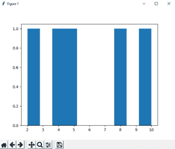
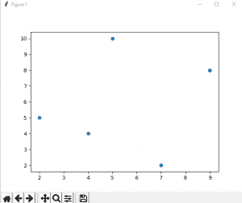

# Python | Matplotlib 简介

> 哎哎哎:# t0]https://www . geeksforgeeks . org/python-introduction-matplot lib/

Matplotlib 是一个神奇的 Python 可视化库，用于数组的 2D 图。Matplotlib 绘图库是一个基于 NumPy 阵列的多平台数据可视化库，旨在与更广泛的 SciPy 堆栈协同工作。它是由约翰·亨特在 2002 年推出的。

可视化的最大好处之一是，它允许我们以易于理解的视觉方式可视化访问大量数据。Matplotlib 由几个图组成，如直线、条形图、散点图、直方图等。

**安装:**
Windows、Linux 和 macOS 发行版都有 matplotlib 及其大部分依赖项作为轮包。运行以下命令安装`matplotlib` 包:

```py
python -mpip install -U matplotlib
```

**导入 matplotlib :**

```py
from matplotlib import pyplot as plt
*or*
import matplotlib.pyplot as plt 
```

#### Matplotlib 中的基本图:

Matplotlib 有各种各样的情节。图表有助于理解趋势、模式和建立相关性。它们是推理定量信息的典型工具。这里涵盖了一些示例图。

**线图:**

```py
# importing matplotlib module 
from matplotlib import pyplot as plt

# x-axis values
x = [5, 2, 9, 4, 7]

# Y-axis values
y = [10, 5, 8, 4, 2]

# Function to plot
plt.plot(x,y)

# function to show the plot
plt.show()
```

输出:

T2**栏式打印**

```py
# importing matplotlib module 
from matplotlib import pyplot as plt

# x-axis values
x = [5, 2, 9, 4, 7]

# Y-axis values
y = [10, 5, 8, 4, 2]

# Function to plot the bar
plt.bar(x,y)

# function to show the plot
plt.show()
```

输出:


**直方图:**

```py
# importing matplotlib module 
from matplotlib import pyplot as plt

# Y-axis values
y = [10, 5, 8, 4, 2]

# Function to plot histogram
plt.hist(y)

# Function to show the plot
plt.show()
```

输出:



**Scatter Plot :**

```py
# importing matplotlib module 
from matplotlib import pyplot as plt

# x-axis values
x = [5, 2, 9, 4, 7]

# Y-axis values
y = [10, 5, 8, 4, 2]

# Function to plot scatter
plt.scatter(x, y)

# function to show the plot
plt.show()
```

输出:



参考: [Matplotlib 文档](https://matplotlib.org/Matplotlib.pdf)。