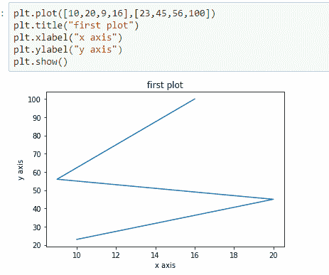
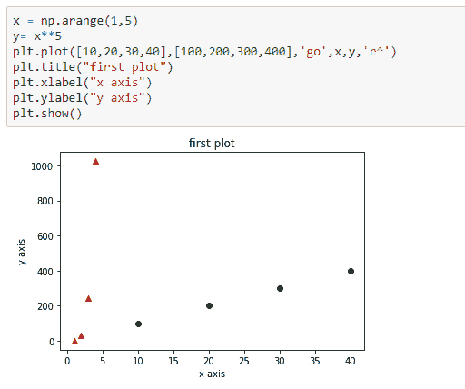
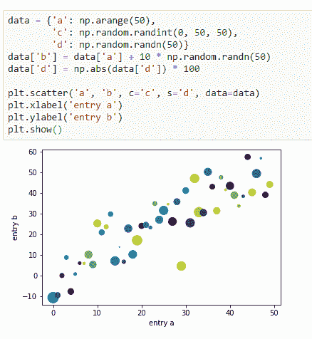
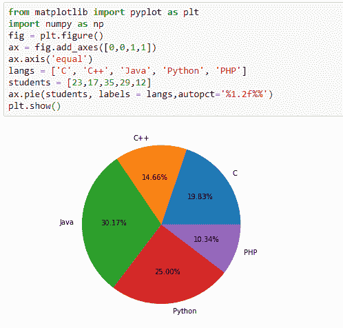
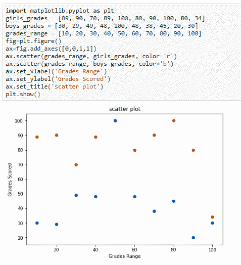
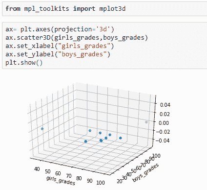

# Python Matplotlib–概述

> 原文:[https://www . geesforgeks . org/python-matplotlib-an-overview/](https://www.geeksforgeeks.org/python-matplotlib-an-overview/)

对于使用 Python 和 NumPy 的人来说，这是一个非常强大的绘图库。为了进行统计干扰，将我们的数据可视化变得非常必要，而 Matplotlib 是对此非常有帮助的工具。它提供类似 MATLAB 的接口，唯一不同的是它使用 Python，并且是开源的。

## 装置

在你的电脑上安装 Matplotlib 非常容易，你只需要打开命令提示符，给出如下命令:

```py
python -m pip install -U matplotlib
```

假设您使用的是最新版本的 Python，即 Python 3。如果你想涉足机器学习领域，建议下载 Anaconda Package Distribution，它附带了许多预安装的库，如 Matplotlib、Numpy、Pandas、Scikit-learn，其中最重要的是 Jupyter Notebook。

## 基础

在进一步讨论之前，让我们明确我们的基本原则，

*   **图形–**是包含一个或多个轴或地块的整体图形。
*   **轴–**一个图形通常包含一个以上的轴(图)，如果是三维结构或物体，它可能包含两个或三个轴。每个轴都有一个标题、一个 X 标签和一个 Y 标签。
*   **轴-** 负责生成图形极限
*   **艺术家-** 他们大多被绑在轴上，无论我们在图上看到什么，比如文本对象、line2d 对象、集合对象。

既然我们已经了解了基础知识，让我们制作一个简单的情节:

#### 制作一个简单的情节


因此，这里我们传递两个数组作为输入，并使用`show()`，以获得所需的图，因为从图中可以看到，第一个数组出现在 x 轴上，第二个数组出现在给定图的 y 轴上。现在让我们给情节加上标题



#### 绘制多组数据

我们还可以通过在图中传递 X 轴和 Y 轴的多组参数来绘制多组数据，



#### 使用关键字字符串绘图

有时，我们的数据格式允许我们用字符串访问特定的变量，所以 matplotlib 用 data 关键字参数给了我们这样的对象。因此，有了这些，您可以生成带有对应于给定变量的字符串的图:



#### 处理文本

Matplotlib 有一个`text()`命令，可用于在任意位置添加文本，`label()`和`title()`用于在预定义位置添加文本:


## 绘制条形图

既然我们已经学习了如何使用文本和如何绘制直方图，那么让我们继续学习如何绘制条形图。我们知道条形图是最常见的图形类型，因此 Matplotlib 提供了一个`bar()`函数来制作条形图，该函数可能采用我们将指定的所需参数，


#### 绘制饼图

我们也可以通过使用`pie()`命令并传递所需的参数来绘制饼图，



#### 散射和三维绘图

它是最基本、应用最广泛的图，尤其是在解决回归问题中有很大的用处。假设我们用两种不同的颜色绘制了男孩和女孩的成绩范围与成绩的散点图，(我们总是使用不同的颜色，因为图表应该易于可视化)



我们也可以在三维视图中查看上面的散点，但是为此，我们必须导入另一个名为 mplot3d 的模块，当导入该模块时，我们必须使用关键字创建三维轴。

投影= '3d '到`axes()`，当物体被创建时，我们传递我们的论点女孩和男孩的成绩，和成绩范围



## 结论

您已经成功完成了今天的 Matplotlib 教程！还有很多东西需要学习，但你肯定已经准备好自己走出去，创造自己的惊人情节。如果您渴望从 matplotlib 中发现更多信息，请考虑查看极客档案[极客档案](https://www.geeksforgeeks.org/tag/python-matplotlib/)，了解如何使用 Matplotlib，如果您已经准备好开始探索 Python 的交互式数据可视化。