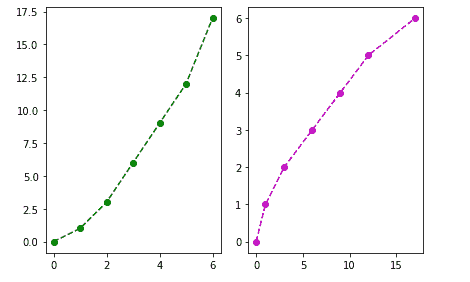

# Python | Matplotlib 使用面向对象的 API 进行子绘图

> 原文:[https://www . geesforgeks . org/python-matplotlib-子绘图-使用-面向对象-api/](https://www.geeksforgeeks.org/python-matplotlib-sub-plotting-using-object-oriented-api/)

在 matplotlib 中使用面向对象的应用编程接口绘图是绘制图形和其他数据可视化方法的一种简单方法。

创建子绘图的类和对象的简单语法是–

> class_name，object _ name = matplotlib . pyplot . subplot(' no _ of _ rows '，' no_of_columns ')

我们举几个例子来说明一下。

**示例#1:**

```py
# importing the matplotlib library
import matplotlib.pyplot as plt

# defining the values of X
x =[0, 1, 2, 3, 4, 5, 6]

# defining the value of Y
y =[0, 1, 3, 6, 9, 12, 17]

# creating the canvas with class 'fig'
# and it's object 'axes' with '1' row 
# and '2' columns
fig, axes = plt.subplots(1, 2)

# plotting graph for 1st column
axes[0].plot(x, y, 'g--o')

# plotting graph for second column
axes[1].plot(y, x, 'm--o')

# Gives a clean look to the graphs
fig.tight_layout()
```

**输出:**


在上面的例子中，我们在绘制图形时使用了‘axes’(类‘fig’的对象)作为数组，这是因为当我们定义行数和列数时，对象的数组是用‘n’个元素创建的，其中‘n’是行和列的乘积，所以如果我们有 2 列和 2 行，那么就会有 4 个元素的数组。

**例 2:**

```py
# importing the matplotlib library
import matplotlib.pyplot as plt

# defining the values of X
x =[0, 1, 2, 3, 4, 5, 6]

# defining the value of Y
y =[0, 1, 3, 6, 9, 12, 17]

# creating the canvas with class 'fig'
# and it's object 'axes' with '1' row 
# and '2' columns
fig, axes = plt.subplots(2, 2)

# plotting graph for 1st element
axes[0, 0].plot(x, y, 'g--o')

# plotting graph for 2nd element
axes[0, 1].plot(y, x, 'm--o')

# plotting graph for 3rd element
axes[1, 0].plot(x, y, 'b--o')

# plotting graph for 4th element
axes[1, 1].plot(y, x, 'r--o')

# Gives a clean look to the graphs
fig.tight_layout()
```

**输出:**
