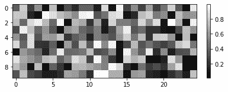
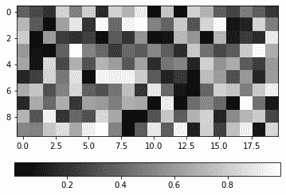
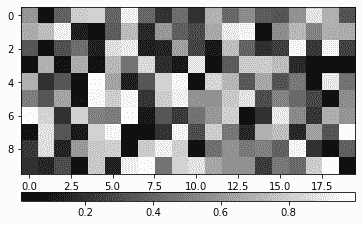
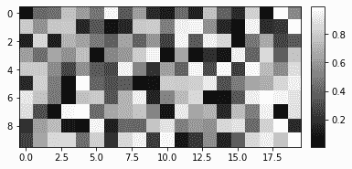
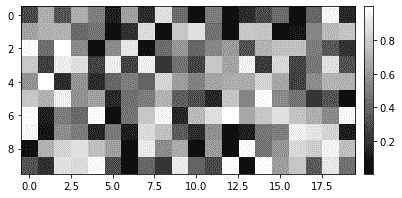
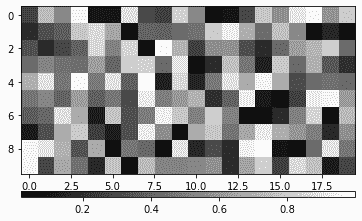

# 设置 Matplotlib 颜色条大小以匹配图形

> 原文:[https://www . geesforgeks . org/set-matplotlib-color bar-size-to-match-graph/](https://www.geeksforgeeks.org/set-matplotlib-colorbar-size-to-match-graph/)

**先决条件:**T2【马特洛特利

为了获得良好的可视化效果，需要与图形或图像相匹配的颜色条大小。这可以使用以下任何一种方法来实现。

### **方法 1:使用分数参数**

*彩条()*中的分数参数用于设置彩条的大小。利用这一点，我们可以将颜色条大小与图表匹配为:

*   如果使用垂直颜色条，则分数=0.047 *(图像的高度/图像的宽度)
*   如果使用水平颜色条，则分数=0.047 *(图像的宽度/图像的高度)

**接近**

*   导入模块
*   绘制图表
*   设置分数参数
*   绘图颜色条
*   显示图

**例 1:**

## 蟒蛇 3

```py
import matplotlib.pyplot as plt
import numpy as np

# Plot an image
a = np.random.random((10, 20))
plt.imshow(a, cmap='gray')

# Calculate (height_of_image / width_of_image)
im_ratio = a.shape[0]/a.shape[1]

# Plot vertical colorbar
plt.colorbar(fraction=0.047*im_ratio)
plt.show()
```

**输出:**



**例 2:**

## 蟒蛇 3

```py
import matplotlib.pyplot as plt
import numpy as np

# Plot an image
a = np.random.random((10, 20))
plt.imshow(a, cmap='gray')

# Calculate (width_of_image/height_of_image)
im_ratio = a.shape[1]/a.shape[0]

# Plot horizontal colorbar
plt.colorbar(orientation="horizontal", fraction=0.047*im_ratio)
plt.show()
```

**输出:**



### **方法二:使用 axes_grid1 工具包**

Axis_grid1 提供了一个辅助函数 *make_axes_locatable()* ，该函数获取一个现有的 axes 实例并为其创建一个分割线。它提供了 *append_axes()* 方法，在原始轴的给定侧(“顶部”、“右侧”、“底部”和“左侧”)创建新轴。

**进场:**

*   导入模块
*   绘制图像
*   使用*使 _ axes _ located()*分割现有轴实例
*   使用*追加 _ 轴()*创建新轴
    *   水平颜色条使用“顶部”或“底部”
    *   使用“左侧”或“右侧”作为垂直颜色条
*   在创建的轴上绘制颜色条

**例 1:**

## 蟒蛇 3

```py
import matplotlib.pyplot as plt
from mpl_toolkits.axes_grid1 import make_axes_locatable
import numpy as np

# Plot image on axes ax
ax = plt.gca()
img = np.random.random((10, 20))
im = plt.imshow(img, cmap='gray')

# Divide existing axes and create new axes
# at bottom side of image
divider = make_axes_locatable(ax)
cax = divider.append_axes("bottom", size="5%", pad=0.25)

# Plot horizontal colorbar
plt.colorbar(im, orientation="horizontal", cax=cax)
plt.show()
```

**输出:**



**例 2:**

## 蟒蛇 3

```py
import matplotlib.pyplot as plt
from mpl_toolkits.axes_grid1 import make_axes_locatable
import numpy as np

# Plot image on axes ax
ax = plt.gca()
img = np.random.random((10, 20))
im = plt.imshow(img, cmap='gray')

# Divide existing axes and create
# new axes at right side of image
divider = make_axes_locatable(ax)
cax = divider.append_axes("right", size="5%", pad=0.15)

# Plot vertical colorbar
plt.colorbar(im, cax=cax)
plt.show()
```

**输出:**



### **方法三:使用 add_axes()方法**

使用 *add_axes()* 方法给一个颜色条赋予它自己的轴，可以是一种获得与给定图像匹配的颜色条的方法。

**进场:**

*   绘制图表
*   使用带有位置参数的 *add_axes()* 方法创建轴:
    *   对于图像右侧的 **v** 垂直颜色条:
        *   **左侧:**彩条的左侧点=图像的右端位置
        *   **底部:**彩条的底部点=图像的底端位置
        *   **宽度:**彩条宽度
        *   **高度:**彩条高度=图像高度
    *   对于图像底部的水平颜色条:
        *   **左侧:**彩条的左侧点=图像的左端位置
        *   **底部:**彩条的底部点=图像的底端位置
        *   **宽度:**彩条宽度=图像宽度
        *   **高度:**彩条高度
*   在创建的轴上绘制颜色条

**例 1 :**

## 蟒蛇 3

```py
import matplotlib.pyplot as plt
import numpy as np

# Plot image
fig = plt.figure()
ax = plt.axes()
img = np.random.random((10, 20))
im = plt.imshow(img, cmap='gray')

# Create new axes according to image position
cax = fig.add_axes([ax.get_position().x1+0.01,
                    ax.get_position().y0,
                    0.02,
                    ax.get_position().height])

# Plot vertical colorbar
plt.colorbar(im, cax=cax)
plt.show()
```

**输出:**



**例 2:**

## 蟒蛇 3

```py
import matplotlib.pyplot as plt
import numpy as np

# Plot an image
fig = plt.figure()
ax = plt.axes()
img = np.random.random((10, 20))
im = plt.imshow(img, cmap='gray')

# Create new axes according to image position
cax = fig.add_axes([ax.get_position().x0,
                    ax.get_position().y0-0.08,
                    ax.get_position().width,
                    0.02])

# Plot horizontal colorbar on created axes
plt.colorbar(im, orientation="horizontal", cax=cax)
plt.show()
```

**输出:**

