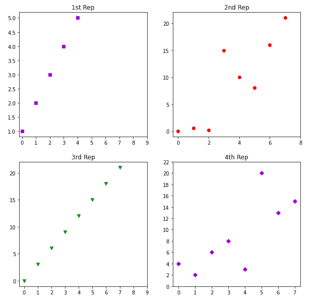

# 使用 Matplotlib 的 Python 简单绘图

> 原文:[https://www . geesforgeks . org/simple-plot-in-python-using-matplotlib/](https://www.geeksforgeeks.org/simple-plot-in-python-using-matplotlib/)

[Matplotlib](https://www.geeksforgeeks.org/python-matplotlib-an-overview/) 是一个 Python 库，它有助于可视化和分析数据，并借助于可以使用 Matplotlib 库进行模拟的图形化可视化来帮助更好地理解数据。Matplotlib 是一个用于静态、动画和交互式可视化的综合库。

### matplotlib 库的安装

**第一步:**打开命令管理器(只需在窗口开始搜索栏中键入“cmd”)
**第二步:**在终端中键入以下命令。

```
cd Desktop
```

**步骤 3:** 然后键入以下命令。

```
pip install matplotlib
```

## 创建简单的绘图

## 蟒蛇 3

```
# importing the required module
import matplotlib.pyplot as plt

# x axis values
x = [1,2,3]
# corresponding y axis values
y = [2,4,1]

# plotting the points 
plt.plot(x, y)

# naming the x axis
plt.xlabel('x - axis')
# naming the y axis
plt.ylabel('y - axis')

# giving a title to my graph
plt.title('My first graph!')

# function to show the plot
plt.show()
```

**输出:**


代码似乎不言自明。遵循了以下步骤:

*   将 x 轴和相应的 y 轴值定义为列表。

*   使用在画布上绘制它们。plot()函数。

*   使用给 x 轴和 y 轴命名。xlabel()和。ylabel()函数。

*   使用给你的情节一个标题。title()函数。

*   Finally, to view your plot, we use .show() function. 

    **我们来看看 matplotlib 中经常用到的一些基本函数。**

<figure class="table">

| 方法 | 描述 |
| --- | --- |
| 图() | 它在计算机的背景下创造情节，而不是显示它。我们还可以添加一个标签，作为我们将称之为这个图的名称的论据——在图例()中使用 |
| 显示() | 它显示创建的地块 |
| xlabel() | 它标记 x 轴 |
| 伊兰贝尔() | 它标记 y 轴 |
| 标题() | 它给出了图表的标题 |
| gca() | 它有助于访问图的所有四个轴 |
| gca()。刺['右/左/上/下']。set_visible(真/假) | 它可以接近单个脊椎或单个边界，并帮助改变它们的可见性 |
| xts() | 它决定如何在 x 轴上做标记 |
| yticks() | 它决定如何在 y 轴上做标记 |
| gca()。图例() | 传递一个列表作为所有绘制图的参数，如果未明确指定标签，则按照绘制图的相同顺序添加列表中的值 |
| 注释() | 它用于在图表的指定位置写注释 |
| 图(figsize = (x，y)) | 每当我们希望结果显示在一个单独的窗口中时，我们就使用这个命令，figsize 参数决定运行后显示的窗口的初始大小 |
| 支线剧情(r、c、I) | 它用于在同一图中创建多个图，其中 r 表示图中的行数，c 表示图中的列数，I 表示特定图的位置 |
| set _ XT picks | 它用于设置子图中 x 轴上标记的范围和步长 |
| set_yticks | 它用于设置子图中 y 轴上标记的范围和步长 |

</figure>

**注意:**试着一个一个去掉添加的特征，了解输出结果是如何变化的
**例 1:**

## 蟒蛇 3

```
import matplotlib.pyplot as plt

a = [1, 2, 3, 4, 5]
b = [0, 0.6, 0.2, 15, 10, 8, 16, 21]
plt.plot(a)

# o is for circles and r is
# for red
plt.plot(b, "or")

plt.plot(list(range(0, 22, 3)))

# naming the x-axis
plt.xlabel('Day ->')

# naming the y-axis
plt.ylabel('Temp ->')

c = [4, 2, 6, 8, 3, 20, 13, 15]
plt.plot(c, label = '4th Rep')

# get current axes command
ax = plt.gca()

# get command over the individual
# boundary line of the graph body
ax.spines['right'].set_visible(False)
ax.spines['top'].set_visible(False)

# set the range or the bounds of
# the left boundary line to fixed range
ax.spines['left'].set_bounds(-3, 40)

# set the interval by  which
# the x-axis set the marks
plt.xticks(list(range(-3, 10)))

# set the intervals by which y-axis
# set the marks
plt.yticks(list(range(-3, 20, 3)))

# legend denotes that what color
# signifies what
ax.legend(['1st Rep', '2nd Rep', '3rd Rep', '4th Rep'])

# annotate command helps to write
# ON THE GRAPH any text xy denotes
# the position on the graph
plt.annotate('Temperature V / s Days', xy = (1.01, -2.15))

# gives a title to the Graph
plt.title('All Features Discussed')

plt.show()
```

**输出:**


**例 2:**

## 蟒蛇 3

```
import matplotlib.pyplot as plt

a = [1, 2, 3, 4, 5]
b = [0, 0.6, 0.2, 15, 10, 8, 16, 21]
c = [4, 2, 6, 8, 3, 20, 13, 15]

# use fig whenever u want the
# output in a new window also
# specify the window size you
# want ans to be displayed
fig = plt.figure(figsize =(10, 10))

# creating multiple plots in a
# single plot
sub1 = plt.subplot(2, 2, 1)
sub2 = plt.subplot(2, 2, 2)
sub3 = plt.subplot(2, 2, 3)
sub4 = plt.subplot(2, 2, 4)

sub1.plot(a, 'sb')

# sets how the display subplot
# x axis values advances by 1
# within the specified range
sub1.set_xticks(list(range(0, 10, 1)))
sub1.set_title('1st Rep')

sub2.plot(b, 'or')

# sets how the display subplot x axis
# values advances by 2 within the
# specified range
sub2.set_xticks(list(range(0, 10, 2)))
sub2.set_title('2nd Rep')

# can directly pass a list in the plot
# function instead adding the reference
sub3.plot(list(range(0, 22, 3)), 'vg')
sub3.set_xticks(list(range(0, 10, 1)))
sub3.set_title('3rd Rep')

sub4.plot(c, 'Dm')

# similarly we can set the ticks for
# the y-axis range(start(inclusive),
# end(exclusive), step)
sub4.set_yticks(list(range(0, 24, 2)))
sub4.set_title('4th Rep')

# without writing plt.show() no plot
# will be visible
plt.show()
```

**输出:**

