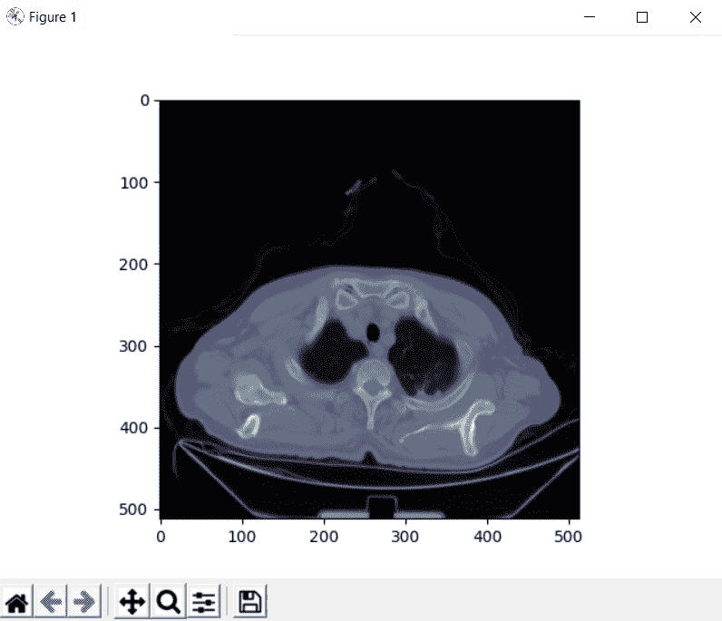

# 使用 Pydicom 和 Matplotlib 查看 DICOM 图像

> 原文:[https://www . geeksforgeeks . org/view-DICOM-images-using-pydicom-and-matplotlib/](https://www.geeksforgeeks.org/view-dicom-images-using-pydicom-and-matplotlib/)

**先决条件:**T2【马特洛特利

DICOM 代表医学中的数字成像和通信。引入 DICOM 文件是为了保持不同类型医学图像模式的一致性。它是查看、存储、共享和检索医学图像的标准格式。

Python 提供了一个强大的模块 **pydicom** 来处理医学图像、报告和放射治疗对象等 dicom 文件。 **pydicom** 读取、修改和写入 dicom 文件中的数据。

### 装置

在命令提示符下运行以下命令:

```
pip install dicom
pip install matplotlib
```

pydicom 使我们能够处理 dicom 文件，在本文中我们将讨论使用 pydicom 和 matplotlib 查看 DICOM 文件的机制。为了读取 DICOM 文件，我们使用 pydicom 包，为了查看结果，我们使用 matplotlib。

### 方法

*   导入模块
*   使用**py DICOM . data . data _ manager . get _ files()**方法读取 DICOM 文件

> **语法:**
> 
> py DICOM . data . data _ manager . get _ files(base，pass_dicom)[0]
> 
> **参数:**
> 
> *   **Base :** 是以字符串形式递归搜索的基目录。
> *   **模式:**默认为“*”。这是一个字符串模式，用于过滤文件。

*   提供两个参数:基础和模式
*   将数据显示为图像，即在 2D 常规光栅上。
*   显示图像

**注意:**在变量名的基中输入除文件名以外的 dcm 文件的位置，在 pass_dicom 变量中输入文件名。在这种情况下，文件存储在一个名为 dicom_image 的目录中，如图所示:

从[这里](https://drive.google.com/drive/u/0/folders/17oIs4uYwjs-kAkVdXFt_mWzorVEnr4K2)下载 dcm 文件，重命名为:1-12.dcm


将地址栏中显示的路径与变量 base 和 pass_dicom 中存储的值进行比较

**程序:**

## 蟒蛇 3

```
import matplotlib.pyplot as plt
import pydicom
import pydicom.data

# Full path of the DICOM file is passed in base
base = r"C:\Users\Ajit Gupta\Documents\dicom image"
pass_dicom = "1-12.dcm"  # file name is 1-12.dcm

# enter DICOM image name for pattern
# result is a list of 1 element
filename = pydicom.data.data_manager.get_files(base, pass_dicom)[0]

ds = pydicom.dcmread(filename)

plt.imshow(ds.pixel_array, cmap=plt.cm.bone)  # set the color map to bone
plt.show()
```

**输出:**

