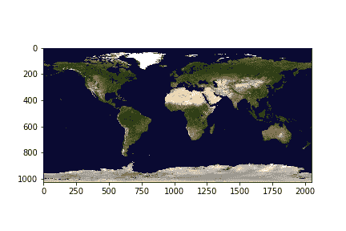

# 使用 Matplotlib 可视化 Tiff 文件，使用 Python 可视化 GDAL】

> 原文:[https://www . geesforgeks . org/visiting-tiff-file-using-matplotlib-and-gdal-using-python/](https://www.geeksforgeeks.org/visualizing-tiff-file-using-matplotlib-and-gdal-using-python/)

Tiff 文件格式用于存储光栅图像。一个名为 GDAL-地理空间数据抽象库的库专门用于读取这种光栅文件以及其他文件格式，如矢量格式。gdal 模块属于开源地理空间基金会

要安装此模块，请在您的终端上运行此命令。

```py
pip install GDAL

```

为了可视化 tiff 文件，我们需要 python 中的 [matplotlib](https://www.geeksforgeeks.org/python-introduction-matplotlib/) 和 GDAL 模块。

#### **接近**:

1.  导入模块
2.  数一数乐队的数量。
3.  从 tiff 文件中获取所有栅格波段。
4.  将波段读入 NumPy 数组。
5.  将数组传递到 Matplotlib 的 imshow()中进行可视化。

tiff 文件可以从[这里](https://drive.google.com/file/d/1Zjxa5iD-L8RjP1U2gKau92YTFNeIgUGd/view?usp=sharing)下载。

#### **分步实施:**

**步骤 1:** 导入模块并打开文件。

## 蟒蛇 3

```py
from osgeo import gdal
import matplotlib.pyplot as plt

dataset = gdal.Open(r'land_shallow_topo_2048.tif')
```

**第二步:**统计波段数。

## 蟒蛇 3

```py
print(dataset.RasterCount)
```

**输出:**

```py
3

```

**第三步:**取出条带，

要获取波段，我们使用 GDAL 的 GetRasterBand(int)。
注意我们传递的 int 的值总是从 1 开始(分带索引从 1 开始)，

## 蟒蛇 3

```py
# since there are 3 bands
# we store in 3 different variables
band1 = dataset.GetRasterBand(1) # Red channel
band2 = dataset.GetRasterBand(2) # Green channel
band3 = dataset.GetRasterBand(3) # Blue channel
```

**第 4 步:**将条带读取为 Numpy 阵列。

GDAL 提供了 ReadAsArray()方法，将波段转换为 numpy 数组并返回。

## 蟒蛇 3

```py
b1 = band1.ReadAsArray()
b2 = band2.ReadAsArray()
b3 = band3.ReadAsArray()
```

**步骤 5:** 使用 imshow()绘制阵列。

为了绘制三个数组，我们将按顺序堆叠它们。

## 蟒蛇 3

```py
img = np.dstack((b1, b2, b3))
f = plt.figure()
plt.imshow(img)
plt.savefig('Tiff.png')
plt.show()
```

**输出:**

