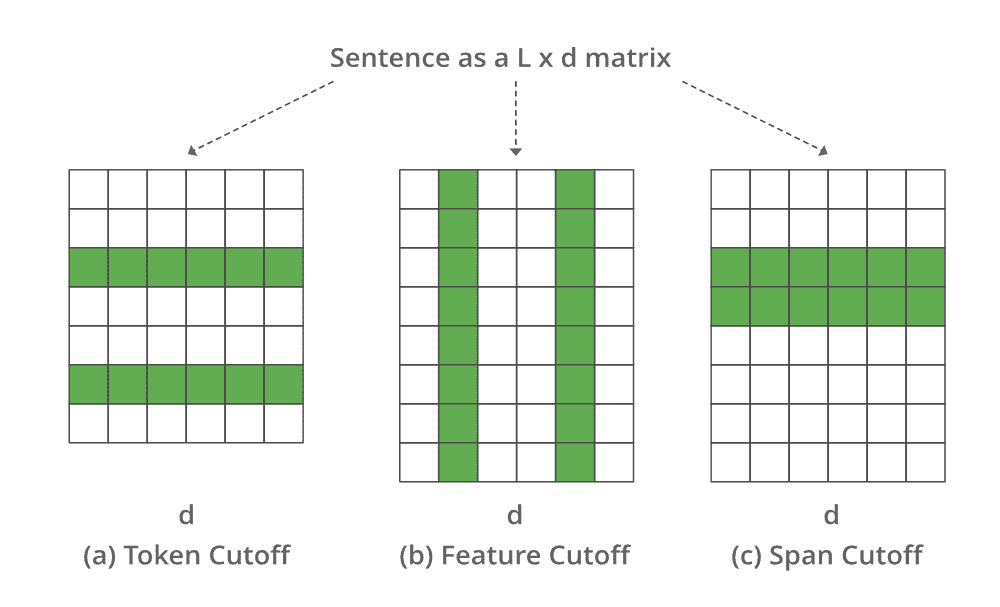

# 自然语言处理中的对比学习

> 原文:[https://www.geeksforgeeks.org/contrastive-learning-in-nlp/](https://www.geeksforgeeks.org/contrastive-learning-in-nlp/)

对比学习的目标是学习这样的嵌入空间，其中相似的样本彼此接近，而不相似的样本相距很远。它假设一组成对的句子，如，其中 xi 和 xi+在语义上相互关联。

让和表示 x_i 和{ 的表示，对于 N 对的小批量，的训练目标是:


其中\τ是温度超参数，sim( )表示编码输出的余弦相似度，可以使用预训练语言模型(如 BERT 和 RoBERTa)生成

它可以应用于监督和非监督设置。在本文中，我们将讨论对比学习的一个特定领域，即文本扩充。

### 文字增加:

计算机视觉中的对比学习只是产生图像的增强。构建文本增广比图像增广更具挑战性，因为我们需要保持句子的意义。有 3 种方法可以增加文本序列:

#### **反向翻译**

在这种方法中，我们试图通过反向翻译来生成增广句子。来自变压器的对比自监督编码器表示)就是这样一篇论文。在本文中，针对不同语言的许多翻译模型被用来对输入文本进行文本扩充，然后我们使用这些扩充来生成文本样本，我们可以使用不同的对比学习记忆库框架来生成句子嵌入。

#### 词汇编辑:

词汇编辑是一组简单的文本扩充操作。它将一个句子作为输入，并随机应用四个简单操作之一:

*   随机插入(RI):在句子的随机位置插入一个随机选择的非终止词的同义词。
*   随机交换(RS):随机交换两个单词 n 次。
*   随机删除(RD):以概率 p 随机删除句子中的每个单词。
*   同义词替换(SR): 从句子中随机选择 n 个非终止词。用随机选择的同义词替换这些单词。

虽然这些方法简单、易于实现，但作者也承认存在局限性，即它们在小数据集上的改进不足 1%，并且当用作预训练模型时几乎没有改进。

#### 截止和压差:

**截止时间:**

2009 年，微软公司的沈等人和伊利诺伊大学的研究人员提出了一种使用截止进行文本增强的方法。他们提出了 3 种不同的截止增强策略。我们将逐一讨论这些策略，但是让我们考虑将句子表示为 L*d 的嵌入，其中 L 是特征的数量，d 是句子的长度

*   特征切断:移除一些选定的特征。
*   令牌切断:移除少数选定令牌的信息。
*   跨度截断:删除连续的文本块。



代表不同截止值的图像

为了比较不同增强的预测分布，我们在训练中使用了额外的 KL-散度损失。

**辍学:**

2021 年，斯坦福 NLP 小组的研究人员提出了 SimCSE。在无监督的场景中，它学习使用 dropout 噪声来预测句子本身。换句话说，他们将 DropOut 视为文本序列的数据扩充。

在上面的方法中，我们收集了一组句子{[x _ I]]}_{i=1}^{m}，并将正对本身视为 x_i^{+} = x_i。在变形金刚的训练过程中，有一个丢失掩码和注意力概率应用于全连接层。它通过应用不同的丢失掩码 z，z <sub>0</sub> 简单地将相同的输入馈送到编码器两次，因此训练目标函数可以定义为:


其中，h_i^{z_i} = f_\theta (x_i，z)是输出，z 是压差的标准屏蔽。

在有监督的环境中，我们试图利用自然语言推理数据集(NLI)来预测给定句子对之间是否存在蕴涵(正对)或矛盾(负对)。我们扩展目标可以定义为:


SimCSE 的工作原理

### 履行

*   在这个实现中，我们取几个句子，然后应用 SimCSE 标记器对句子和模型进行标记，以生成输入的嵌入，然后计算它们之间的余弦相似度 b/w。

## 蟒蛇 3

```
# Install PyTorch
! pip install torch==1.7.1+cu110 -f https://download.pytorch.org/whl/torch_stable.html
# clone the repo
!git clone https://github.com/princeton-nlp/SimCSE
# install the requirements
! pip install -r /content/SimCSE/requirements.txt

# imports
import torch
from scipy.spatial.distance import cosine
from transformers import AutoModel, AutoTokenizer

# Import the pretrained models and tokenizer, this will also download and import th
tokenizer = AutoTokenizer.from_pretrained("princeton-nlp/sup-simcse-bert-base-uncased")
model = AutoModel.from_pretrained("princeton-nlp/sup-simcse-bert-base-uncased")

# input sentence
texts = [
    "I am writing an article",
    "Writing an article on Machine learning",
    "I am not writing.",
    "the article on machine learning is already written"
]

# tokenize the input
inputs = tokenizer(texts, padding=True, truncation=True, return_tensors="pt")

# generate the embeddings
with torch.no_grad():
    embeddings = model(**inputs, output_hidden_states=True,
                       return_dict=True).pooler_output
# the shape of embedding (# input, 768)
embeddings.shape

# print cosine similarity b/w the sentences
for i in range(len(texts)):
  for j in range(len(texts)):
    if (i != j):
      cosine_sim = 1 - cosine(embeddings[i], embeddings[j])
      print("Cosine similarity between \"%s\" and \"%s\" is: %.3f" % (texts[i], texts[j], cosine_sim))
```

> “我正在写文章”和“正在写一篇关于机器学习的文章”之间的余弦相似度为:0.515
> 在“我正在写文章”和“我没有在写”之间的余弦相似度 is: 0.517
> 在“我在写文章”和“关于机器学习的文章已经写了”之间的余弦相似度为:0.441
> 在“写关于机器学习的文章”和“我正在写文章”之间的余弦相似度为:0.515
> 在“写关于机器学习的文章”和“我没有在写”之间的余弦相似度为 is: 0.188
> 在“写一篇关于机器学习的文章”和“关于机器学习的文章已经写了”之间的余弦相似度是:0.807
> 在“我没有在写”之间的余弦相似度而“我在写文章”是:0.517
> 余弦相似度“我没有在写。”而“写一篇关于机器学习的文章”是:0.188
> 余弦相似度“我不是在写。”而“关于机器学习的文章已经写好了”是:0.141
> 关于机器学习的文章已经写好了”和“我正在写文章”之间的余弦相似度是:0.441
> 关于机器学习的文章已经写好了”和“正在写机器学习的文章”之间的余弦相似度是:0.807
> 关于机器学习的文章已经写好了”和“我没有写好”之间的余弦相似度是:0.141

*   在上面的例子中，我们只是比较句子的余弦相似度。想了解更多培训详情，请查看官方[资源库](https://github.com/princeton-nlp/SimCSE)中的培训详情。

### 参考文献:

*   [**SimCSE 论文**](https://arxiv.org/pdf/2104.08821.pdf)
*   [**CERT 纸**](https://arxiv.org/pdf/2005.12766.pdf)
*   [**【截止文本增加】**](https://arxiv.org/pdf/2009.13818.pdf)
*   [**【l’il wong 博客**](https://lilianweng.github.io/lil-log/2021/05/31/contrastive-representation-learning.html#text-augmentation)