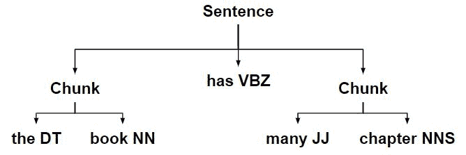

# NLP |分块规则

> 原文:[https://www.geeksforgeeks.org/nlp-chunking-rules/](https://www.geeksforgeeks.org/nlp-chunking-rules/)

以下是重庆的步骤——

*   句子到平树的转换。


*   使用此树创建区块字符串。
*   通过使用正则表达式解析语法来创建正则表达式解析器。
*   将创建的组块规则应用于将句子匹配成组块的组块字符串。


*   使用定义的块规则将较大的块分割成较小的块。



*   ChunkString 然后被转换回树，有两个 chunk 子树。


**代码#1:通过应用每个规则修改 ChunkString。**

## 蟒蛇 3

```py
# Loading Libraries
from nltk.chunk.regexp import ChunkString, ChunkRule, ChinkRule
from nltk.tree import Tree

# ChunkString() starts with the flat tree
tree = Tree('S', [('the', 'DT'), ('book', 'NN'),
               ('has', 'VBZ'), ('many', 'JJ'), ('chapters', 'NNS')])

# Initializing ChunkString()
chunk_string = ChunkString(tree)
print ("Chunk String : ", chunk_string)

# Initializing ChunkRule
chunk_rule = ChunkRule('<DT><NN.*><.*>*<NN.*>', 'chunk determiners and nouns')
chunk_rule.apply(chunk_string)
print ("\nApplied ChunkRule : ", chunk_string)

# Another ChinkRule
ir = ChinkRule('<VB.*>', 'chink verbs')
ir.apply(chunk_string)
print ("\nApplied ChinkRule : ", chunk_string, "\n")

# Back to chunk sub-tree
chunk_string.to_chunkstruct()
```

**输出:**

```py
Chunk String :   <<DT>  <NN>  <VBZ>  <JJ>  <NNS> 

Applied ChunkRule :  {<DT>  <NN>  <VBZ>  <JJ>  <NNS>}

Applied ChinkRule :  {<DT>  <NN>} <VBZ> {<JJ>  <NNS>} 

Tree('S', [Tree('CHUNK', [('the', 'DT'), ('book', 'NN')]), 
    ('has', 'VBZ'), Tree('CHUNK', [('many', 'JJ'), ('chapters', 'NNS')])])
```

**注意:**这段代码的工作方式与上面 ChunkRule 步骤中解释的完全相同。

**代码#2:如何直接用 RegexpChunkParser 完成这个任务。**

## 蟒蛇 3

```py
# Loading Libraries
from nltk.chunk.regexp import ChunkString, ChunkRule, ChinkRule
from nltk.tree import Tree
from nltk.chunk import RegexpChunkParser

# ChunkString() starts with the flat tree
tree = Tree('S', [('the', 'DT'), ('book', 'NN'),
               ('has', 'VBZ'), ('many', 'JJ'), ('chapters', 'NNS')])

# Initializing ChunkRule
chunk_rule = ChunkRule('<DT><NN.*><.*>*<NN.*>', 'chunk determiners and nouns')

# Another ChinkRule
chink_rule = ChinkRule('<VB.*>', 'chink verbs')

# Applying RegexpChunkParser
chunker = RegexpChunkParser([chunk_rule, chink_rule])
chunker.parse(tree)
```

**输出:**

```py
Tree('S', [Tree('CHUNK', [('the', 'DT'), ('book', 'NN')]), 
    ('has', 'VBZ'), Tree('CHUNK', [('many', 'JJ'), ('chapters', 'NNS')])])
```

**代码#3:用不同的 ChunkType 解析。**T3】

## 蟒蛇 3

```py
# Loading Libraries
from nltk.chunk.regexp import ChunkString, ChunkRule, ChinkRule
from nltk.tree import Tree
from nltk.chunk import RegexpChunkParser

# ChunkString() starts with the flat tree
tree = Tree('S', [('the', 'DT'), ('book', 'NN'),
               ('has', 'VBZ'), ('many', 'JJ'), ('chapters', 'NNS')])

# Initializing ChunkRule
chunk_rule = ChunkRule('<DT><NN.*><.*>*<NN.*>', 'chunk determiners and nouns')

# Another ChinkRule
chink_rule = ChinkRule('<VB.*>', 'chink verbs')

# Applying RegexpChunkParser
chunker = RegexpChunkParser([chunk_rule, chink_rule], chunk_label ='CP')
chunker.parse(tree)
```

**输出:**

```py
Tree('S', [Tree('CP', [('the', 'DT'), ('book', 'NN')]), ('has', 'VBZ'), 
          Tree('CP', [('many', 'JJ'), ('chapters', 'NNS')])])
```