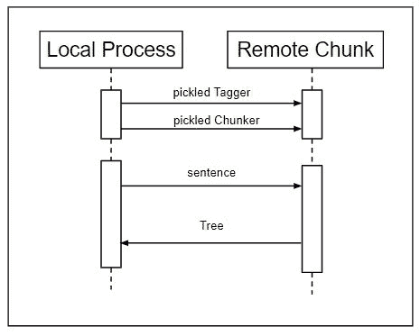

# NLP |使用 Execnet 进行分布式分块

> 原文:[https://www . geesforgeks . org/NLP-distributed-chunking-with-exec net/](https://www.geeksforgeeks.org/nlp-distributed-chunking-with-execnet/)

本文旨在通过 execnet 网关执行分块和标记。这里将发送两个对象而不是一个对象，并接收一个树，这需要酸洗和拆封以进行序列化。

**它是如何工作的？**

*   使用腌制的标签。
*   首先，酸洗 **nltk.chunk.ne_chunk()** 使用的默认 chunker，尽管任何 chunker 都可以。
*   接下来，为 remote_chunk 模块创建一个网关，获取一个通道，然后将腌制的标记器和 chunker 发送过来。
*   然后，收到一棵腌制过的树，可以拆开检查，看看结果。最后，退出网关:

**代码:解释工作**

```py
# importing libraries
import execnet, remote_chunk
import nltk.data, nltk.tag, nltk.chunk
import pickle
from nltk.corpus import treebank_chunk

tagger = pickle.dumps(nltk.data.load(nltk.tag._POS_TAGGER))
chunker = pickle.dumps(
        nltk.data.load(nltk.chunk._MULTICLASS_NE_CHUNKER))
gw = execnet.makegateway()

channel = gw.remote_exec(remote_chunk)
channel.send(tagger)
channel.send(chunker)
channel.send(treebank_chunk.sents()[0])

chunk_tree = pickle.loads(channel.receive())

print (chunk_tree)
gw.exit()
```

**输出:**

```py
Tree('S', [Tree('PERSON', [('Pierre', 'NNP')]), Tree('ORGANIZATION',
[('Vinken', 'NNP')]), (', ', ', '), ('61', 'CD'), ('years', 'NNS'),
('old', 'JJ'), (', ', ', '), ('will', 'MD'), ('join', 'VB'), ('the',
'DT'), ('board', 'NN'), ('as', 'IN'), ('a', 'DT'), ('nonexecutive',
'JJ'), ('director', 'NN'), ('Nov.', 'NNP'), ('29', 'CD'), ('.', '.')]) 

```

这次沟通略有不同，如下图所示–


*   remote_chunk.py 模块比 remote_tag.py 模块稍微复杂一点。
*   除了接收一个腌制标记器，它还希望接收一个实现 ChunkerIinterface 的腌制 chunker
*   一旦它有了一个标记器和一个组块器，它期望接收任意数量的标记化句子，并将其标记和解析成一个树。然后，这棵树被腌制并通过通道送回:

**代码:解释上述工作**

```py
import pickle

if __name__ == '__channelexec__':
    tagger = pickle.loads(channel.receive())
    chunker = pickle.loads(channel.receive())

for sentence in channel:
    chunk_tree = chunker.parse(tagger.tag(sent))
    channel.send(pickle.dumps(chunk_tree))
```

**remote_chunk 模块的**唯一的外部依赖是 pickle 模块，它是 Python 标准库的一部分。它不需要导入任何 NLTK 模块来使用标记器或分块器，因为所有必要的数据都被腌制并通过通道发送。