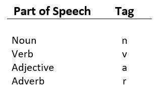

# NLP |在 WordNet 中为一个单词设置 Synsets】

> 原文:[https://www . geesforgeks . org/NLP-synset-for-a-word-in-wordnet/](https://www.geeksforgeeks.org/nlp-synsets-for-a-word-in-wordnet/)

**WordNet** 是专门为自然语言处理设计的词汇数据库，即英语词典。

**Synset** 是 NLTK 中存在的一种特殊的简单接口，用于在 WordNet 中查找单词。Synset 实例是表达相同概念的同义单词的分组。有些词只有一个 Synset，有些词有几个 Synset。

**代码#1:了解 Synset**

```
from nltk.corpus import wordnet
syn = wordnet.synsets('hello')[0]

print ("Synset name :  ", syn.name())

# Defining the word
print ("\nSynset meaning : ", syn.definition())

# list of phrases that use the word in context
print ("\nSynset example : ", syn.examples())
```

**输出:**

```
Synset name :   hello.n.01

Synset meaning :  an expression of greeting

Synset example :  ['every morning they exchanged polite hellos']
```

`**wordnet.synsets(word)**`可用于获取 Synsets 列表。这个列表可以是空的(如果没有找到这样的词)，也可以只有很少的元素。

**上音和下音–**

**上声:**更抽象的术语
下声:更具体的术语。

两者都是以类似于继承树的结构来组织的。这棵树可以一直追溯到词根的上位词。超音词提供了一种根据单词之间的相似性对单词进行分类和分组的方法。

**代码#2:理解超音和次音**

```
from nltk.corpus import wordnet
syn = wordnet.synsets('hello')[0]

print ("Synset name :  ", syn.name())

print ("\nSynset abstract term :  ", syn.hypernyms())

print ("\nSynset specific term :  ", 
       syn.hypernyms()[0].hyponyms())

syn.root_hypernyms()

print ("\nSynset root hypernerm :  ", syn.root_hypernyms())
```

**输出:**

```
Synset name :   hello.n.01

Synset abstract term :   [Synset('greeting.n.01')]

Synset specific term :   [Synset('calling_card.n.02'), Synset('good_afternoon.n.01'), 
Synset('good_morning.n.01'), Synset('hail.n.03'), Synset('hello.n.01'), 
Synset('pax.n.01'), Synset('reception.n.01'), Synset('regard.n.03'), 
Synset('salute.n.02'), Synset('salute.n.03'), Synset('welcome.n.02'), 
Synset('well-wishing.n.01')]

Synset root hypernerm :   [Synset('entity.n.01')]
```



**代码# 3:Synset 中的词性(POS)。**

```
syn = wordnet.synsets('hello')[0]
print ("Syn tag : ", syn.pos())

syn = wordnet.synsets('doing')[0]
print ("Syn tag : ", syn.pos())

syn = wordnet.synsets('beautiful')[0]
print ("Syn tag : ", syn.pos())

syn = wordnet.synsets('quickly')[0]
print ("Syn tag : ", syn.pos())
```

**输出:**

```
Syn tag :  n
Syn tag :  v
Syn tag :  a
Syn tag :  r
```