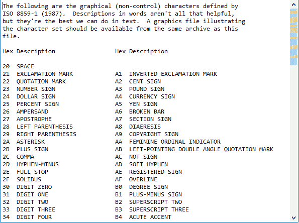
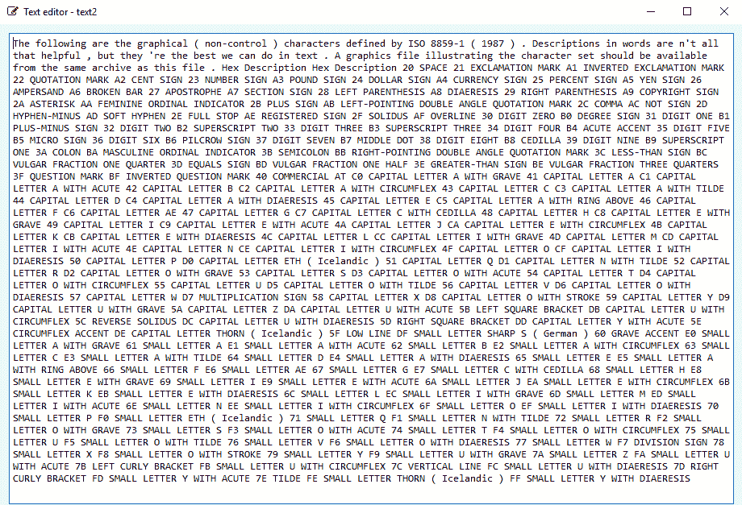

# 使用 NLP 处理文本|基础知识

> 原文:[https://www . geesforgeks . org/processing-text-use-NLP-basics/](https://www.geeksforgeeks.org/processing-text-using-nlp-basics/)

前提:[NLP 入门](https://www.geeksforgeeks.org/introduction-to-natural-language-processing/)

在本文中，我们将讨论如何从在线文本文件中获取文本，并从中提取所需的数据。出于本文的目的，我们将使用这里可用的文本文件。

当前工作环境中必须安装以下设备:

*   NLTK 库
*   urllib 程式库
*   美丽的组合库

**步骤#1:** 导入所需的库

```
import nltk
from bs4 import BeautifulSoup
from urllib.request import urlopen
```

关于上述库的一些基本信息:

*   **NLTK 库:**NLTK 库是为处理用 Python 编程语言编写的英语语言而编写的库和程序的集合。
*   **urllib 库:**这是一个针对 python 的 URL 处理库。了解更多[这里](https://www.geeksforgeeks.org/python-urllib-module/)
*   **美化输出库:**这是一个用于从 HTML 和 XML 文档中提取数据的库。

**步骤#2:** 提取文本文件的所有内容。

```
raw = urlopen("https://www.w3.org/TR/PNG/iso_8859-1.txt").read()
```

因此，未处理的数据被加载到变量 raw 中。

**步骤#3:** 接下来，我们处理数据以移除可能存在于我们的“原始”变量中的任何 html/xml 标签，使用:

```
raw1 = BeautifulSoup(raw)
```

**步骤#4:** 现在我们获得“原始”变量中的文本。

```
raw2 = raw1.get_text()
```

**输出:**


**步骤#5:** 接下来，我们将文本标记为单词。

```
token = nltk.word_tokenize(raw2)
```

**输出:**

这是作为下一步的预处理完成的，在这里我们将获得最终文本。

**步骤#6:** 最后，我们获得最终文本。

```
text2 = ' '.join(token)
```

**输出:**


以下是完整代码:

```
# importing libraries
import nltk
from bs4 import BeautifulSoup
from urllib.request import urlopen

# extract all the contents of the text file.
raw = urlopen("https://www.w3.org/TR/PNG/iso_8859-1.txt").read()

# remove any html/xml tags
raw1 = BeautifulSoup(raw)

#  obtain the text present in ‘raw’
raw2 = raw1.get_text()

#  tokenize the text into words.
token = nltk.word_tokenize(raw2)
text2 = ' '.join(token)
```